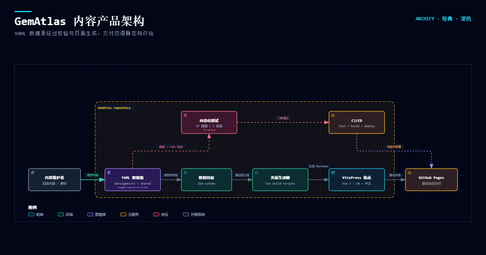

# 💎 GemAtlas — The Open Gemological Compendium

> A bilingual (English / 中文) open-source gemological knowledge platform built as a data-driven content system.

[](https://cang-ge.github.io/gematlas/)
[](./package.json)
[](./LICENSE)

**Languages:** [English](./README.en.md) · [中文](./README.zh.md)

GemAtlas turns structured gemological data into a searchable bilingual reference site. Content is maintained as YAML, checked against TypeScript/Zod schemas, transformed into VitePress pages, and published as a static site through GitHub Pages.

## At a glance

| Area | Current scope |
| --- | --- |
| Gem knowledge | 60 gemstone entries |
| Content modules | Classification, identification, cutting, grading, gallery |
| Shared references | 7 crystal systems, Mohs scale, mineral groups, optical phenomena, colour causes |
| Editorial examples | 18 maison and landmark pieces |
| Quality checks | 70 Vitest tests plus data and bilingual consistency checks |
| Runtime | VitePress 1.6 · Vue 3 · TypeScript · pnpm 9 |

## Explore the live site

- [Classification](https://cang-ge.github.io/gematlas/classification/intro) — crystal systems, mineral groups, optical phenomena, and causes of colour
- [Identification](https://cang-ge.github.io/gematlas/identification/intro) — physical tests, optical tests, synthetics, imitations, and same-colour comparisons
- [Cutting](https://cang-ge.github.io/gematlas/cutting/intro) — brilliant cuts, fancy cuts, cabochons, and carving
- [Grading](https://cang-ge.github.io/gematlas/grading/intro) — diamond 4Cs, coloured-stone grading, clarity, treatments, and origin disclosure
- [Gallery](https://cang-ge.github.io/gematlas/gallery/intro) — maison references, design eras, and legendary stones

## Why this project exists

Gemological reference material is often fragmented across prose, tables, image collections, and language-specific pages. That makes it difficult to compare stones consistently and difficult to maintain translations without drift.

GemAtlas addresses that problem with three design decisions:

1. **Model the knowledge before rendering it.** A gem is represented with identity, chemistry, physical properties, optical properties, treatments, provenance, and images rather than as an unstructured page.
2. **Keep one source of truth.** YAML files are edited directly; generated pages are delivery artifacts.
3. **Make content quality testable.** Schema validation, bilingual pairing checks, and unit tests run before a build is considered ready.

## What visitors can do

- Browse 60 gem entries through a consistent bilingual page structure.
- Compare mineral identity, chemical formula, crystal system, hardness, specific gravity, and refractive index.
- Learn how optical phenomena and colour causes relate to particular stones.
- Read practical identification, cutting, grading, and disclosure guidance.
- Use local search across the generated VitePress knowledge site.
- Switch between English and Chinese while preserving the same content tree.

## Architecture



The main path is:

```text
Content maintainers
        ↓
YAML data sources
        ↓
Zod schema validation ──→ data and i18n tests
        ↓                         ↓
TypeScript page generators ──→ CI quality gate
        ↓                         ↓
VitePress static site ───────→ GitHub Pages
```

The repository separates content, transformation, presentation, and delivery:

- `data/` stores the source data and shared taxonomies.
- `scripts/build/` validates data, generates pages, and checks bilingual structure.
- `docs/` contains the VitePress site and its generated Markdown pages.
- `.github/workflows/ci.yml` runs type checking, validation, tests, and the production build; pushes to the default branch deploy the build output to `gh-pages`.

## Data model

Each gem entry follows a typed model defined in [`scripts/build/schema.ts`](./scripts/build/schema.ts):

```text
Gem
├── identity       id, bilingual names
├── category       mineral, formula, crystal system
├── physical       Mohs hardness, specific gravity, refractive index
├── optical        pleochroism, typical colours, colour causes
├── treatments     common treatments and disclosure requirements
├── images         main image and gallery references
└── provenance     origin and historical notes when available
```

Shared YAML files provide reusable taxonomies such as crystal systems, the Mohs scale, mineral groups, optical phenomena, colour causes, grading topics, cutting topics, identification topics, and gallery topics. The same field shapes are consumed by the page generators and validated before publication.

## Content modules

### Classification

Organises the reference layer around crystal systems, chemistry-based mineral groups, optical phenomena, and causes of colour. It gives readers a structured route from mineral identity to visible behaviour.

### Identification

Explains physical and optical tests, synthetic and imitation identification, and comparisons between stones with similar colours. These pages are written as practical reference material rather than as a single diagnostic shortcut.

### Cutting

Covers brilliant cuts, fancy cuts, cabochons, and carving. The module connects geometry and craft vocabulary with examples that readers can use when viewing a stone or a jewellery piece.

### Grading

Introduces the diamond 4Cs, coloured-stone grading, clarity inclusion types, and origin or treatment disclosure. It distinguishes grading language from treatment and provenance claims.

### Gallery

Provides a visual and cultural layer through maison references, design eras, and legendary stones. It complements the technical modules without turning the project into an e-commerce catalogue.

## Build and quality pipeline

The build workflow is intentionally explicit:

1. Edit or add YAML data under `data/gems/v1/` or `data/shared/`.
2. Run `pnpm validate:data` to parse every supported YAML file against its Zod schema.
3. Run `pnpm generate:pages` when source data changes and generated pages need refreshing.
4. Run `pnpm sync:content` to verify that English and Chinese page trees remain paired and shared frontmatter stays aligned.
5. Run `pnpm test` for per-file schema checks and bilingual invariants.
6. Run `pnpm build` to produce `docs/.vitepress/dist/`.

The CI workflow also runs TypeScript checks and deploys the production output to GitHub Pages on pushes to the repository default branch.

## Repository layout

```text
data/
├── gems/v1/*.yaml             # 60 gem records: source of truth
└── shared/*.yaml              # shared taxonomies and module topics

scripts/build/
├── schema.ts                  # Zod schemas and TypeScript types
├── validate-data.ts           # data validation command
├── generate-gem-pages.ts      # gem page generator
├── generate-topic-pages.ts    # shared topic-page generator
├── generate-*-pages.ts        # specialised taxonomy generators
└── sync-content.ts            # English / Chinese structure check

docs/
├── .vitepress/                # site configuration and theme
├── gems/                      # English gem pages
├── zh/gems/                   # Chinese gem pages
├── classification/            # classification module
├── identification/            # identification module
├── cutting/                   # cutting module
├── grading/                   # grading module
└── gallery/                   # gallery module

tests/                         # Vitest data and i18n checks
.github/workflows/ci.yml       # validation, build, and Pages deployment
```

## Local development

### Requirements

- Node.js 20 or newer
- pnpm 9 or newer

The repository pins pnpm through `packageManager` and the lockfile. Corepack can activate the expected package-manager version:

```bash
corepack enable
pnpm install
```

### Run the site

```bash
pnpm dev       # http://localhost:5173
```

### Verify the project

```bash
pnpm validate:data
pnpm sync:content
pnpm test
pnpm build
pnpm preview
```

## Content sources and attribution

Mineralogical, grading, and gemological background is curated from public-domain and licensed references, including:

- [GIA](https://www.gia.edu/) — 4Cs and gemological reference material
- [SSEF](https://www.ssef.ch/) — origin and treatment research
- [Gübelin](https://www.gubelin.com/) — gemological research and historical context

Image sources and license records are listed in [`docs/image-credits.md`](./docs/image-credits.md).

The project is an educational reference and does not replace an examination by a qualified gemologist or an independent laboratory report. Treatment, origin, and identification content should be interpreted with the source notes and the limits of the available evidence.

## Contributing

Contributions are welcome. For content changes, please keep the YAML model and the generated bilingual pages in sync, run the validation and test commands locally, and explain the source or editorial rationale in the pull request.

See [`CONTRIBUTING.md`](./CONTRIBUTING.md) for repository-level guidance.

## License

[MIT](./LICENSE) — Copyright © 2026–present GemAtlas contributors.
