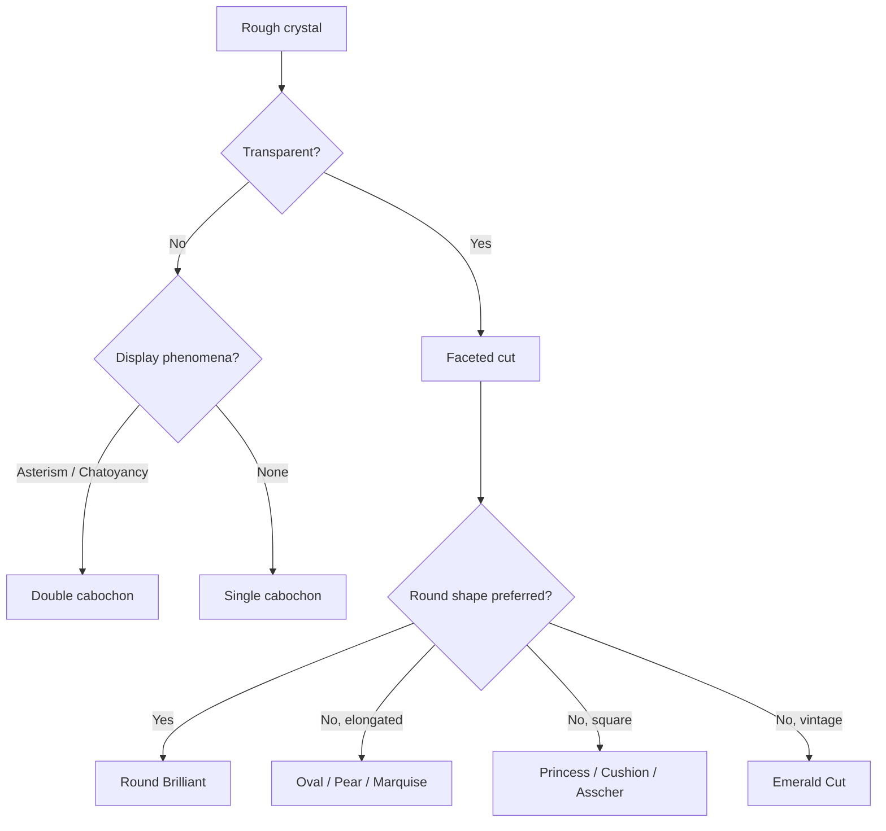

# Cutting

> *Light enters, light returns — and is what we call fire.*

Gem cutting transforms rough crystals into finished gemstones that maximize beauty, brilliance, and value. A well-cut gem reveals the stone's color, manages internal reflections, and protects against damage.

## Cutting Types

| Type | Description | Typical For |
|------|-------------|-------------|
| **Faceted** | Flat polished surfaces that reflect light | Transparent gems (Diamond, Sapphire, Emerald) |
| **Cabochon** | Smooth domed surface, no facets | Opaque/translucent gems (Opal, Turquoise, Star Sapphire) |
| **Carved** | Figurative or abstract sculpture | Jade, Coral, Quartz |
| **Bead** | Polished round or shaped sphere | Pearl, Lapis, Amber |

## Standard Round Brilliant

The most researched and optimized cut in gemology. Its proportions are tuned to maximize light return through the crown while minimizing leakage through the pavilion.

<FacetDiagram locale="en" />

**Key proportions (Tolkowsky ideal):**
- Total depth: 62-62.5% of girdle diameter
- Crown angle: 34-35°
- Pavilion angle: 40.75-41.2°
- Table size: 53-60% of girdle diameter

## Fancy Cuts

Eight common shapes that adapt the brilliant design concept to different aesthetics:

<FancyCutGrid locale="en" />

## Cabochon Cuts

Cabochons (or "cabs") are smooth domed stones, typically cut in three shapes:

| Shape | Profile | Use |
|-------|---------|-----|
| **Simple cab** | Single dome | Most cabs (Opal, Turquoise) |
| **Double cab** | Domed top + flat bottom | Star stones, Cat's-eye Chrysoberyl |
| **High-dome cab** | Tall domed profile | Asterism display |

Cabochons are chosen when:
- The gem is opaque or translucent (no light return to enhance)
- The gem displays asterism or chatoyancy (phenomena need curved surface)
- The owner prefers a smooth tactile feel over sparkle

## Cameos & Intaglios

| Type | Style | Traditional Material |
|------|-------|---------------------|
| **Cameo** | Raised relief (figure stands up) | Shell, Sardonyx |
| **Intaglio** | Carved into the surface | Carnelian, Agate |

Worn as personal seals, jewelry, and decorative objects since antiquity.

## Choosing a Cut

The cutting style depends on the rough material's character:

## Cutting Process

A faceted gem goes through several stages:

1. **Planning** — Marking the rough based on inclusions and shape
2. **Sawing** — Cutting the rough into manageable pieces
3. **Grinding** — Shaping on a coarse wheel
4. **Pre-forming** — Roughing out the basic shape
5. **Faceting** — Polishing individual facets (can take hours per stone)
6. **Final polishing** — Mirror finish on all facets

Modern faceting machines automate facet angles to within 0.1° precision.