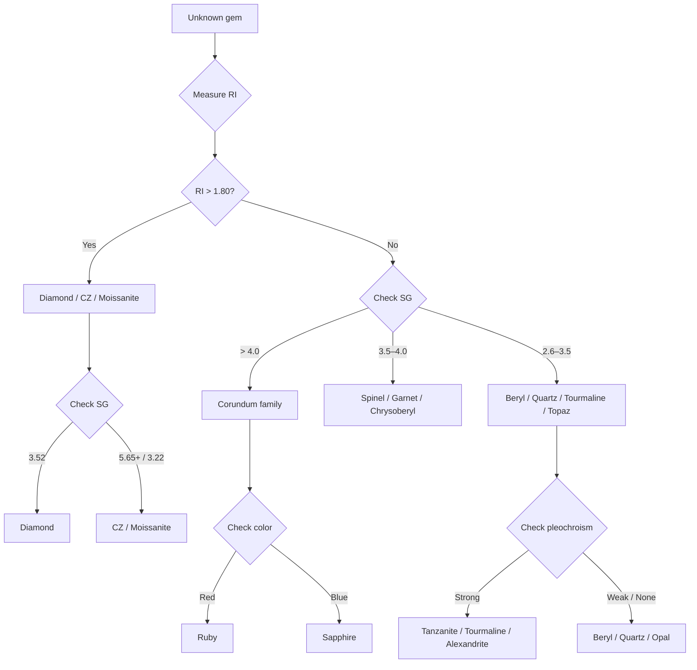

# Identification

> *How gemologists tell one stone from another.*

Identification is the core skill of gemology. By measuring a handful of physical and optical properties, a trained gemologist can distinguish any natural gem from its imitators and identify treatments.

## The Essential Toolkit

Four measurements form the foundation of gem identification:

| Measurement | What It Tells | Typical Range |
|---|---|---|
| **Refractive Index (RI)** | How much light bends entering the stone | 1.37 (Opal) – 2.42 (Diamond) |
| **Specific Gravity (SG)** | Density relative to water | 2.10 (Opal) – 4.00 (Corundum) |
| **Mohs Hardness** | Resistance to scratching | 1 (Talc) – 10 (Diamond) |
| **Birefringence** | Double refraction (DR) | 0.000 (Diamond) – 0.287 (Rutile) |

## Quick Reference: Key Gems Compared

<PropertyTable :gemIds="['ruby','sapphire','emerald','diamond','spinel','opal']" locale="en" />

## Mohs Hardness Scale

The standard of scratch resistance, from softest (1) to hardest (10):

<MohsScale locale="en" />

## Refractive Index

RI is the most reliable single measurement for gem identification. A refractometer measures how much a gem slows and bends light. Each species has a characteristic range:

| RI Range | Typical Gems |
|----------|-------------|
| 1.37–1.47 | Opal |
| 1.54–1.55 | Quartz (Amethyst, Citrine) |
| 1.57–1.58 | Beryl (Emerald, Aquamarine) |
| 1.61–1.67 | Tourmaline |
| 1.71–1.76 | Spinel |
| 1.74–1.76 | Garnet (Tsavorite) |
| 1.76–1.77 | Corundum (Ruby, Sapphire) |
| 2.42 | Diamond |

## Specific Gravity

SG is measured by weighing the gem in air and in water. The ratio is constant for each species:

| SG | Typical Gems |
|----|-------------|
| 2.10 | Opal |
| 2.65 | Quartz |
| 2.72 | Beryl |
| 3.06 | Tourmaline |
| 3.35 | Tanzanite |
| 3.52 | Diamond |
| 3.60 | Spinel |
| 4.00 | Corundum |

## Pleochroism

Many colored gems show different colors when viewed from different directions. This is called pleochroism.

| Strength | Meaning | Examples |
|----------|---------|---------|
| **Strong** | Clear color difference by direction | Ruby/Sapphire (blue/orange), Tanzanite (blue/violet/red), Alexandrite (green/red), Tourmaline |
| **Weak** | Subtle color shift | Emerald |
| **None** | Same color from all angles | Diamond, Spinel, Garnet |

Testing: View the gem through a dichroscope while rotating. Two or three distinct colors confirm pleochroism.

## Inclusions

Inclusions are nature's fingerprints — internal features that identify a gem's origin and distinguish natural from synthetic stones.

| Inclusion Type | Diagnostic For |
|---------------|----------------|
| **Rutile needles (silk)** | Burmese Ruby, Kashmir Sapphire |
| **Fingerprint patterns** | Healed fractures in Ruby, Emerald |
| **Feathers** | Diamond clarity grading |
| **Three-phase inclusions** | Colombian Emerald |
| **Zoning** | Sapphire (color bands), Tourmaline |
| **Liquid / gas bubbles** | Synthetic gems, glass imitations |

## Identification Flowchart

## Crystal System Reference

Each gem crystallizes in one of seven systems (plus amorphous). The crystal system affects how light behaves inside the stone.

<CrystalDiagram systemId="cubic" />
**Cubic (Isometric)** — Diamond, Spinel, Garnet. Single RI (no birefringence).

<CrystalDiagram systemId="tetragonal" />
**Tetragonal** — Zircon, Rutile. High birefringence.

<CrystalDiagram systemId="orthorhombic" />
**Orthorhombic** — Tanzanite, Alexandrite, Topaz. Three distinct RI directions.

<CrystalDiagram systemId="hexagonal" />
**Hexagonal** — Beryl (Emerald, Aquamarine). Moderate birefringence.

<CrystalDiagram systemId="trigonal" />
**Trigonal** — Ruby, Sapphire, Quartz, Tourmaline. Strong pleochroism.

<CrystalDiagram systemId="monoclinic" />
**Monoclinic** — Orthoclase, Spodumene.

<CrystalDiagram systemId="triclinic" />
**Triclinic** — Kyanite, Turquoise.
