# The Maison Archive

A first-edition archive of seven legendary maisons. Each house is represented by three object records: one for heritage, one for signature craft, and one for the gemstone itself. Related cards may describe the same object from different states or viewpoints; every bundled image has a traceable source and recorded reuse terms.

21 works7 maisonsSelection rule: heritage · signature craft · gemstone focus

## Browse by maison

Browse 21 object records by maison. Open any image to inspect its original file page, author, institution, and reuse terms; an “Archive relation” note marks a related view, not automatically a separate work.

<nav class="maison-index" aria-label="Maison index"><a href="#cartier">Cartier</a><a href="#vca">Van Cleef & Arpels</a><a href="#boucheron">Boucheron</a><a href="#tiffany">Tiffany & Co.</a><a href="#harry-winston">Harry Winston</a><a href="#graff">Graff</a><a href="#chaumet">Chaumet</a></nav>

<section class="maison-section" id="cartier">
  <header class="maison-section__header">
    

MAISON · 1847
<h2>Cartier</h2>

    
carved colour · panther · Art Deco

  </header>
  
<article class="maison-work-card">
  <a class="maison-work-card__media" href="https://commons.wikimedia.org/wiki/File:Tutti_frutti_bracelet_-_Cartier_(25802475508).jpg" target="_blank" rel="noreferrer">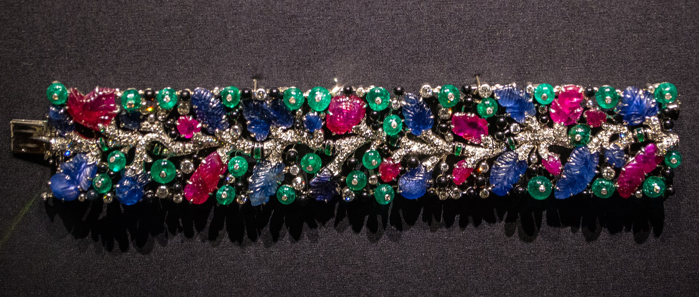</a>
  

    
Heritage piece<time>1928</time>

    <h3>Tutti Frutti Bracelet</h3>
    <dl class="maison-work-card__facts">
      
<dt>Gems</dt><dd>ruby · emerald · sapphire</dd>

      
<dt>Craft</dt><dd>carved coloured gemstones</dd>

      
<dt>Style</dt><dd>Art Deco botanical</dd>

    </dl>
    
Carved rubies, emeralds, and sapphires form a botanical composition that defines Cartier&#39;s coloured-gem vocabulary.

    <a class="maison-work-card__source" href="https://www.cartier.com/en-gb/maison/the-story/living-heritage/the-cartier-collection/jewellery" target="_blank" rel="noreferrer">Open source ↗</a>
  

</article>
<article class="maison-work-card">
  <a class="maison-work-card__media" href="https://commons.wikimedia.org/wiki/File:Linked_bracelet_-_Cartier_(25891095068).jpg" target="_blank" rel="noreferrer">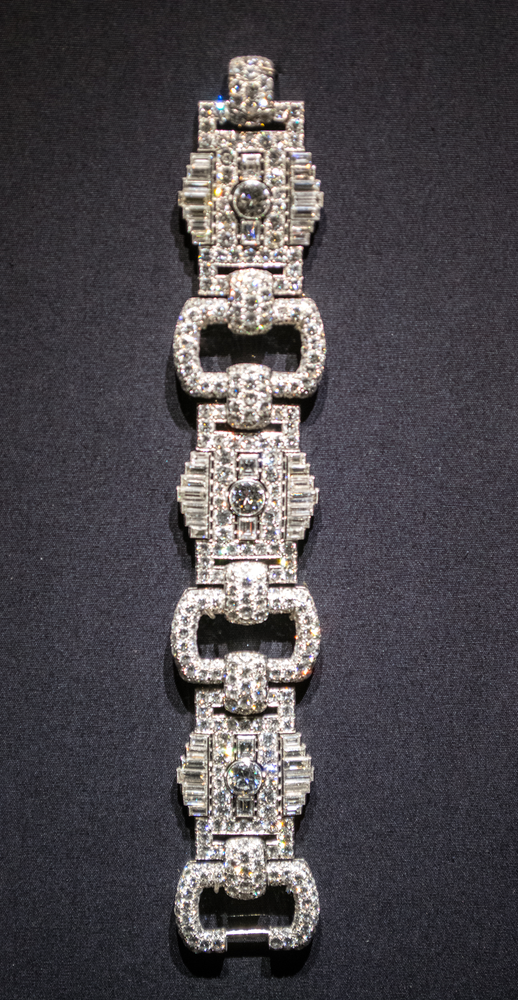</a>
  

    
Signature craft<time>1920s</time>

    <h3>Linked Bracelet</h3>
    <dl class="maison-work-card__facts">
      
<dt>Gems</dt><dd>diamond</dd>

      
<dt>Craft</dt><dd>articulated platinum links</dd>

      
<dt>Style</dt><dd>Jazz Age geometry</dd>

    </dl>
    
Articulated links turn a geometric Art Deco rhythm into a wearable, flexible structure.

    <a class="maison-work-card__source" href="https://www.cartier.com/en-gb/maison/the-story/living-heritage/the-cartier-collection/jewellery" target="_blank" rel="noreferrer">Open source ↗</a>
  

</article>
<article class="maison-work-card">
  <a class="maison-work-card__media" href="https://commons.wikimedia.org/wiki/File:Joyaux_dynastiques_H%C3%B4tel_de_la_Marine_broche_noeud_dentelle_diamants_platine_or.jpg" target="_blank" rel="noreferrer">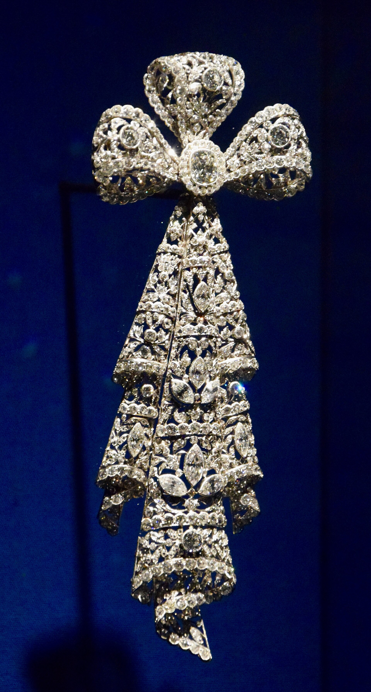</a>
  

    
Gemstone focus<time>1906</time>

    <h3>Lace-Knot Diamond Brooch</h3>
    <dl class="maison-work-card__facts">
      
<dt>Gems</dt><dd>diamond</dd>

      
<dt>Craft</dt><dd>lace-knot diamond setting</dd>

      
<dt>Style</dt><dd>Belle Époque formal jewellery</dd>

    </dl>
    
A lace-like openwork silhouette organises diamonds and metal into a study of Cartier&#39;s light, formal structure.

    <a class="maison-work-card__source" href="https://commons.wikimedia.org/wiki/File:Joyaux_dynastiques_H%C3%B4tel_de_la_Marine_broche_noeud_dentelle_diamants_platine_or.jpg" target="_blank" rel="noreferrer">Open source ↗</a>
  

</article>

</section>
<section class="maison-section" id="vca">
  <header class="maison-section__header">
    

MAISON · 1906
<h2>Van Cleef & Arpels</h2>

    
Mystery Set · nature · movement

  </header>
  
<article class="maison-work-card">
  <a class="maison-work-card__media" href="https://commons.wikimedia.org/wiki/File:Loop_bracelet_-_Van_Cleef_and_Arpels_(39055602034).jpg" target="_blank" rel="noreferrer">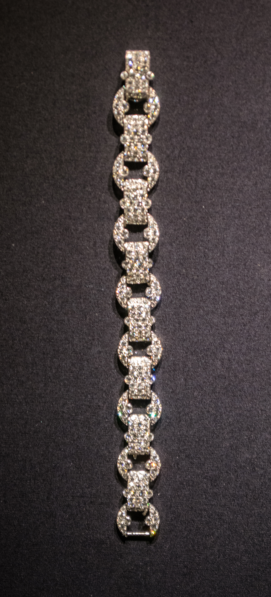</a>
  

    
Heritage piece<time>1929</time>

    <h3>Loop Bracelet</h3>
    <dl class="maison-work-card__facts">
      
<dt>Gems</dt><dd>diamond</dd>

      
<dt>Craft</dt><dd>platinum and diamond geometry</dd>

      
<dt>Style</dt><dd>Cubist Art Deco</dd>

    </dl>
    
A 1920s geometric bracelet pairing step-cut stones with platinum structure and early VCA modernism.

    <a class="maison-work-card__source" href="https://www.vam.ac.uk/collections/jewellery" target="_blank" rel="noreferrer">Open source ↗</a>
  

</article>
<article class="maison-work-card">
  <a class="maison-work-card__media" href="https://commons.wikimedia.org/wiki/File:Ruby_necklace_-_Van_Cleef_and_Arpels_(38965252754).jpg" target="_blank" rel="noreferrer">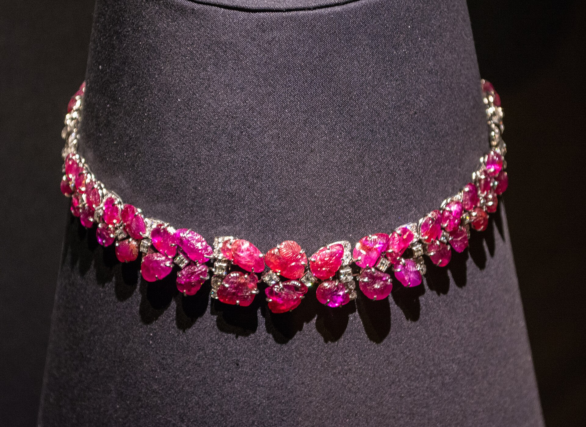</a>
  

    
Gemstone focus<time>20th century</time>

    <h3>Ruby Necklace</h3>
    <dl class="maison-work-card__facts">
      
<dt>Gems</dt><dd>ruby · diamond</dd>

      
<dt>Craft</dt><dd>articulated necklace construction</dd>

      
<dt>Style</dt><dd>colour-led high jewellery</dd>

    </dl>
    
Saturated ruby colour establishes the focal point while diamonds control contrast and visual layering.

    <a class="maison-work-card__source" href="https://www.vam.ac.uk/collections/jewellery" target="_blank" rel="noreferrer">Open source ↗</a>
  

</article>
<article class="maison-work-card">
  <a class="maison-work-card__media" href="https://commons.wikimedia.org/wiki/File:Pendant_watch_-_Van_Cleef_and_Arpels_(38772069405).jpg" target="_blank" rel="noreferrer">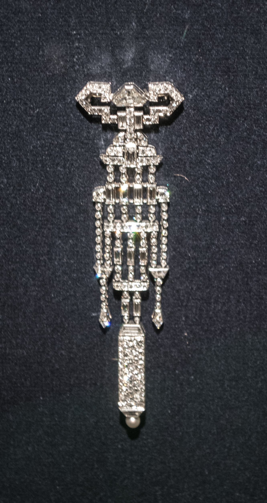</a>
  

    
Signature craft<time>1927</time>

    <h3>Pendant Watch</h3>
    <dl class="maison-work-card__facts">
      
<dt>Gems</dt><dd>diamond · pearl</dd>

      
<dt>Craft</dt><dd>concealed watch movement and chatelaine form</dd>

      
<dt>Style</dt><dd>Jazz Age Cubism</dd>

    </dl>
    
A miniature watch, pearls, and chatelaine-like chains merge decoration with function in one compact object.

    <a class="maison-work-card__source" href="https://www.vam.ac.uk/collections/jewellery" target="_blank" rel="noreferrer">Open source ↗</a>
  

</article>

</section>
<section class="maison-section" id="boucheron">
  <header class="maison-section__header">
    

MAISON · 1858
<h2>Boucheron</h2>

    
open structure · fauna · colour

  </header>
  
<article class="maison-work-card">
  <a class="maison-work-card__media" href="https://commons.wikimedia.org/wiki/File:Mackay_Necklace_Boucheron_1877.png" target="_blank" rel="noreferrer">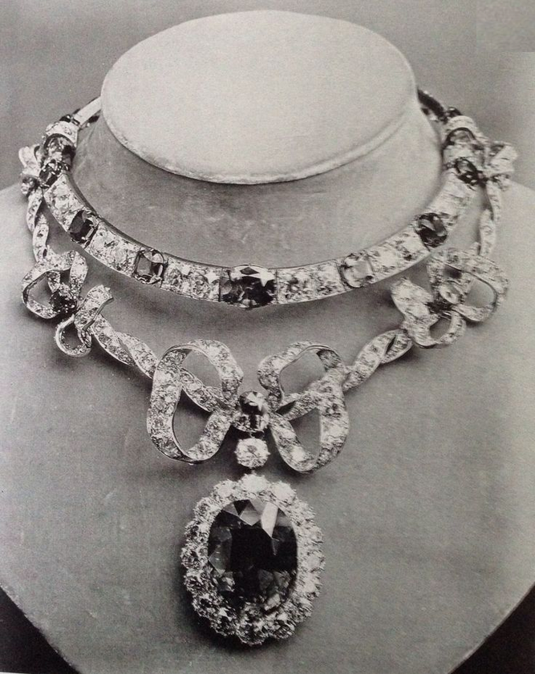</a>
  

    
Heritage piece<time>1877</time>

    <h3>Mackay Sapphire and Diamond Necklace</h3>
    <dl class="maison-work-card__facts">
      
<dt>Gems</dt><dd>sapphire · diamond</dd>

      
<dt>Craft</dt><dd>sapphire and diamond necklace composition</dd>

      
<dt>Style</dt><dd>Belle Époque historic jewellery</dd>

    </dl>
    
A historic necklace made for the 1878 Paris exposition, showing Boucheron&#39;s early contrast between sapphire and diamond.

    <a class="maison-work-card__source" href="https://commons.wikimedia.org/wiki/File:Mackay_Necklace_Boucheron_1877.png" target="_blank" rel="noreferrer">Open source ↗</a>
  

</article>
<article class="maison-work-card">
  <a class="maison-work-card__media" href="https://commons.wikimedia.org/wiki/File:Collier_tuyau_%C3%A0_gaz,_PPO03791(1).jpg" target="_blank" rel="noreferrer">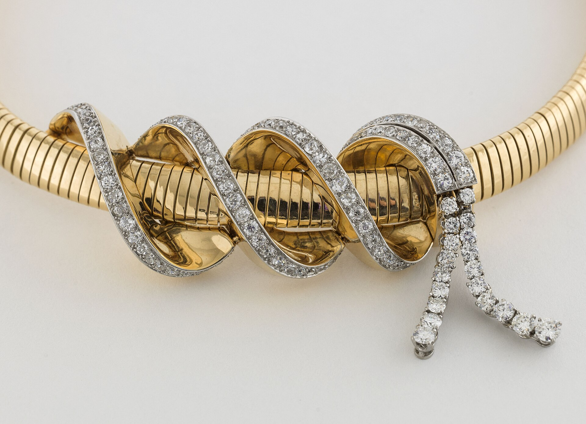</a>
  

    
Signature craft<time>1945–1950</time>

    <h3>Gas-Pipe Diamond Necklace</h3>
    <dl class="maison-work-card__facts">
      
<dt>Gems</dt><dd>diamond</dd>

      
<dt>Craft</dt><dd>articulated tubular necklace with diamond ribbon</dd>

      
<dt>Style</dt><dd>mid-century architectural jewellery</dd>

    </dl>
    
A Petit Palais Boucheron necklace layers a lightweight articulated tube with a diamond ribbon to study structure and reflection.

    <a class="maison-work-card__source" href="https://commons.wikimedia.org/wiki/File:Collier_tuyau_%C3%A0_gaz,_PPO03791(1).jpg" target="_blank" rel="noreferrer">Open source ↗</a>
  

</article>
<article class="maison-work-card">
  <a class="maison-work-card__media" href="https://commons.wikimedia.org/wiki/File:Boucheron,_devant_de_corsage,_1925,_oro_al_palladio,_lapislazzuli,_corallo,_giada,_onice,_turchese,_strass_(parigi,_coll._boucheron).jpg" target="_blank" rel="noreferrer">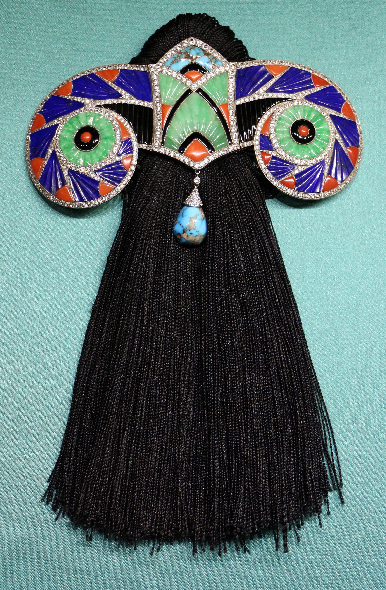</a>
  

    
Gemstone focus<time>1925</time>

    <h3>1925 Coloured-Gemstone Corsage Ornament</h3>
    <dl class="maison-work-card__facts">
      
<dt>Gems</dt><dd>lapis-lazuli · coral · jade · onyx · turquoise</dd>

      
<dt>Craft</dt><dd>multi-material corsage ornament construction</dd>

      
<dt>Style</dt><dd>Art Deco colour blocking</dd>

    </dl>
    
Lapis lazuli, coral, jade, onyx, and turquoise create layered colour blocks in a Boucheron stone-first study.

    <a class="maison-work-card__source" href="https://commons.wikimedia.org/wiki/File:Boucheron,_devant_de_corsage,_1925,_oro_al_palladio,_lapislazzuli,_corallo,_giada,_onice,_turchese,_strass_(parigi,_coll._boucheron).jpg" target="_blank" rel="noreferrer">Open source ↗</a>
  

</article>

</section>
<section class="maison-section" id="tiffany">
  <header class="maison-section__header">
    

MAISON · 1837
<h2>Tiffany & Co.</h2>

    
light · proportion · blue book

  </header>
  
<article class="maison-work-card">
  <a class="maison-work-card__media" href="https://commons.wikimedia.org/wiki/File:Tiffany_setting.jpg" target="_blank" rel="noreferrer">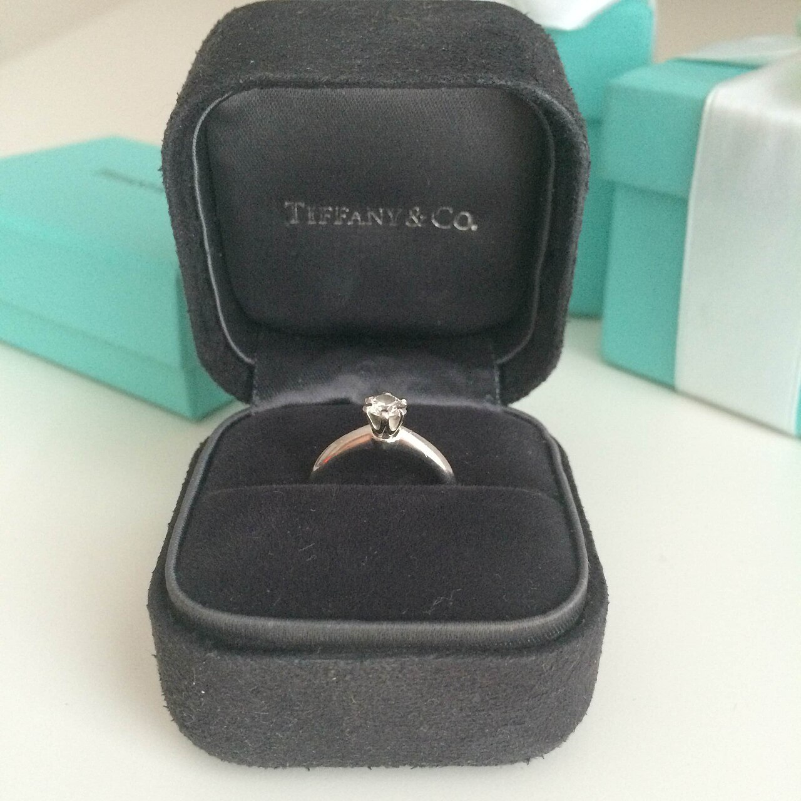</a>
  

    
Heritage piece<time>1886</time>

    <h3>Tiffany Setting</h3>
    <dl class="maison-work-card__facts">
      
<dt>Gems</dt><dd>diamond</dd>

      
<dt>Craft</dt><dd>six-prong solitaire setting</dd>

      
<dt>Style</dt><dd>modern engagement icon</dd>

    </dl>
    
Raising the stone above the band to maximise light became a foundational product form for modern engagement rings.

    <a class="maison-work-card__source" href="https://commons.wikimedia.org/wiki/File:Tiffany_setting.jpg" target="_blank" rel="noreferrer">Open source ↗</a>
  

</article>
<article class="maison-work-card">
  <a class="maison-work-card__media" href="https://commons.wikimedia.org/wiki/File:Jean_schlumberger_per_tiffany_%26_co.,_spilla_fiocco_schlumberger,_con_acquamarina_da_148,5_carati,_diamanti,_platino_e_oro.jpg" target="_blank" rel="noreferrer">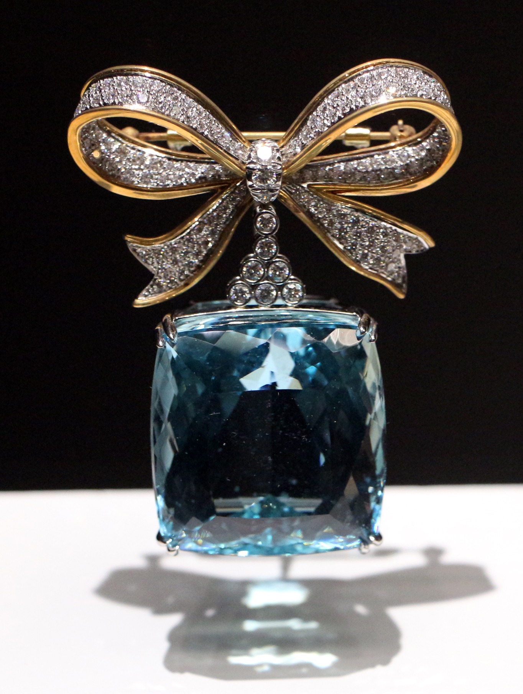</a>
  

    
Signature craft<time>20th century</time>

    <h3>Schlumberger Bow Brooch</h3>
    <dl class="maison-work-card__facts">
      
<dt>Gems</dt><dd>aquamarine · diamond</dd>

      
<dt>Craft</dt><dd>sculptural platinum ribbon setting</dd>

      
<dt>Style</dt><dd>organic modernism</dd>

    </dl>
    
A platinum ribbon-like structure wraps the centre stone, turning movement and tension into a sculptural setting.

    <a class="maison-work-card__source" href="https://commons.wikimedia.org/wiki/File:Jean_schlumberger_per_tiffany_%26_co.,_spilla_fiocco_schlumberger,_con_acquamarina_da_148,5_carati,_diamanti,_platino_e_oro.jpg" target="_blank" rel="noreferrer">Open source ↗</a>
  

</article>
<article class="maison-work-card">
  <a class="maison-work-card__media" href="https://commons.wikimedia.org/wiki/File:Tiffany_Diamond.jpg" target="_blank" rel="noreferrer">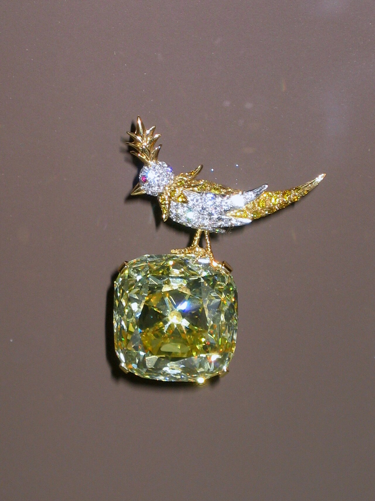</a>
  

    
Gemstone focus<time>1877</time>

    <h3>Tiffany Yellow Diamond</h3>
    <dl class="maison-work-card__facts">
      
<dt>Gems</dt><dd>yellow-diamond</dd>

      
<dt>Craft</dt><dd>cushion-cut diamond presentation</dd>

      
<dt>Style</dt><dd>iconic coloured diamond</dd>

    </dl>
    
An open-license view of the Tiffany Yellow Diamond foregrounds how a maison builds a narrative around one exceptional coloured stone.

    <a class="maison-work-card__source" href="https://commons.wikimedia.org/wiki/File:Tiffany_Diamond.jpg" target="_blank" rel="noreferrer">Open source ↗</a>
  

</article>

</section>
<section class="maison-section" id="harry-winston">
  <header class="maison-section__header">
    

MAISON · 1932
<h2>Harry Winston</h2>

    
diamond · cluster · scale

  </header>
  
<article class="maison-work-card">
  <a class="maison-work-card__media" href="https://commons.wikimedia.org/wiki/File:Spanish_Inquisition_Necklace.jpg" target="_blank" rel="noreferrer">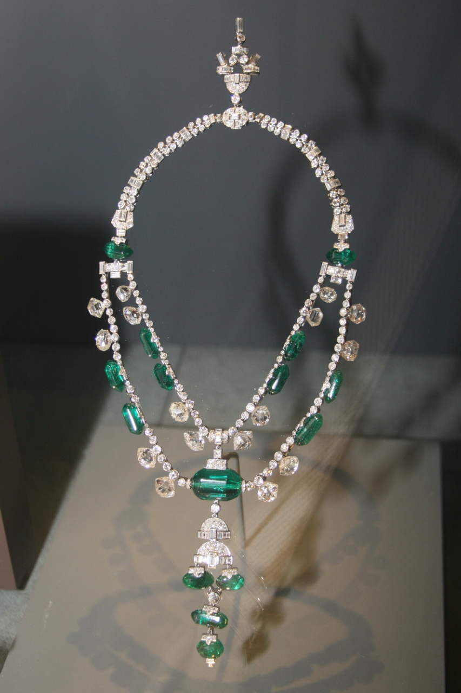</a>
  

    
Heritage piece<time>before 1926</time>

    <h3>Spanish Inquisition Necklace</h3>
    <dl class="maison-work-card__facts">
      
<dt>Gems</dt><dd>emerald · diamond</dd>

      
<dt>Craft</dt><dd>graduated emerald and diamond necklace</dd>

      
<dt>Style</dt><dd>historic Indian-inspired grandeur</dd>

    </dl>
    
An emerald-and-diamond historic necklace later named by Harry Winston and documented through the Smithsonian collection.

    <a class="maison-work-card__source" href="https://naturalhistory.si.edu/explore/collections/geogallery/10002801" target="_blank" rel="noreferrer">Open source ↗</a>
  

</article>
<article class="maison-work-card">
  <a class="maison-work-card__media" href="https://commons.wikimedia.org/wiki/File:Spanish_Inquisition_Necklace_2.jpg" target="_blank" rel="noreferrer">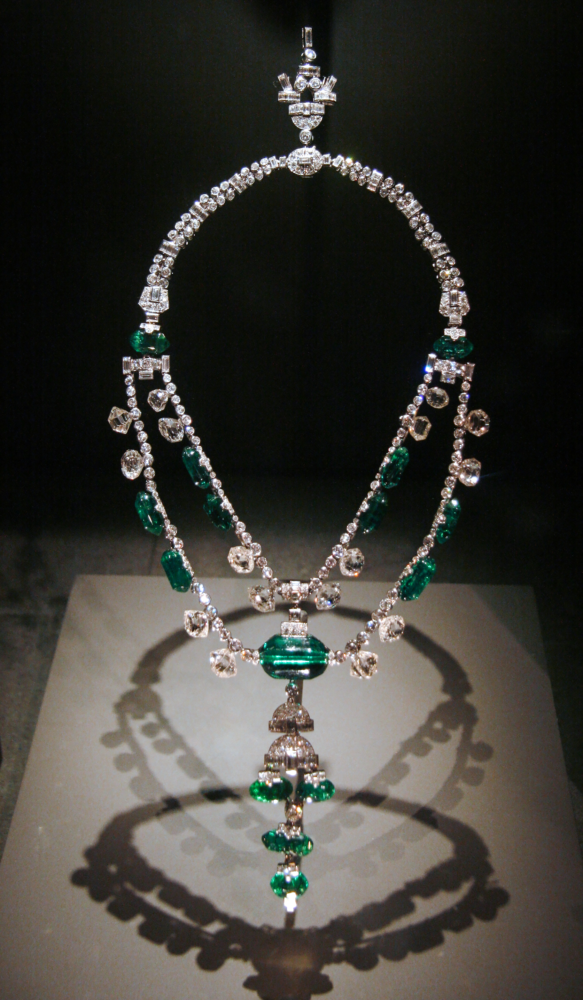</a>
  

    
Signature craft<time>1940s</time>

    <h3>Cluster Setting</h3>
    <dl class="maison-work-card__facts">
      
<dt>Gems</dt><dd>diamond</dd>

      
<dt>Craft</dt><dd>floating cluster arrangement</dd>

      
<dt>Style</dt><dd>diamond-led naturalism</dd>

    </dl>
    
Diamonds set at varied angles create a continuous floral sparkle, one of Harry Winston&#39;s most recognisable design languages.

    <a class="maison-work-card__source" href="https://commons.wikimedia.org/wiki/File:Spanish_Inquisition_Necklace_2.jpg" target="_blank" rel="noreferrer">Open source ↗</a>
  

</article>
<article class="maison-work-card">
  <a class="maison-work-card__media" href="https://commons.wikimedia.org/wiki/File:The_Hope_Diamond_(107006041).jpg" target="_blank" rel="noreferrer">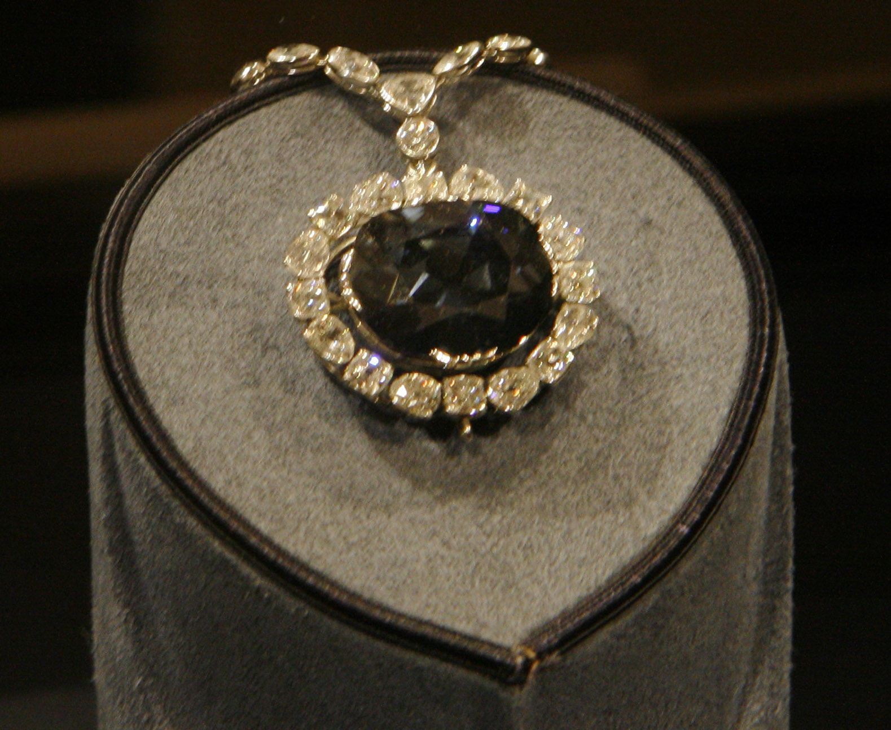</a>
  

    
Gemstone focus<time>1949–1958</time>

    <h3>Hope Diamond · Winston Archive</h3>
    <dl class="maison-work-card__facts">
      
<dt>Gems</dt><dd>diamond</dd>

      
<dt>Craft</dt><dd>historic diamond presentation and provenance</dd>

      
<dt>Style</dt><dd>diamond-led institutional archive</dd>

    </dl>
    
Harry Winston acquired the Hope Diamond in 1949 and donated it to the Smithsonian in 1958; this archive view links stone, display, and brand narrative.

    <a class="maison-work-card__source" href="https://commons.wikimedia.org/wiki/File:The_Hope_Diamond_(107006041).jpg" target="_blank" rel="noreferrer">Open source ↗</a>
  

</article>

</section>
<section class="maison-section" id="graff">
  <header class="maison-section__header">
    

MAISON · 1960
<h2>Graff</h2>

    
exceptional stones · provenance

  </header>
  
<article class="maison-work-card">
  <a class="maison-work-card__media" href="https://commons.wikimedia.org/wiki/File:Wittelsbach_diamond,_before_beeing_recut_by_Graff.png" target="_blank" rel="noreferrer">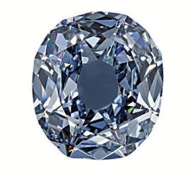</a>
  

    
Gemstone focus<time>17th century / recut 2008</time>

    <h3>Wittelsbach Diamond · Before Recut</h3>
    <dl class="maison-work-card__facts">
      
<dt>Gems</dt><dd>blue-diamond</dd>

      
<dt>Craft</dt><dd>historical diamond recutting</dd>

      
<dt>Style</dt><dd>exceptional coloured diamond</dd>

    </dl>
    
A public-domain archival view before recutting, useful for discussing gemstone history, cutting decisions, and brand narrative.

    
<strong>Archive relation</strong>Read this with the Graff post-recut records as one stone across two cutting states.

    <a class="maison-work-card__source" href="https://commons.wikimedia.org/wiki/File:Wittelsbach_diamond,_before_beeing_recut_by_Graff.png" target="_blank" rel="noreferrer">Open source ↗</a>
  

</article>
<article class="maison-work-card">
  <a class="maison-work-card__media" href="https://commons.wikimedia.org/wiki/File:Wittelsbach_Graff_Diamond.JPG" target="_blank" rel="noreferrer">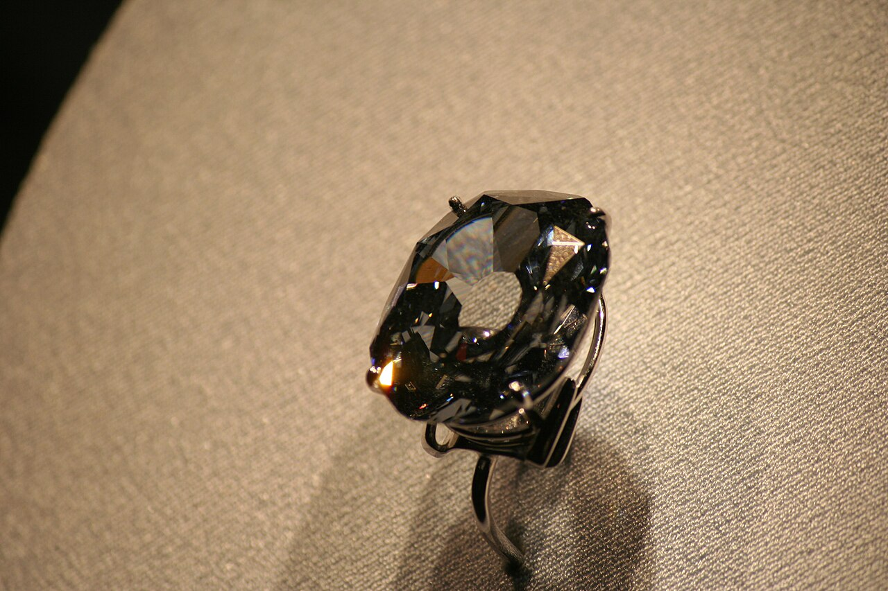</a>
  

    
Signature craft<time>2008 recut</time>

    <h3>Wittelsbach Diamond · After Recut</h3>
    <dl class="maison-work-card__facts">
      
<dt>Gems</dt><dd>blue-diamond</dd>

      
<dt>Craft</dt><dd>historical diamond recutting</dd>

      
<dt>Style</dt><dd>exceptional coloured diamond</dd>

    </dl>
    
An open-license post-recut view pairs with the earlier archive to study how Graff used cutting to renew visual and brand value; it is not a separate stone.

    
<strong>Archive relation</strong>Same stone as the preceding record, shown after recutting as a before/after comparison.

    <a class="maison-work-card__source" href="https://commons.wikimedia.org/wiki/File:Wittelsbach_Graff_Diamond.JPG" target="_blank" rel="noreferrer">Open source ↗</a>
  

</article>
<article class="maison-work-card">
  
  

    
Heritage piece<time>2008 recut</time>

    <h3>Wittelsbach Diamond · Cutting Study Record</h3>
    <dl class="maison-work-card__facts">
      
<dt>Gems</dt><dd>blue-diamond</dd>

      
<dt>Craft</dt><dd>precision faceting and provenance</dd>

      
<dt>Style</dt><dd>provenance-led luxury</dd>

    </dl>
    
The same open-license finished image is indexed here for a cutting study, separating a workshop record from the gemstone object; it is not another independent work.

    
<strong>Archive relation</strong>Shares the post-recut image source as a related cutting-study view, not a separate object.

    <a class="maison-work-card__source" href="https://commons.wikimedia.org/wiki/File:Wittelsbach_Graff_Diamond.JPG" target="_blank" rel="noreferrer">Open source ↗</a>
  

</article>

</section>
<section class="maison-section" id="chaumet">
  <header class="maison-section__header">
    

MAISON · 1780
<h2>Chaumet</h2>

    
tiara · history · geometry

  </header>
  
<article class="maison-work-card">
  <a class="maison-work-card__media" href="https://commons.wikimedia.org/wiki/File:Egyptian_brooch_-_Chaumet_(39643558802).jpg" target="_blank" rel="noreferrer">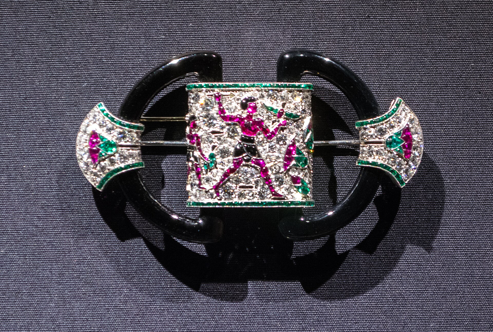</a>
  

    
Heritage piece<time>1920s</time>

    <h3>Egyptian Brooch</h3>
    <dl class="maison-work-card__facts">
      
<dt>Gems</dt><dd>diamond · emerald</dd>

      
<dt>Craft</dt><dd>geometric brooch construction</dd>

      
<dt>Style</dt><dd>Egyptian Revival</dd>

    </dl>
    
Egyptian Revival imagery meets geometric gemstone construction in a concise example of Chaumet&#39;s historical translation.

    <a class="maison-work-card__source" href="https://commons.wikimedia.org/wiki/File:Egyptian_brooch_-_Chaumet_(39643558802).jpg" target="_blank" rel="noreferrer">Open source ↗</a>
  

</article>
<article class="maison-work-card">
  <a class="maison-work-card__media" href="https://commons.wikimedia.org/wiki/File:Tiara_with_brier_rose_and_jasmine_by_Chaumet.jpg" target="_blank" rel="noreferrer">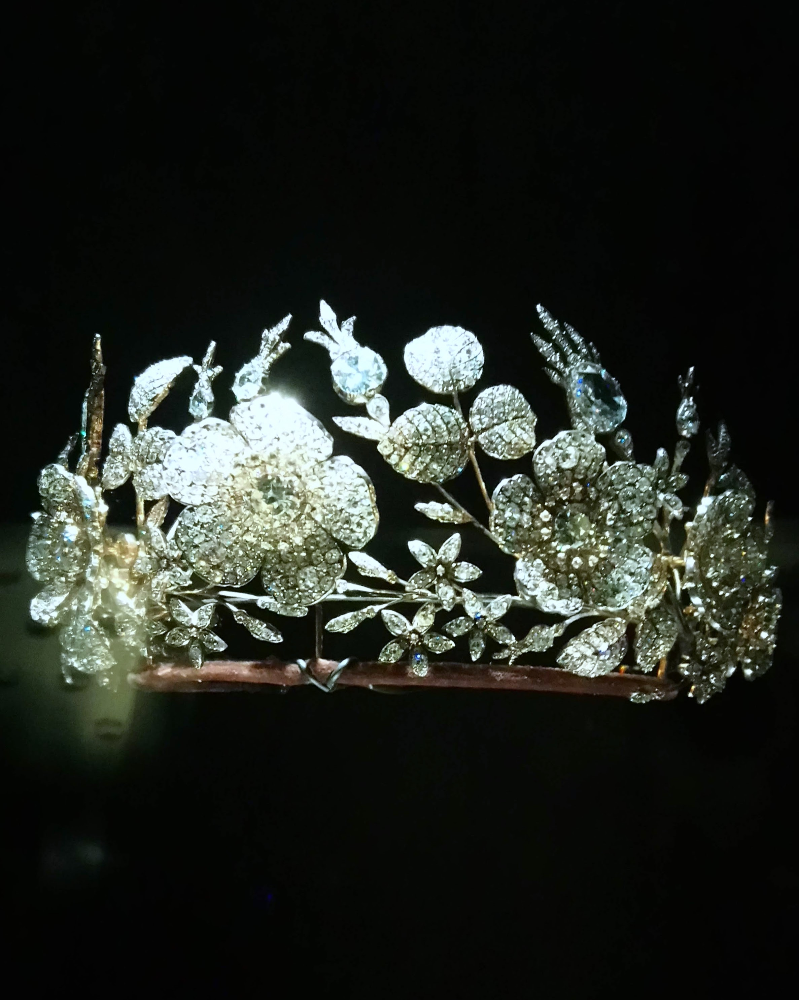</a>
  

    
Signature craft<time>1830</time>

    <h3>Brier Rose and Jasmine Tiara</h3>
    <dl class="maison-work-card__facts">
      
<dt>Gems</dt><dd>diamond · sapphire</dd>

      
<dt>Craft</dt><dd>floral tiara architecture</dd>

      
<dt>Style</dt><dd>Romantic historic jewellery</dd>

    </dl>
    
A 1830 Chaumet tiara by Jean-Baptiste Fossin translates brier rose and jasmine into a court-jewellery structure.

    <a class="maison-work-card__source" href="https://commons.wikimedia.org/wiki/File:Tiara_with_brier_rose_and_jasmine_by_Chaumet.jpg" target="_blank" rel="noreferrer">Open source ↗</a>
  

</article>
<article class="maison-work-card">
  <a class="maison-work-card__media" href="https://commons.wikimedia.org/wiki/File:Chaumet_vendome.JPG" target="_blank" rel="noreferrer">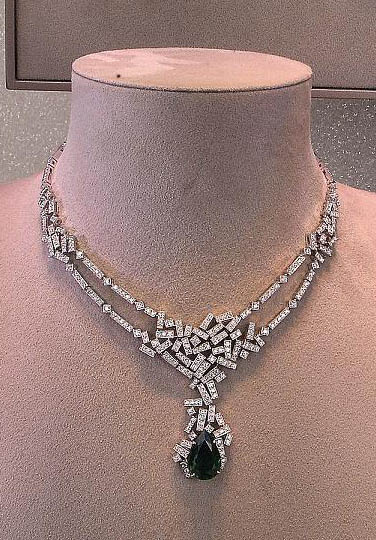</a>
  

    
Gemstone focus<time>20th century</time>

    <h3>Chaumet Vendôme Jewellery</h3>
    <dl class="maison-work-card__facts">
      
<dt>Gems</dt><dd>diamond</dd>

      
<dt>Craft</dt><dd>diamond necklace construction</dd>

      
<dt>Style</dt><dd>Place Vendôme formal jewellery</dd>

    </dl>
    
An open-license finished Chaumet view adds a diamond-jewellery sample focused on necklace proportion, reflection, and wearability.

    <a class="maison-work-card__source" href="https://commons.wikimedia.org/wiki/File:Chaumet_vendome.JPG" target="_blank" rel="noreferrer">Open source ↗</a>
  

</article>

</section>

<strong>Editorial boundary</strong>

Object or work sources and image-rights sources are recorded separately. Every card uses a local image, with reuse details maintained on the [image credits page](../image-credits); related records for one object are labelled on the card.

*Return to the [gallery overview](intro).*
