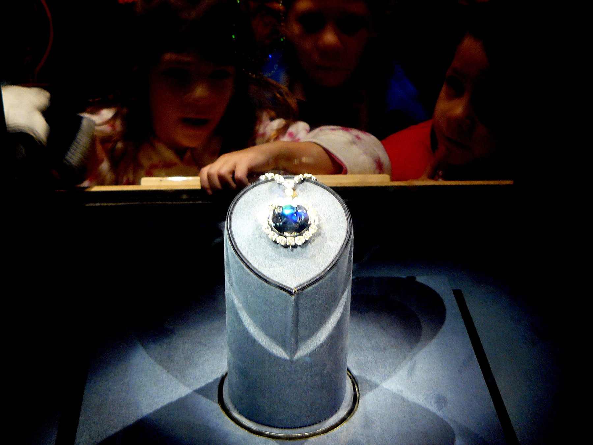
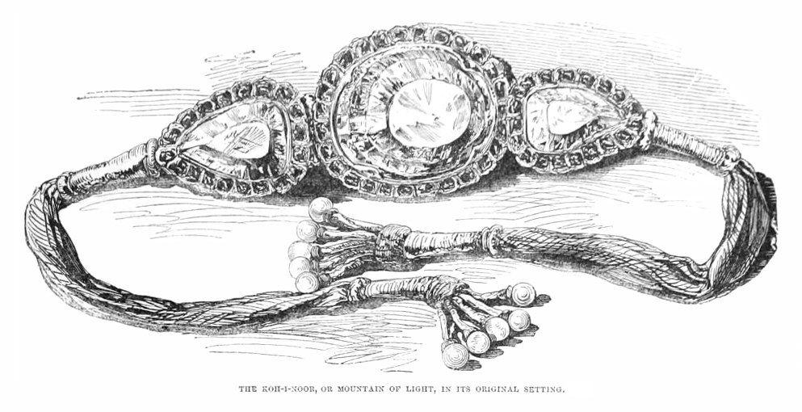
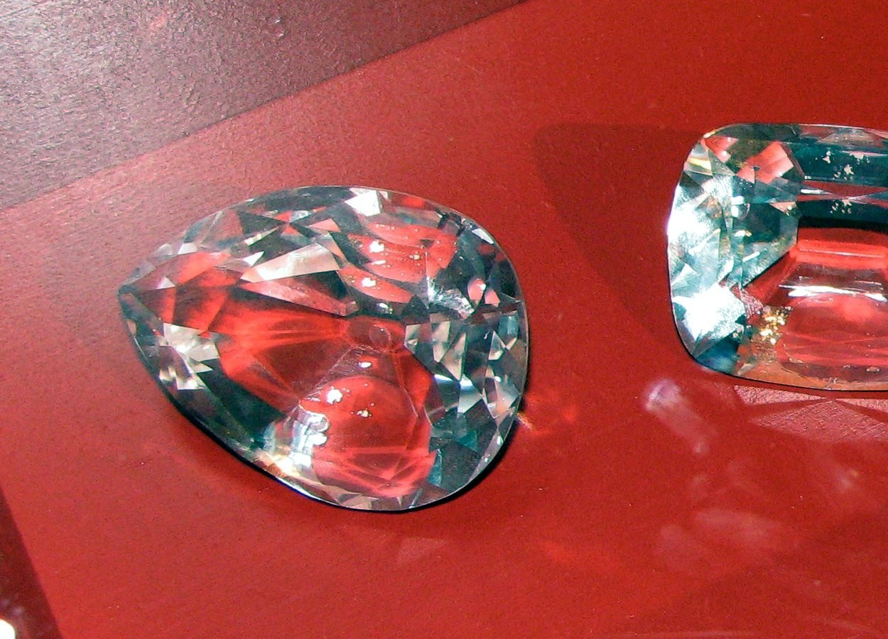
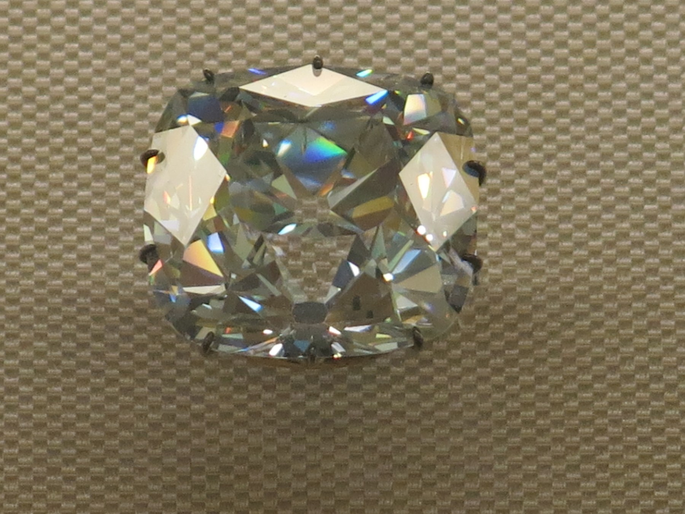
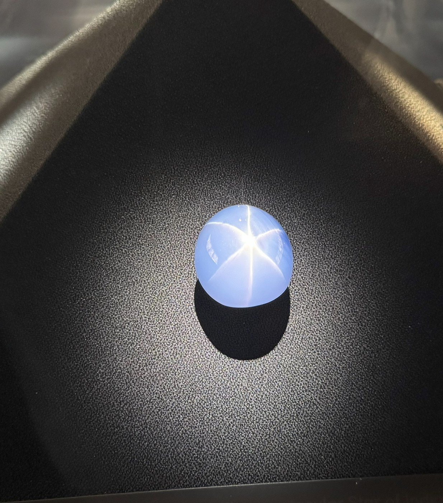

# Legendary Stones

## Overview

A few stones outlive their owners through size, colour, or history —
the Hope blue diamond, Koh-i-Noor, the Cullinans, the Regent, the Star
of India. Their stories are as precious as the gems themselves.

## Core Principles

- Hope (45.52 ct): the most famous blue diamond; cut from the French Blue; Smithsonian.
- Koh-i-Noor (105.6 ct): the Mughal "Mountain of Light"; crown of the UK.
- Cullinan I (530.2 ct): largest top-quality cut diamond, the "Great Star of Africa", in the Sovereign's Sceptre.
- Regent (140.6 ct): set in Louis XV's crown; now in the Louvre.
- Star of India (563 ct): largest star sapphire; American Museum of Natural History.

## Visual Archive

The five local images below correspond to the stones listed on this page. See the [image credits](../image-credits) page for source and reuse details.

<article class="maison-work-card">
  
  

    
45.52 ct · blue diamond

    <h3>Hope Diamond</h3>
    
Smithsonian display; ex-French Blue

    
<a href="https://commons.wikimedia.org/wiki/File:Hope_Diamond_Smithsonian.jpg" target="_blank" rel="noreferrer">View source file</a>

  

</article>
<article class="maison-work-card">
  
  

    
105.6 ct · historical diamond

    <h3>Koh-i-Noor</h3>
    
Historical illustration; original setting

    
<a href="https://commons.wikimedia.org/wiki/File:Kohinoor.jpg" target="_blank" rel="noreferrer">View source file</a>

  

</article>
<article class="maison-work-card">
  
  

    
530.2 ct · D-colour diamond

    <h3>Cullinan I</h3>
    
The Great Star of Africa; Sovereign's Sceptre

    
<a href="https://commons.wikimedia.org/wiki/File:Cullinan_Diamond_and_some_of_its_cuts_-_copy.jpg" target="_blank" rel="noreferrer">View source file</a>

  

</article>
<article class="maison-work-card">
  
  

    
140.6 ct · historic diamond

    <h3>Regent Diamond</h3>
    
Louis XV's crown; Louvre collection

    
<a href="https://commons.wikimedia.org/wiki/File:Diamant_le_R%C3%A9gent_%28Louvre%29.jpg" target="_blank" rel="noreferrer">View source file</a>

  

</article>
<article class="maison-work-card">
  
  

    
563 ct · star sapphire

    <h3>Star of India</h3>
    
American Museum of Natural History

    
<a href="https://commons.wikimedia.org/wiki/File:Star_Of_India_Gem2.jpg" target="_blank" rel="noreferrer">View source file</a>

  

</article>

## Examples

| Piece | Detail | Note |
|---|---|---|
| Hope Diamond | 45.52 ct, blue | Smithsonian, ex-French Blue |
| Cullinan I | 530.2 ct, D colour | Sovereign's Sceptre |
| Star of India | 563 ct, star sapphire | NY Natural History |

*See the [gallery overview](intro).*
