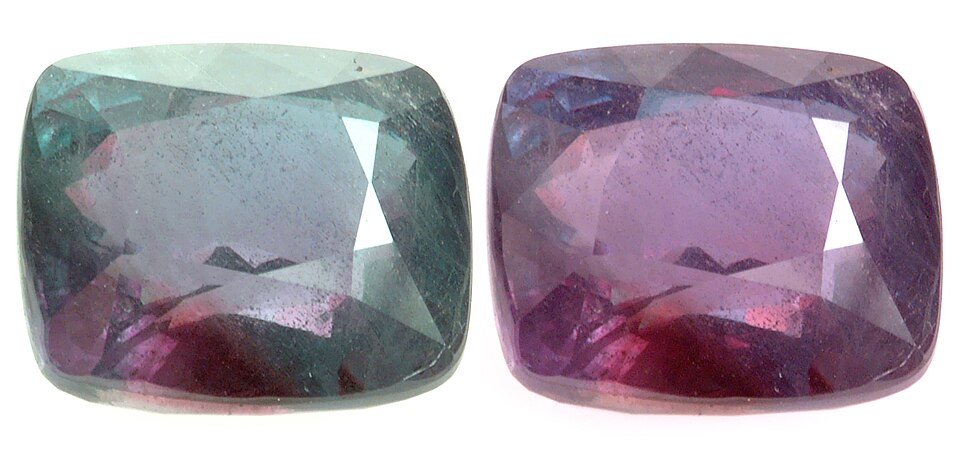
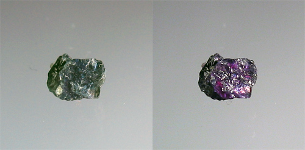
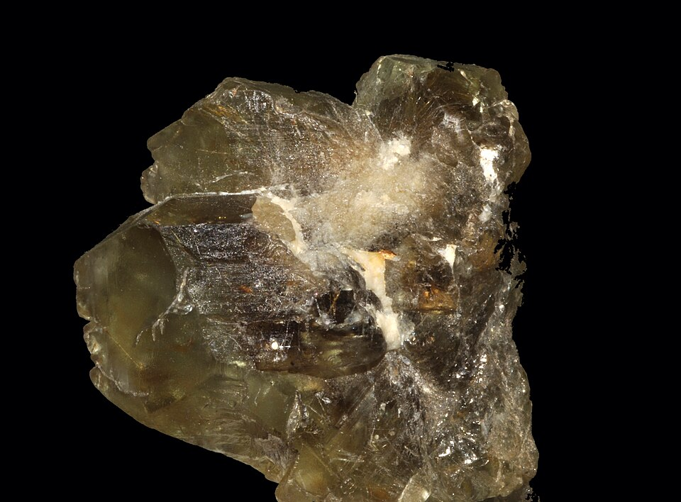
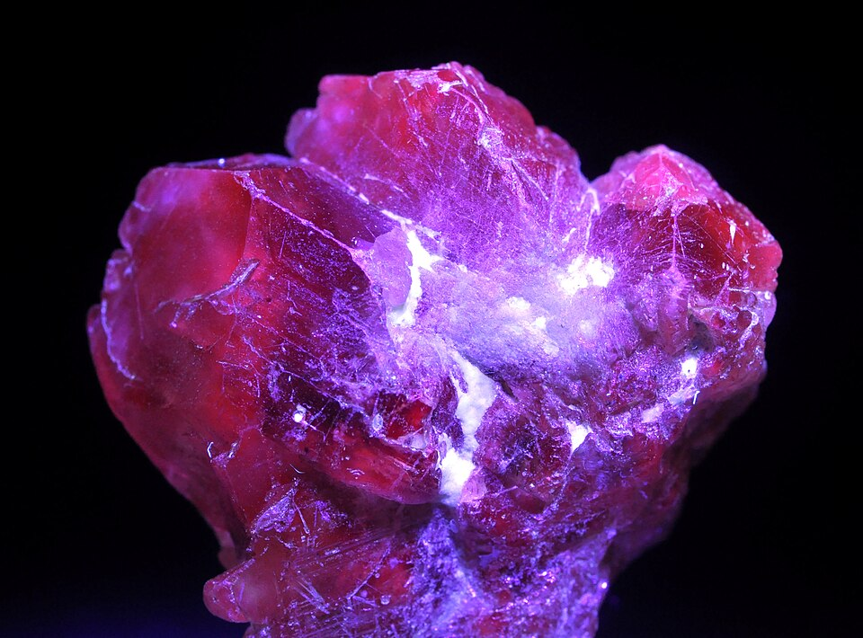

# Alexandrite

> Chrysoberyl

<!-- language switcher hint -->
中文: [亚历山大石](/zh/gems/alexandrite)

---

## Classification

| Property | Value |
|---|---|
| Mineral Family | Chrysoberyl |
| Formula | BeAl₂O₄ |
| Crystal System | orthorhombic |

## Physical Properties

| Property | Value |
|---|---|
| Mohs Hardness | 8.5 |
| Specific Gravity | 3.73 |
| Refractive Index | 1.746-1.755 |

## Optical Properties

| Property | Value |
|---|---|
| Pleochroism | strong |
| Typical Colors | Green in daylight, Red in incandescent light |
| Color Cause | Cr³⁺ causes color-change effect |

## Treatments & Disclosure

| Treatment | Details |
|-----------|---------|
| Common Methods | None / Typically untreated |
| Disclosure Required | No |
| Note | Virtually untreated; origin commands significant premium |

## Origin

| Region |
|---|
| Ural Mountains, Russia |
| Brazil |
| Sri Lanka |

## History & Lore

Discovered in the Urals in 1830 and named for Tsar Alexander II. Its green-to-red colour change makes it among the rarest gems.

## Gallery

