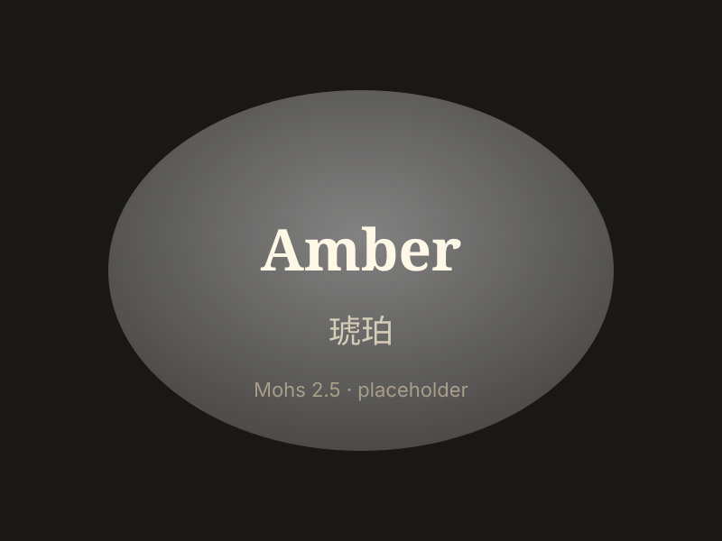

# Amber

> Organic (fossil resin)

<!-- language switcher hint -->
中文: [琥珀](/zh/gems/amber)

---

## Classification

| Property | Value |
|---|---|
| Mineral Family | Organic (fossil resin) |
| Formula | C₁₀H₁₆O (polymerised resin) |
| Crystal System | amorphous |

## Physical Properties

| Property | Value |
|---|---|
| Mohs Hardness | 2.5 (Soft) |
| Specific Gravity | 1.08 |
| Refractive Index | 1.54 |

## Optical Properties

| Property | Value |
|---|---|
| Pleochroism | none |
| Typical Colors | Honey, Deep red, Blue (Dominican) |
| Color Cause | Resin oxidation, trace S/Fe |

## Treatments & Disclosure

| Treatment | Details |
|-----------|---------|
| Common Methods | heating |
| Disclosure Required | Yes |
| Note | Baltic amber most common; insect inclusions most prized |

## Origin

| Region |
|---|
| Baltic Sea |
| Myanmar |
| Dominican Republic |
| Mexico |

## History & Lore

Amber fossilises ancient resin, preserving insects and plants. Baltic amber was traded to Rome and China since antiquity.

## Gallery

