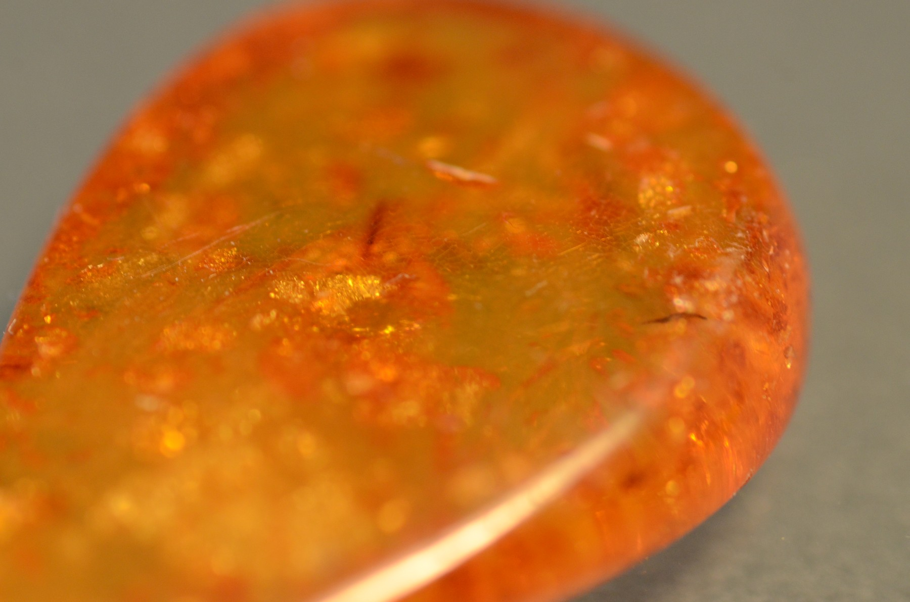
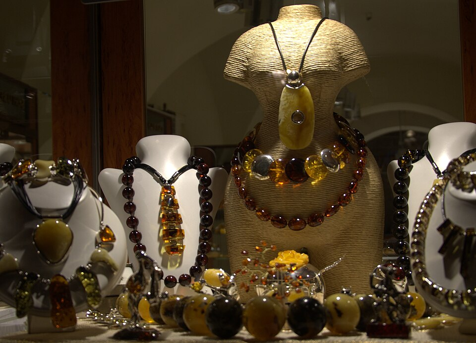
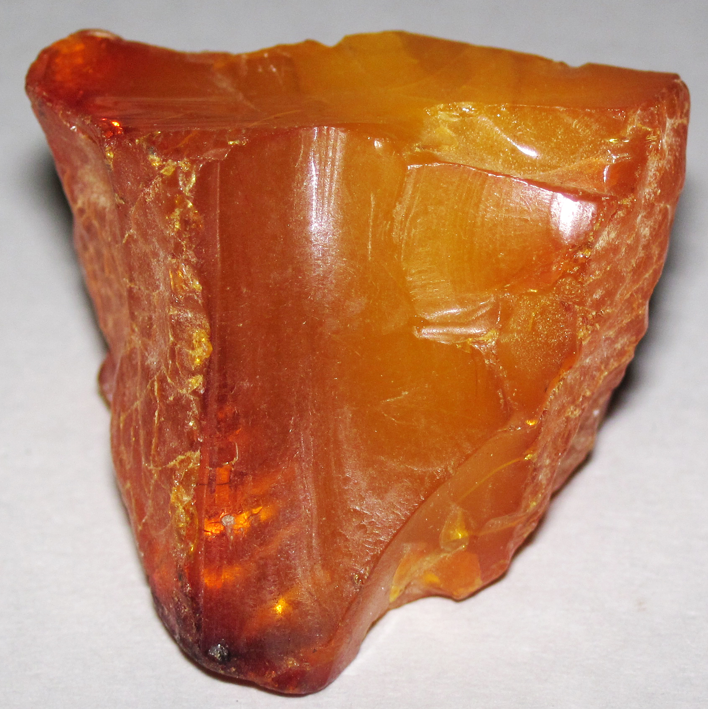
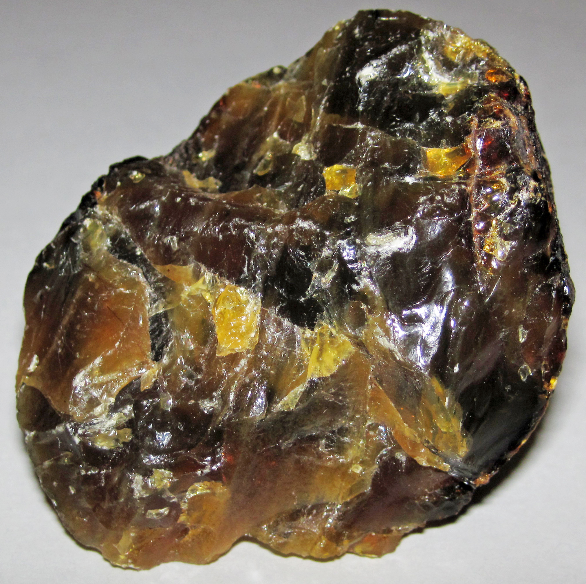

<a href="./">Gemstone Index</a>/Amber

  

    
GEM ATLAS / 04

    <h1 id="gem-detail-title-amber">Amber琥珀</h1>
    
Mineral identityOrganic (fossil resin)

    <dl class="gem-detail__identity-facts">
      
<dt>Formula</dt><dd>C₁₀H₁₆O (polymerised resin)</dd>

      
<dt>Crystal system</dt><dd>Amorphous</dd>

    </dl>
    <dl class="gem-detail__quick-facts">
      
<dt>Mohs</dt><dd>2.5</dd>

      
<dt>Specific gravity</dt><dd>1.08</dd>

      
<dt>Refractive index</dt><dd>1.54</dd>

    </dl>
    <a class="gem-detail__language" href="../zh/gems/amber.html" hreflang="zh-CN">中文: 琥珀 ↗</a>
  

  <figure class="gem-detail__hero-media"><figcaption>Primary viewVisual identification</figcaption></figure>

## Classification

IDENTITY / SPECIES RECORD

<table class="gem-detail__table">
  <thead><tr><th scope="col">Property</th><th scope="col">Value</th></tr></thead>
  <tbody><tr><th scope="row">Mineral Family</th><td>Organic (fossil resin)</td></tr><tr><th scope="row">Formula</th><td>C₁₀H₁₆O (polymerised resin)</td></tr><tr><th scope="row">Crystal System</th><td>Amorphous</td></tr></tbody>
</table>

## Physical Properties

<table class="gem-detail__table">
  <thead><tr><th scope="col">Property</th><th scope="col">Value</th></tr></thead>
  <tbody><tr><th scope="row">Mohs Hardness</th><td>2.5 (Soft)</td></tr><tr><th scope="row">Specific Gravity</th><td>1.08</td></tr><tr><th scope="row">Refractive Index</th><td>1.54</td></tr></tbody>
</table>

## Optical Properties

<table class="gem-detail__table">
  <thead><tr><th scope="col">Property</th><th scope="col">Value</th></tr></thead>
  <tbody><tr><th scope="row">Pleochroism</th><td>None</td></tr><tr><th scope="row">Typical Colors</th><td>Honey, Deep red, Blue (Dominican)</td></tr><tr><th scope="row">Color Cause</th><td>Resin oxidation, trace S/Fe</td></tr></tbody>
</table>

## Treatments & Disclosure

  
Common methods<strong>Heating</strong>

  
Disclosure required<strong class="is-required">Yes</strong>

  
NoteBaltic amber most common; insect inclusions most prized

## Origin Records

Representative localities<ul><li>Baltic Sea</li><li>Myanmar</li><li>Dominican Republic</li><li>Mexico</li></ul>

## History & Lore

Amber fossilises ancient resin, preserving insects and plants. Baltic amber was traded to Rome and China since antiquity. 

## Image Evidence

<figure><figcaption>Evidence 01</figcaption></figure>
<figure><figcaption>Evidence 02</figcaption></figure>
<figure><figcaption>Evidence 03</figcaption></figure>

CONTINUE EXPLORING<i aria-hidden="true">/</i><small>继续阅读</small>

<nav class="gem-detail__pager" aria-label="Gemstone record navigation">
<a class="gem-detail__pager-link gem-detail__pager-link--previous" href="./amazonite.html" aria-label="Previous Amazonite"><i aria-hidden="true">←</i>Previous<strong>Amazonite</strong><small>天河石</small></a>
<a class="gem-detail__pager-index" href="./" aria-label="Return to gemstone index">Return to index<strong>04 / 60</strong><small>All species</small></a>
<a class="gem-detail__pager-link gem-detail__pager-link--next" href="./amethyst.html" aria-label="Next Amethyst">Next<strong>Amethyst</strong><small>紫晶</small><i aria-hidden="true">→</i></a>
</nav>

