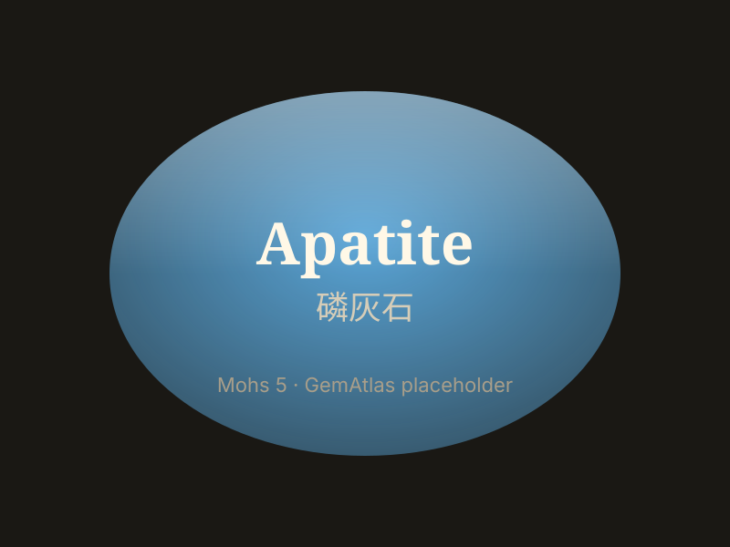

# Apatite

> Phosphate

<!-- language switcher hint -->
中文: [磷灰石](/zh/gems/apatite)

---

## Classification

| Property | Value |
|---|---|
| Mineral Family | Phosphate |
| Formula | Ca₅(PO₄)₃(F,OH,Cl) |
| Crystal System | hexagonal |

## Physical Properties

| Property | Value |
|---|---|
| Mohs Hardness | 5 (Soft — rarely faceted) |
| Specific Gravity | 3.17 |
| Refractive Index | 1.63-1.65 |

## Optical Properties

| Property | Value |
|---|---|
| Pleochroism | weak |
| Typical Colors | Paraíba-blue, Mint green, Yellow |
| Color Cause | Rare-earth gives Paraíba blue |

## Treatments & Disclosure

| Treatment | Details |
|-----------|---------|
| Common Methods | None / Typically untreated |
| Disclosure Required | No |
| Note | Burmese Paraíba-blue apatite prized by collectors |

## Origin

| Region |
|---|
| Myanmar |
| Madagascar |
| Brazil |
| Mexico |

## History & Lore

Apatite forms human bones and teeth; gem apatite is sought for its Paraíba-like blue.

## Gallery

