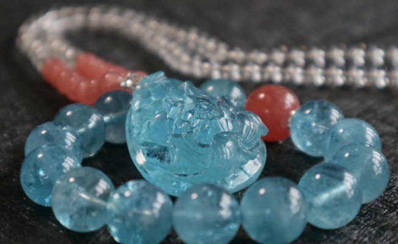

# Aquamarine

> Beryl

<!-- language switcher hint -->
中文: [海蓝宝](/zh/gems/aquamarine)

---

## Classification

| Property | Value |
|---|---|
| Mineral Family | Beryl |
| Formula | Be₃Al₂Si₆O₁₈ |
| Crystal System | hexagonal |

## Physical Properties

| Property | Value |
|---|---|
| Mohs Hardness | 7.75 |
| Specific Gravity | 2.68 |
| Refractive Index | 1.564-1.596 |

## Optical Properties

| Property | Value |
|---|---|
| Pleochroism | weak |
| Typical Colors | Sky blue, Sea blue, Greenish blue |
| Color Cause | Fe²⁺ ion absorbs red-yellow light → transmitted blue-green |

## Treatments & Disclosure

| Treatment | Details |
|-----------|---------|
| Common Methods | heat-treatment |
| Disclosure Required | Yes |
| Note | Heat treatment can convert greenish hues to stable blue |

## Origin

| Region |
|---|
| Minas Gerais, Brazil |
| Madagascar |
| Pakistan |

## History & Lore

Beryl cousin of emerald. Brazil's Minas Gerais yields the finest aquamarine, long a sailor's talisman.

