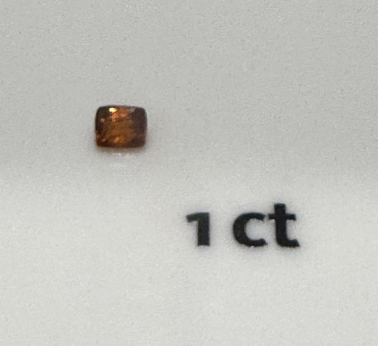
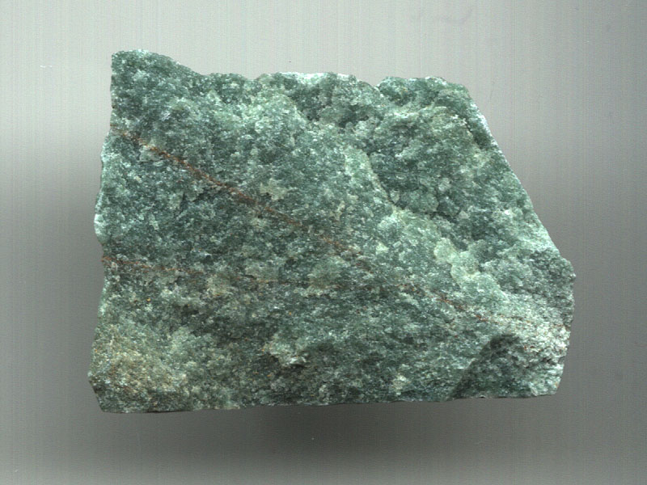
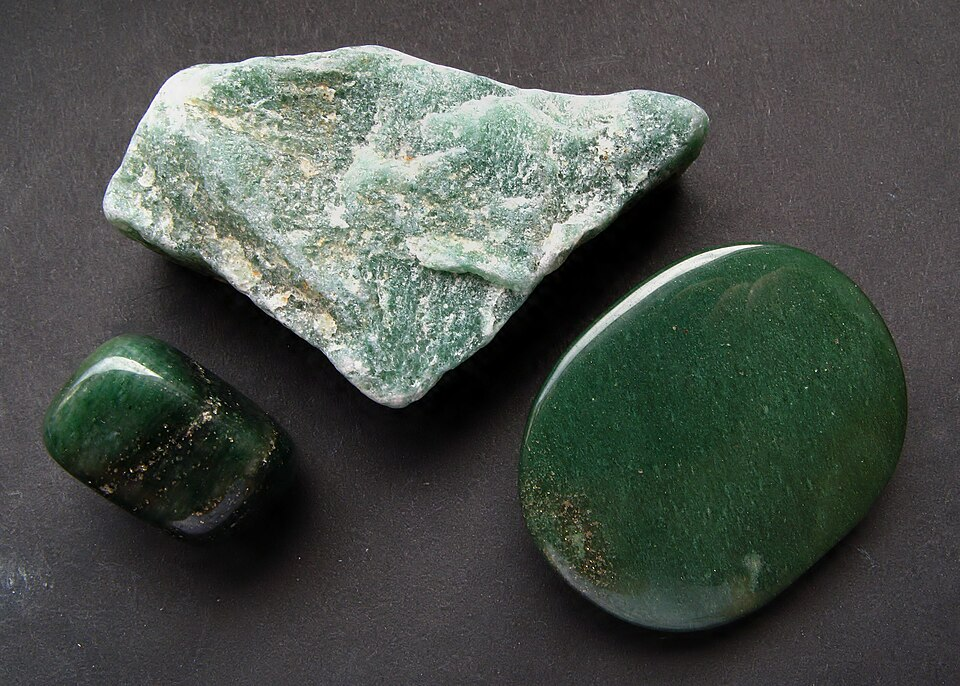

# Aventurine Quartz

> Quartz (microcrystalline)

<!-- language switcher hint -->
中文: [东陵石 / 砂金石](/zh/gems/aventurine-quartz)

---

## Classification

| Property | Value |
|---|---|
| Mineral Family | Quartz (microcrystalline) |
| Formula | SiO₂ + Cr-mica / hematite |
| Crystal System | trigonal |

## Physical Properties

| Property | Value |
|---|---|
| Mohs Hardness | 7 |
| Specific Gravity | 2.64 |
| Refractive Index | 1.544-1.553 |

## Optical Properties

| Property | Value |
|---|---|
| Pleochroism | none |
| Typical Colors | Green, Red-brown, Blue |
| Color Cause | Green from fuchsite (chrome mica) inclusions; red-brown from hematite |

## Treatments & Disclosure

| Treatment | Details |
|-----------|---------|
| Common Methods | dyeing |
| Disclosure Required | Yes |
| Note | Commercial blue varieties are often dyed; green is the most common natural color, sourced mainly from India |

## Gallery

