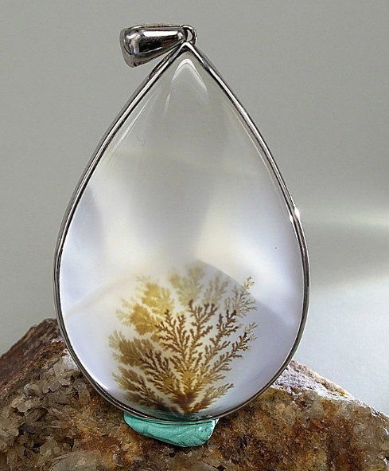
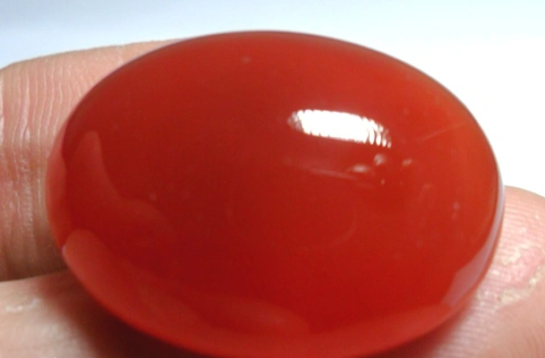
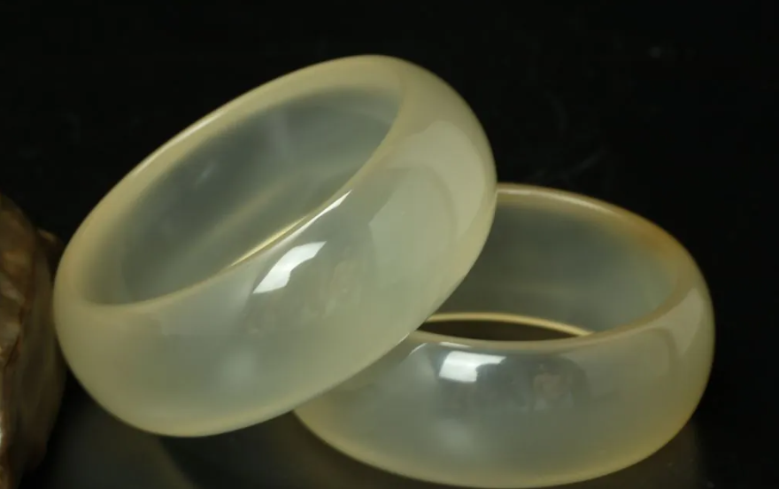
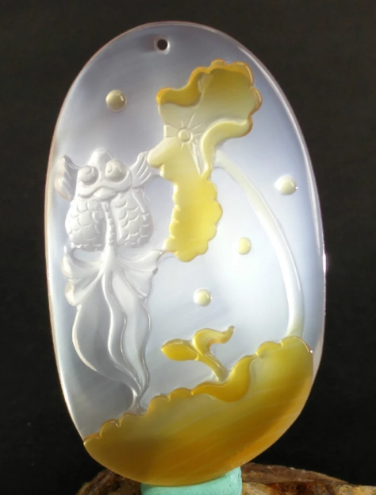

# Chalcedony / Agate

> Quartz (microcrystalline)

<!-- language switcher hint -->
中文: [玉髓 / 玛瑙](/zh/gems/chalcedony)

---

## Classification

| Property | Value |
|---|---|
| Mineral Family | Quartz (microcrystalline) |
| Formula | SiO₂ |
| Crystal System | trigonal |

## Physical Properties

| Property | Value |
|---|---|
| Mohs Hardness | 7 |
| Specific Gravity | 2.6 |
| Refractive Index | 1.530-1.543 |

## Optical Properties

| Property | Value |
|---|---|
| Pleochroism | none |
| Typical Colors | Multi-color banded (agate), Blue (blue chalcedony), Black (onyx), White, Red (carnelian / sard) |
| Color Cause | Impurity / inclusion coloration; dyeing is very common in commercial material |

## Treatments & Disclosure

| Treatment | Details |
|-----------|---------|
| Common Methods | dyeing, heat-treatment |
| Disclosure Required | Yes |
| Note | Agate dyeing techniques are thousands of years old; nearly all black and blue agate on the market is dyed |

## Gallery

