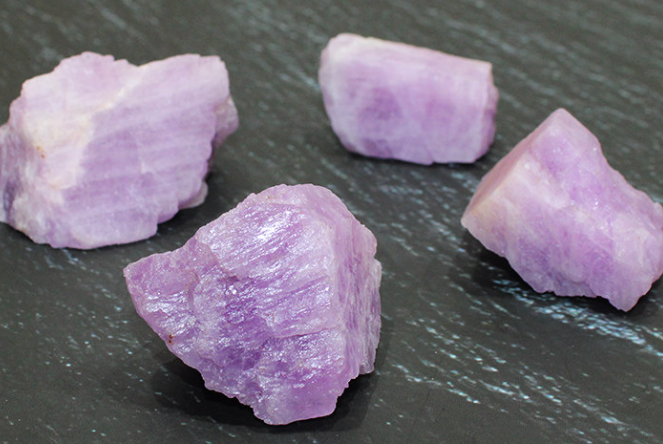
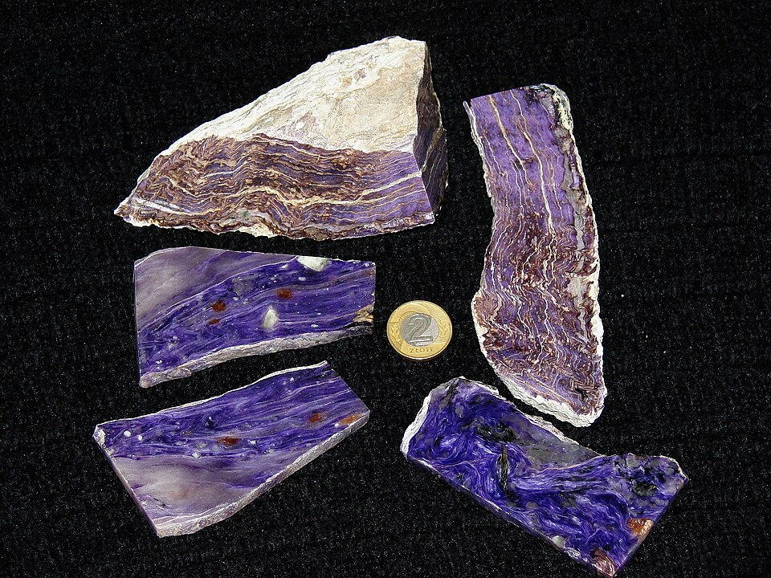
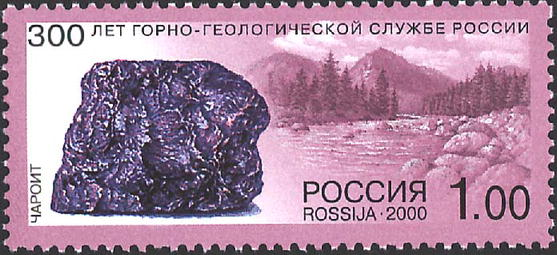
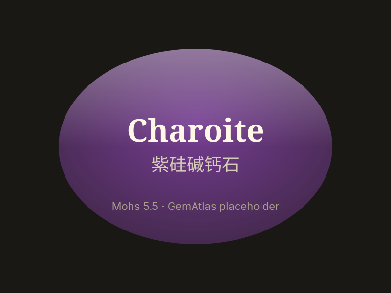

# Charoite

> Inosilicate

<!-- language switcher hint -->
中文: [紫硅碱钙石](/zh/gems/charoite)

---

## Classification

| Property | Value |
|---|---|
| Mineral Family | Inosilicate |
| Formula | (K,Sr,Ba,Na)₁₅₋₁₆(Ca,Na)₃₂[Si₆O₁₁(O,OH)₆]₂[Si₈O₂₂]₂(OH,F)₄·~1.5H₂O |
| Crystal System | monoclinic |

## Physical Properties

| Property | Value |
|---|---|
| Mohs Hardness | 5.5 |
| Specific Gravity | 2.54 |
| Refractive Index | 1.550-1.559 |

## Optical Properties

| Property | Value |
|---|---|
| Pleochroism | strong |
| Typical Colors | Violet, Purple (with silky luster), Pale lavender |
| Color Cause | Mn²⁺/Fe³⁺ violet; fibrous structure produces silky luster |

## Treatments & Disclosure

| Treatment | Details |
|-----------|---------|
| Common Methods | None / Typically untreated |
| Disclosure Required | No |
| Note | Only found at the Chara River, Sakha Republic, Russia |

## Origin

| Region |
|---|
| Siberia, Russia |

## History & Lore

Charoite comes only from Siberia's Chara River, confirmed in the 1970s; its purple silky chatoyancy is one-of-a-kind.

## Gallery

