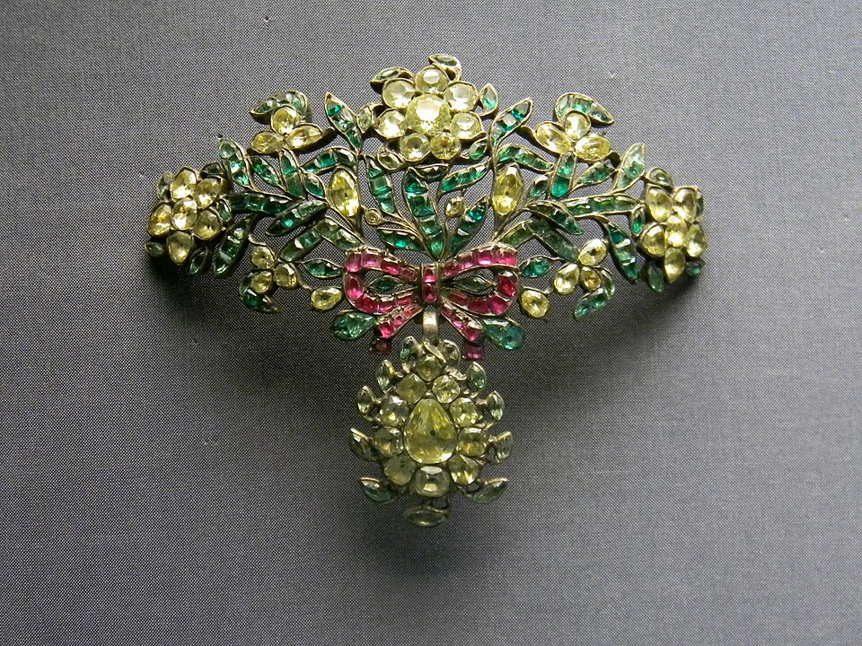
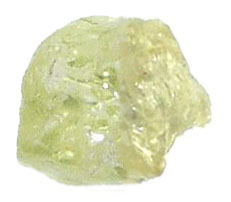
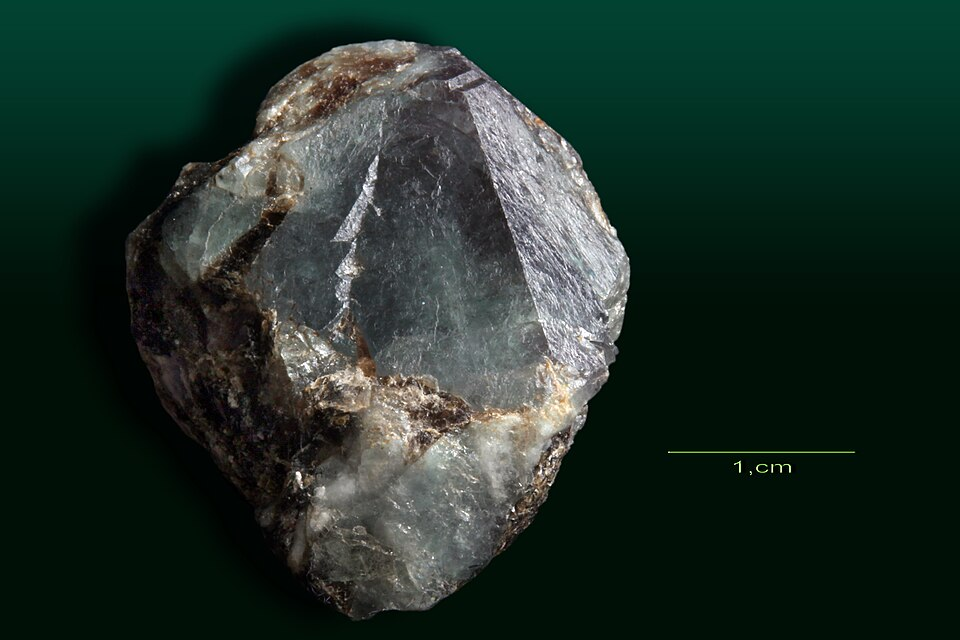
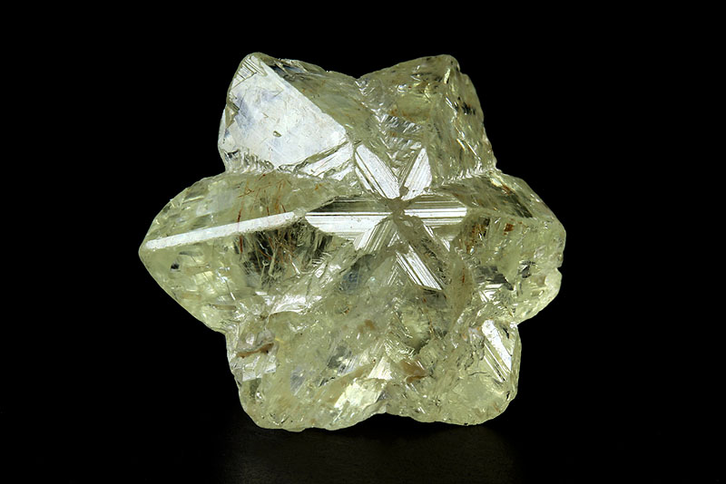

# Chrysoberyl

> Chrysoberyl

<!-- language switcher hint -->
中文: [金绿宝石](/zh/gems/chrysoberyl)

---

## Classification

| Property | Value |
|---|---|
| Mineral Family | Chrysoberyl |
| Formula | BeAl₂O₄ |
| Crystal System | orthorhombic |

## Physical Properties

| Property | Value |
|---|---|
| Mohs Hardness | 8.5 |
| Specific Gravity | 3.72 |
| Refractive Index | 1.745-1.755 |

## Optical Properties

| Property | Value |
|---|---|
| Pleochroism | strong |
| Typical Colors | Pale yellow, Honey yellow, Greenish yellow |
| Color Cause | Fe³⁺ produces yellow-green |

## Treatments & Disclosure

| Treatment | Details |
|-----------|---------|
| Common Methods | None / Typically untreated |
| Disclosure Required | No |
| Note | Same mineral species as alexandrite; cymophane (cat's-eye) is the prized variety |

## Gallery

