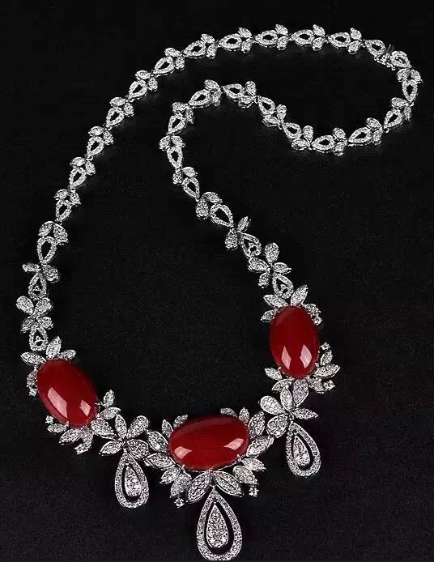
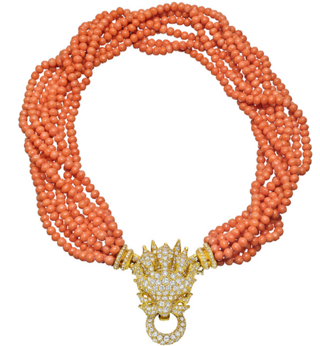
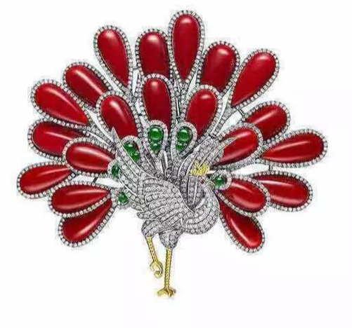
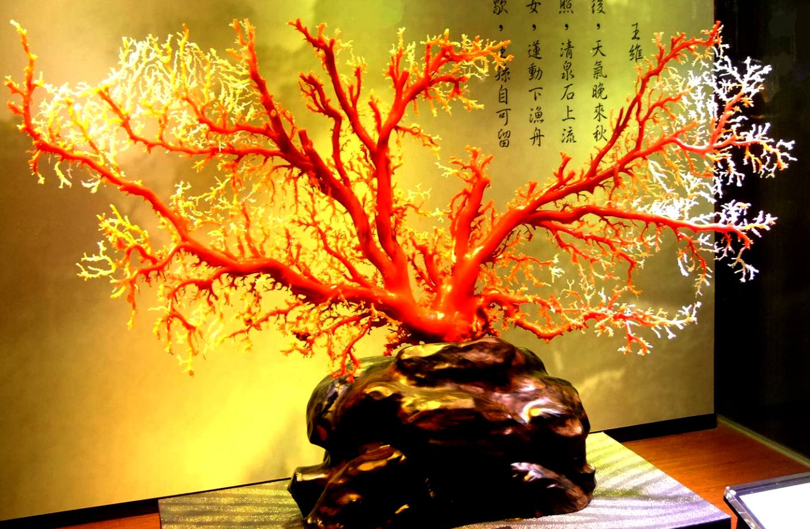

# Coral (gem-grade)

> Organic (coral skeleton)

<!-- language switcher hint -->
中文: [珊瑚（宝石级）](/zh/gems/coral)

---

## Classification

| Property | Value |
|---|---|
| Mineral Family | Organic (coral skeleton) |
| Formula | CaCO₃ (calcite) |
| Crystal System | amorphous |

## Physical Properties

| Property | Value |
|---|---|
| Mohs Hardness | 3.5 (Soft) |
| Specific Gravity | 2.65 |
| Refractive Index | 1.49-1.66 |

## Optical Properties

| Property | Value |
|---|---|
| Pleochroism | none |
| Typical Colors | Deep red (aka), Pink (momo), White, Angel skin |
| Color Cause | Iron / organic pigments |

## Treatments & Disclosure

| Treatment | Details |
|-----------|---------|
| Common Methods | waxing, dyeing |
| Disclosure Required | Yes |
| Note | Japanese aka deep-red priciest; avoid acid and heat |

## Origin

| Region |
|---|
| Japan |
| Mediterranean |
| Taiwan |
| Hawaii |

## History & Lore

Coral has adorned religions and royals since antiquity; Rome prized it as lightning-proof. Japanese aka coral was treasured in Ming-Qing China.

## Gallery

