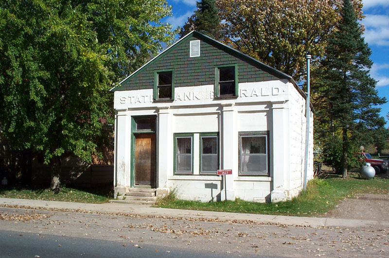

<a href="./">Gemstone Index</a>/Emerald

  

    
GEM ATLAS / 18

    <h1 id="gem-detail-title-emerald">Emerald祖母绿</h1>
    
Mineral identityBeryl

    <dl class="gem-detail__identity-facts">
      
<dt>Formula</dt><dd>Be₃Al₂Si₆O₁₈</dd>

      
<dt>Crystal system</dt><dd>Hexagonal</dd>

    </dl>
    <dl class="gem-detail__quick-facts">
      
<dt>Mohs</dt><dd>7.75</dd>

      
<dt>Specific gravity</dt><dd>2.72</dd>

      
<dt>Refractive index</dt><dd>1.577-1.583</dd>

    </dl>
    <a class="gem-detail__language" href="../zh/gems/emerald.html" hreflang="zh-CN">中文: 祖母绿 ↗</a>
  

  <figure class="gem-detail__hero-media"><figcaption>Primary viewVisual identification</figcaption></figure>

## Classification

IDENTITY / SPECIES RECORD

<table class="gem-detail__table">
  <thead><tr><th scope="col">Property</th><th scope="col">Value</th></tr></thead>
  <tbody><tr><th scope="row">Mineral Family</th><td>Beryl</td></tr><tr><th scope="row">Formula</th><td>Be₃Al₂Si₆O₁₈</td></tr><tr><th scope="row">Crystal System</th><td>Hexagonal</td></tr></tbody>
</table>

## Physical Properties

<table class="gem-detail__table">
  <thead><tr><th scope="col">Property</th><th scope="col">Value</th></tr></thead>
  <tbody><tr><th scope="row">Mohs Hardness</th><td>7.75 (Brittle; avoid impact)</td></tr><tr><th scope="row">Specific Gravity</th><td>2.72</td></tr><tr><th scope="row">Refractive Index</th><td>1.577-1.583</td></tr></tbody>
</table>

## Optical Properties

<table class="gem-detail__table">
  <thead><tr><th scope="col">Property</th><th scope="col">Value</th></tr></thead>
  <tbody><tr><th scope="row">Pleochroism</th><td>Weak</td></tr><tr><th scope="row">Typical Colors</th><td>Muzo Green, Colombian Green</td></tr><tr><th scope="row">Color Cause</th><td>Chromium and/or vanadium trace ions</td></tr></tbody>
</table>

## Treatments & Disclosure

  
Common methods<strong>Cedar-oil filling</strong>

  
Disclosure required<strong class="is-required">Yes</strong>

  
NoteCedar-oil filling is industry standard; &quot;no oil&quot; commands significant premiums

## Origin Records

Representative localities<ul><li>Muzo / Chivor, Colombia</li><li>Zambia</li><li>Brazil</li></ul>

## History & Lore

Colombian Muzo greens with a blue cast are most prized; Spanish colonists mined them from the 1500s. Cleopatra&#39;s Egyptian mines are the oldest known source. 

## Image Evidence

<figure><figcaption>Evidence 01</figcaption></figure>
<figure><figcaption>Evidence 02</figcaption></figure>

CONTINUE EXPLORING<i aria-hidden="true">/</i><small>继续阅读</small>

<nav class="gem-detail__pager" aria-label="Gemstone record navigation">
<a class="gem-detail__pager-link gem-detail__pager-link--previous" href="./dioptase.html" aria-label="Previous Dioptase"><i aria-hidden="true">←</i>Previous<strong>Dioptase</strong><small>透视石</small></a>
<a class="gem-detail__pager-index" href="./" aria-label="Return to gemstone index">Return to index<strong>18 / 60</strong><small>All species</small></a>
<a class="gem-detail__pager-link gem-detail__pager-link--next" href="./fluorite.html" aria-label="Next Fluorite">Next<strong>Fluorite</strong><small>萤石</small><i aria-hidden="true">→</i></a>
</nav>

