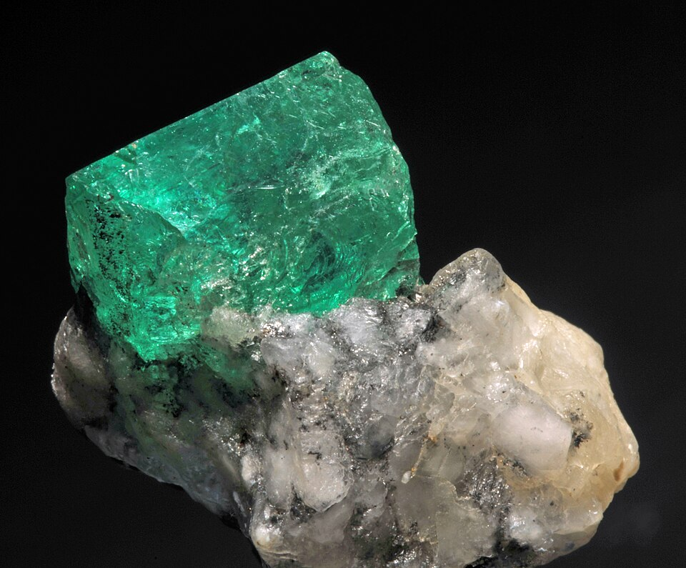
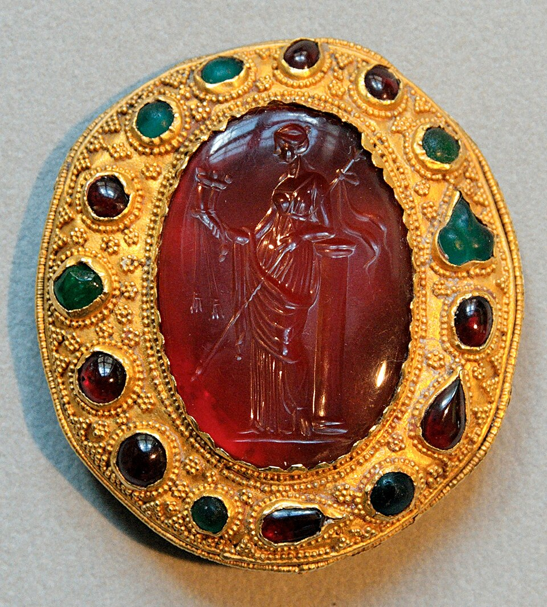
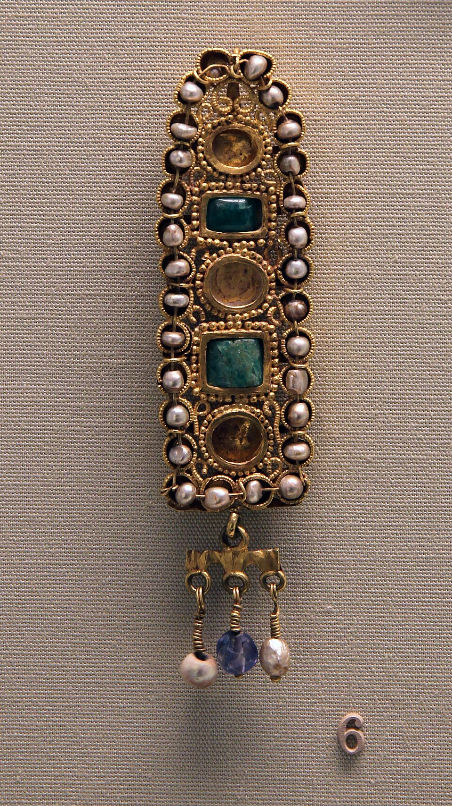

# Emerald

> Beryl

<!-- language switcher hint -->
中文: [祖母绿](/zh/gems/emerald)

---

## Classification

| Property | Value |
|---|---|
| Mineral Family | Beryl |
| Formula | Be₃Al₂Si₆O₁₈ |
| Crystal System | hexagonal |

## Physical Properties

| Property | Value |
|---|---|
| Mohs Hardness | 7.75 (Brittle; avoid impact) |
| Specific Gravity | 2.72 |
| Refractive Index | 1.577-1.583 |

## Optical Properties

| Property | Value |
|---|---|
| Pleochroism | weak |
| Typical Colors | Muzo Green, Colombian Green |
| Color Cause | Chromium and/or vanadium trace ions |

## Treatments & Disclosure

| Treatment | Details |
|-----------|---------|
| Common Methods | cedar-oil-filling |
| Disclosure Required | Yes |
| Note | Cedar-oil filling is industry standard; "no oil" commands significant premiums |

## Gallery

