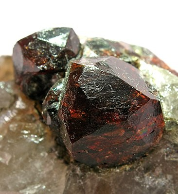
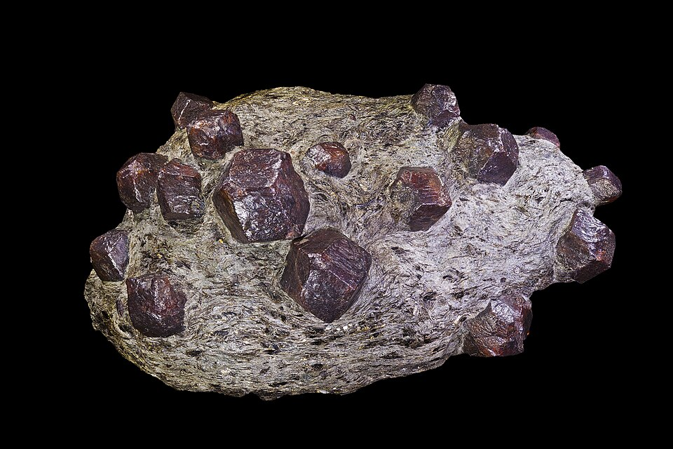
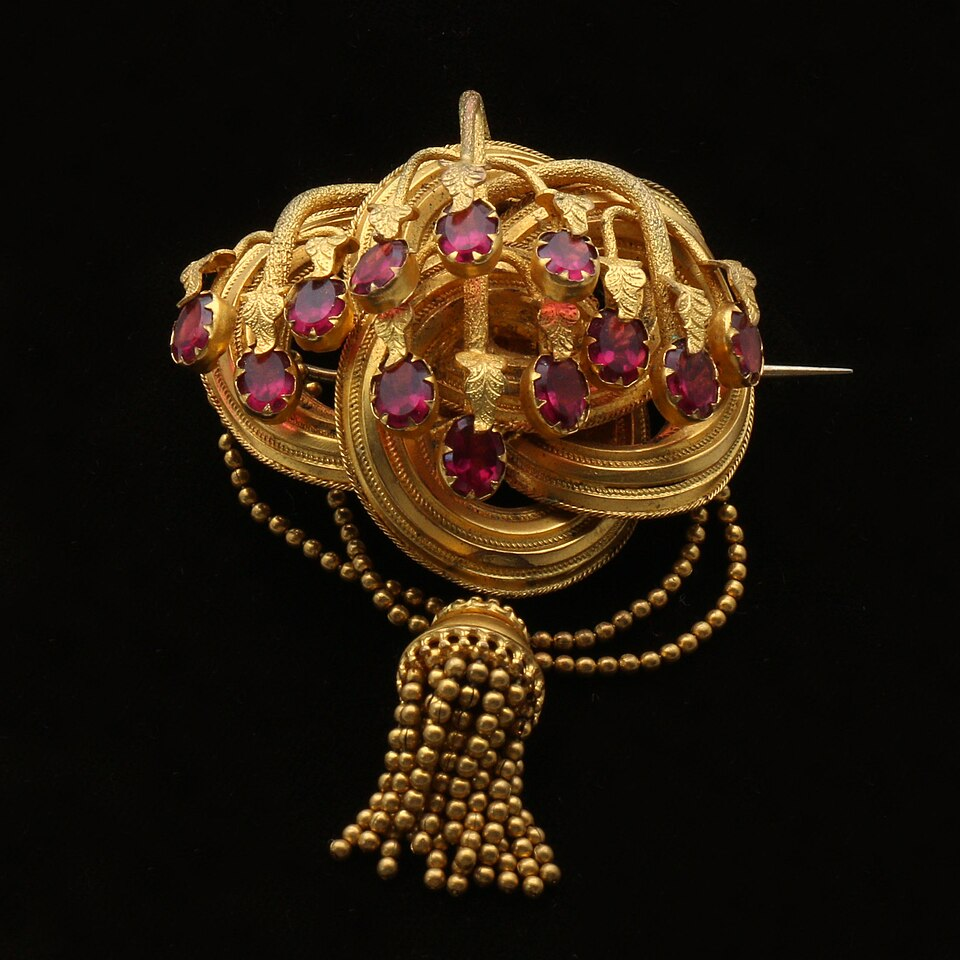
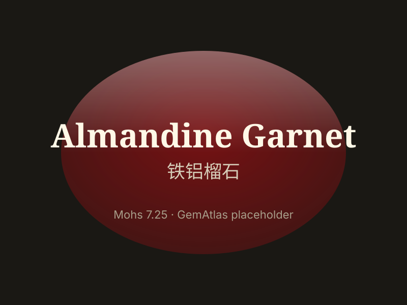

# Almandine (Garnet)

> Garnet (Almandine)

<!-- language switcher hint -->
中文: [铁铝榴石](/zh/gems/garnet-almandine)

---

## Classification

| Property | Value |
|---|---|
| Mineral Family | Garnet (Almandine) |
| Formula | Fe₃Al₂(SiO₄)₃ |
| Crystal System | cubic |

## Physical Properties

| Property | Value |
|---|---|
| Mohs Hardness | 7.25 |
| Specific Gravity | 4.05 |
| Refractive Index | 1.770-1.820 |

## Optical Properties

| Property | Value |
|---|---|
| Pleochroism | none |
| Typical Colors | Deep red, Purplish red, Brownish red |
| Color Cause | Fe²⁺ produces deep red color |

## Treatments & Disclosure

| Treatment | Details |
|-----------|---------|
| Common Methods | None / Typically untreated |
| Disclosure Required | No |
| Note | Most common commercial garnet, typically untreated |

## Gallery

