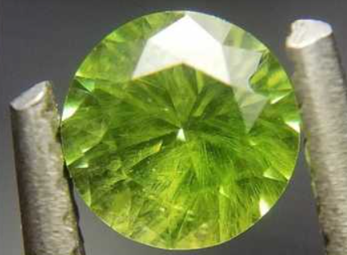
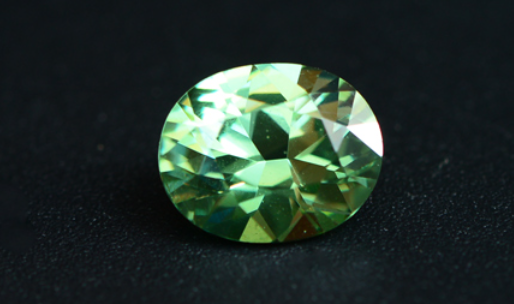
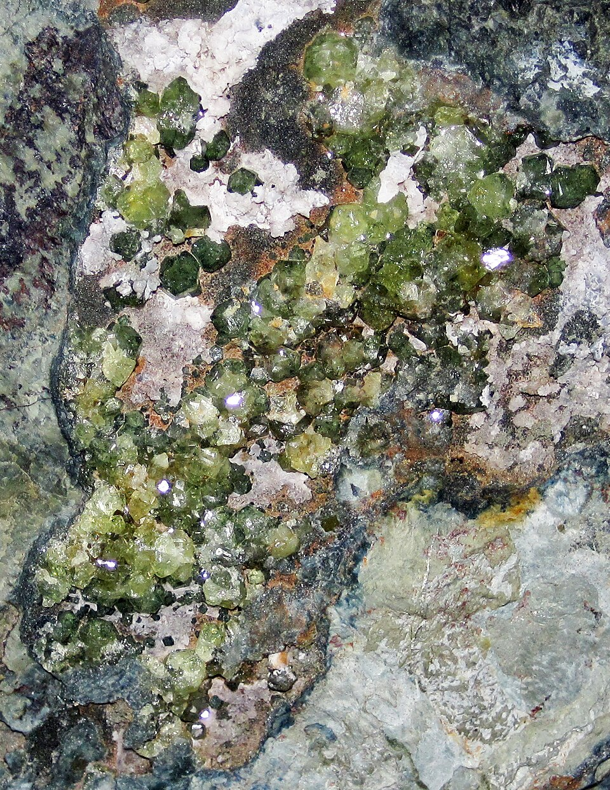
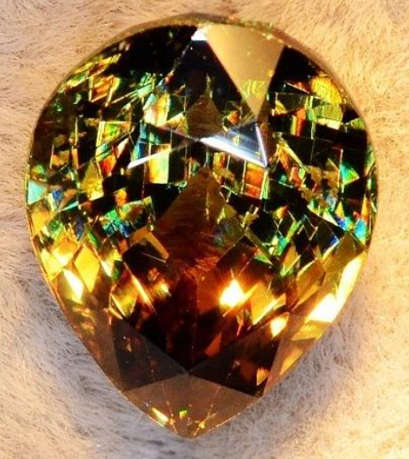

# Demantoid (Garnet)

> Garnet (Andradite)

<!-- language switcher hint -->
中文: [翠榴石](/zh/gems/garnet-demantoid)

---

## Classification

| Property | Value |
|---|---|
| Mineral Family | Garnet (Andradite) |
| Formula | Ca₃Fe₂(SiO₄)₃ |
| Crystal System | cubic |

## Physical Properties

| Property | Value |
|---|---|
| Mohs Hardness | 6.5 |
| Specific Gravity | 3.85 |
| Refractive Index | 1.880-1.940 |

## Optical Properties

| Property | Value |
|---|---|
| Pleochroism | none |
| Typical Colors | Vivid green, Yellowish green |
| Color Cause | Cr³⁺ produces vivid green; very high dispersion (0.057, near diamond) |

## Treatments & Disclosure

| Treatment | Details |
|-----------|---------|
| Common Methods | None / Typically untreated |
| Disclosure Required | No |
| Note | Russian Ural Mountains are the most famous source; "horsetail" inclusions are characteristic |

## Origin

| Region |
|---|
| Urals, Russia |
| Namibia |

## History & Lore

Demantoid is the green garnet king with dispersion exceeding diamond; beloved in Russian imperial jewelry.

## Gallery

