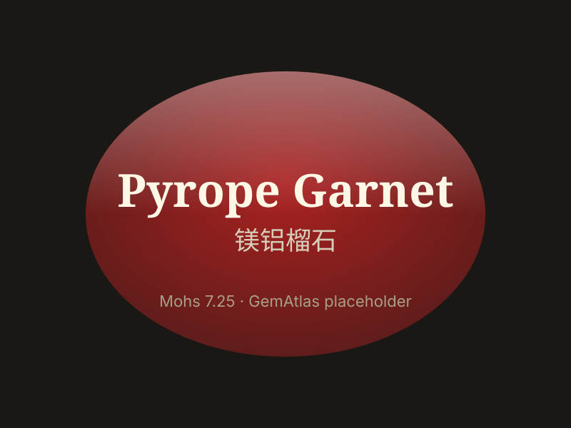

# Pyrope (Garnet)

> Garnet (Pyrope)

<!-- language switcher hint -->
中文: [镁铝榴石](/zh/gems/garnet-pyrope)

---

## Classification

| Property | Value |
|---|---|
| Mineral Family | Garnet (Pyrope) |
| Formula | Mg₃Al₂(SiO₄)₃ |
| Crystal System | cubic |

## Physical Properties

| Property | Value |
|---|---|
| Mohs Hardness | 7.25 |
| Specific Gravity | 3.78 |
| Refractive Index | 1.714-1.940 |

## Optical Properties

| Property | Value |
|---|---|
| Pleochroism | none |
| Typical Colors | Deep red, Purplish red, Rose red |
| Color Cause | Trace Fe²⁺ produces deep red (without Fe, almost colorless) |

## Treatments & Disclosure

| Treatment | Details |
|-----------|---------|
| Common Methods | None / Typically untreated |
| Disclosure Required | No |
| Note | Famous "Bohemian garnets" are mostly pyrope-almandine mixes |

## Gallery

