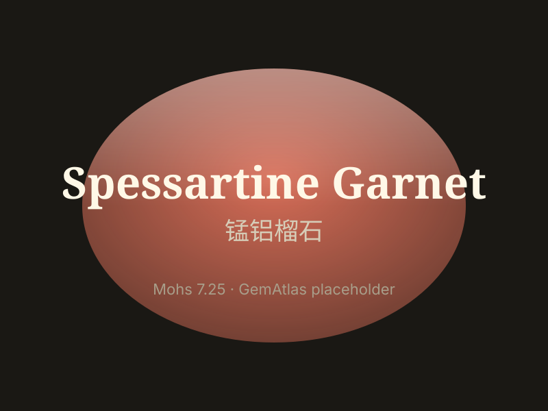

# Spessartine (Garnet)

> Garnet (Spessartine)

<!-- language switcher hint -->
中文: [锰铝榴石](/zh/gems/garnet-spessartine)

---

## Classification

| Property | Value |
|---|---|
| Mineral Family | Garnet (Spessartine) |
| Formula | Mn₃Al₂(SiO₄)₃ |
| Crystal System | cubic |

## Physical Properties

| Property | Value |
|---|---|
| Mohs Hardness | 7.25 |
| Specific Gravity | 4.16 |
| Refractive Index | 1.790-1.820 |

## Optical Properties

| Property | Value |
|---|---|
| Pleochroism | none |
| Typical Colors | Orange yellow, Tangerine, Fanta orange |
| Color Cause | Mn²⁺ produces orange-yellow to tangerine red |

## Treatments & Disclosure

| Treatment | Details |
|-----------|---------|
| Common Methods | None / Typically untreated |
| Disclosure Required | No |
| Note | Fanta garnet is Fe-bearing spessartine |

## Origin

| Region |
|---|
| Xinjiang, China |
| Namibia |
| Madagascar |
| USA |

## History & Lore

Spessartine (mandarin garnet) glows orange; its vivid tone has surged in demand.

## Gallery

