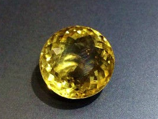
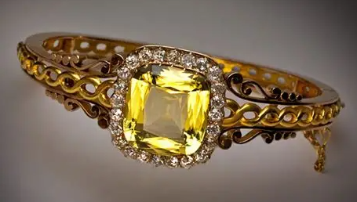
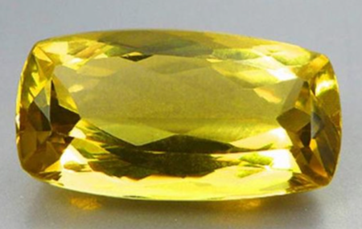
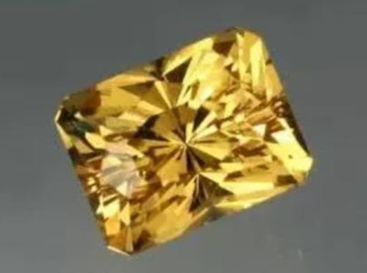

# Heliodor (golden beryl)

> Beryl

<!-- language switcher hint -->
中文: [金绿柱石（金绿玉）](/zh/gems/heliodor)

---

## Classification

| Property | Value |
|---|---|
| Mineral Family | Beryl |
| Formula | Be₃Al₂(SiO₃)₆ |
| Crystal System | hexagonal |

## Physical Properties

| Property | Value |
|---|---|
| Mohs Hardness | 7.75 |
| Specific Gravity | 2.7 |
| Refractive Index | 1.57-1.58 |

## Optical Properties

| Property | Value |
|---|---|
| Pleochroism | weak |
| Typical Colors | Golden, Yellow-green |
| Color Cause | Fe³⁺ golden |

## Treatments & Disclosure

| Treatment | Details |
|-----------|---------|
| Common Methods | None / Typically untreated |
| Disclosure Required | No |
| Note | Beryl's yellow member; heat can improve tone |

## Origin

| Region |
|---|
| Namibia |
| Brazil |
| Madagascar |
| Ukraine |

## History & Lore

Heliodor takes its name from the Greek sun-god Helios; golden African crystals are collectors' favourites.

## Gallery

