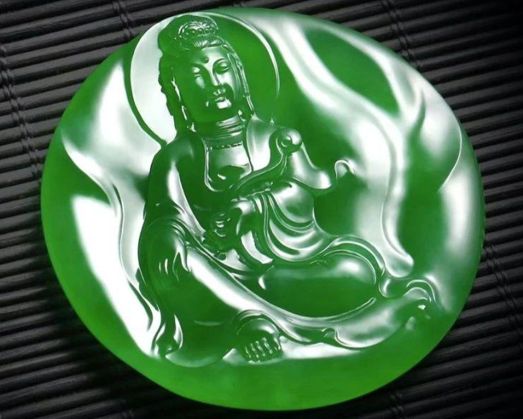
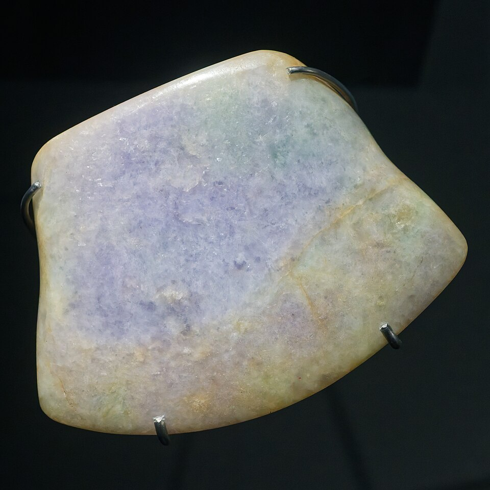
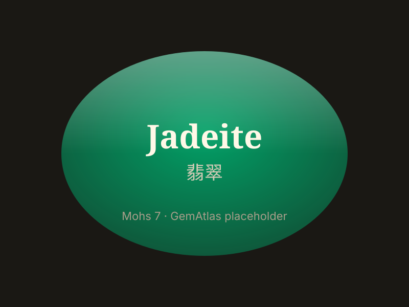

# Jadeite (Burmese Jade)

> Jadeite (Pyroxene)

<!-- language switcher hint -->
中文: [翡翠](/zh/gems/jadeite)

---

## Classification

| Property | Value |
|---|---|
| Mineral Family | Jadeite (Pyroxene) |
| Formula | NaAlSi₂O₆ |
| Crystal System | monoclinic |

## Physical Properties

| Property | Value |
|---|---|
| Mohs Hardness | 7 |
| Specific Gravity | 3.34 |
| Refractive Index | 1.660-1.680 |

## Optical Properties

| Property | Value |
|---|---|
| Pleochroism | weak |
| Typical Colors | Imperial green, Apple green, Lavender, Red, Colorless |
| Color Cause | Cr³⁺ green; Fe³⁺ purple; Fe³⁺ red (secondary) |

## Treatments & Disclosure

| Treatment | Details |
|-----------|---------|
| Common Methods | wax-impregnation, polymer-impregnation, heat-treatment, dyeing |
| Disclosure Required | Yes |
| Note | B+C jade uses acid-bleaching + polymer filling; strict disclosure required |

## Origin

| Region |
|---|
| Myanmar |
| Guatemala |
| Japan |

## History & Lore

Jadeite became China's 'king of jade' after the Ming dynasty; imperial green is most valued. Myanmar is the only commercial source.

## Gallery

