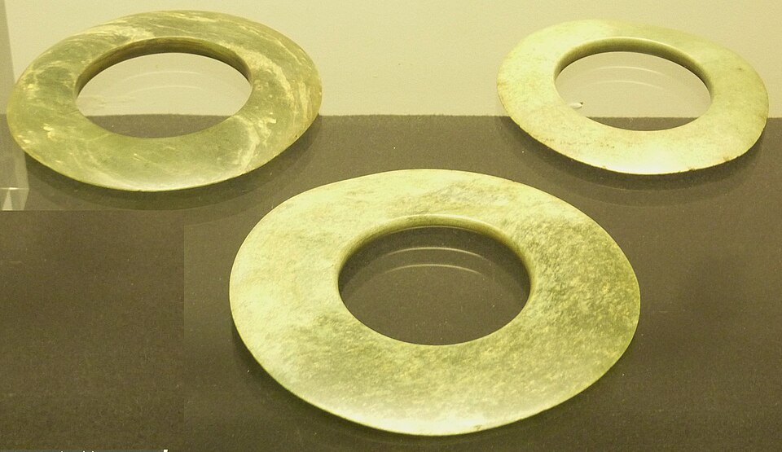

<a href="./">Gemstone Index</a>/Jadeite (Burmese Jade)

  

    
GEM ATLAS / 22

    <h1 id="gem-detail-title-jadeite">Jadeite (Burmese Jade)翡翠</h1>
    
Mineral identityJadeite (Pyroxene)

    <dl class="gem-detail__identity-facts">
      
<dt>Formula</dt><dd>NaAlSi₂O₆</dd>

      
<dt>Crystal system</dt><dd>Monoclinic</dd>

    </dl>
    <dl class="gem-detail__quick-facts">
      
<dt>Mohs</dt><dd>7</dd>

      
<dt>Specific gravity</dt><dd>3.34</dd>

      
<dt>Refractive index</dt><dd>1.660-1.680</dd>

    </dl>
    <a class="gem-detail__language" href="../zh/gems/jadeite.html" hreflang="zh-CN">中文: 翡翠 ↗</a>
  

  <figure class="gem-detail__hero-media"><figcaption>Primary viewVisual identification</figcaption></figure>

## Classification

IDENTITY / SPECIES RECORD

<table class="gem-detail__table">
  <thead><tr><th scope="col">Property</th><th scope="col">Value</th></tr></thead>
  <tbody><tr><th scope="row">Mineral Family</th><td>Jadeite (Pyroxene)</td></tr><tr><th scope="row">Formula</th><td>NaAlSi₂O₆</td></tr><tr><th scope="row">Crystal System</th><td>Monoclinic</td></tr></tbody>
</table>

## Physical Properties

<table class="gem-detail__table">
  <thead><tr><th scope="col">Property</th><th scope="col">Value</th></tr></thead>
  <tbody><tr><th scope="row">Mohs Hardness</th><td>7</td></tr><tr><th scope="row">Specific Gravity</th><td>3.34</td></tr><tr><th scope="row">Refractive Index</th><td>1.660-1.680</td></tr></tbody>
</table>

## Optical Properties

<table class="gem-detail__table">
  <thead><tr><th scope="col">Property</th><th scope="col">Value</th></tr></thead>
  <tbody><tr><th scope="row">Pleochroism</th><td>Weak</td></tr><tr><th scope="row">Typical Colors</th><td>Imperial green, Apple green, Lavender, Red, Colorless</td></tr><tr><th scope="row">Color Cause</th><td>Cr³⁺ green; Fe³⁺ purple; Fe³⁺ red (secondary)</td></tr></tbody>
</table>

## Treatments & Disclosure

  
Common methods<strong>Wax impregnation, Polymer impregnation, Heat treatment, Dyeing</strong>

  
Disclosure required<strong class="is-required">Yes</strong>

  
NoteB+C jade uses acid-bleaching + polymer filling; strict disclosure required

## Origin Records

Representative localities<ul><li>Myanmar</li><li>Guatemala</li><li>Japan</li></ul>

## History & Lore

Jadeite became China&#39;s &#39;king of jade&#39; after the Ming dynasty; imperial green is most valued. Myanmar is the only commercial source. 

## Image Evidence

<figure><figcaption>Evidence 01</figcaption></figure>
<figure><figcaption>Evidence 02</figcaption></figure>

CONTINUE EXPLORING<i aria-hidden="true">/</i><small>继续阅读</small>

<nav class="gem-detail__pager" aria-label="Gemstone record navigation">
<a class="gem-detail__pager-link gem-detail__pager-link--previous" href="./iolite.html" aria-label="Previous Iolite"><i aria-hidden="true">←</i>Previous<strong>Iolite</strong><small>堇青石</small></a>
<a class="gem-detail__pager-index" href="./" aria-label="Return to gemstone index">Return to index<strong>22 / 60</strong><small>All species</small></a>
<a class="gem-detail__pager-link gem-detail__pager-link--next" href="./kunzite.html" aria-label="Next Kunzite">Next<strong>Kunzite</strong><small>紫锂辉石</small><i aria-hidden="true">→</i></a>
</nav>

