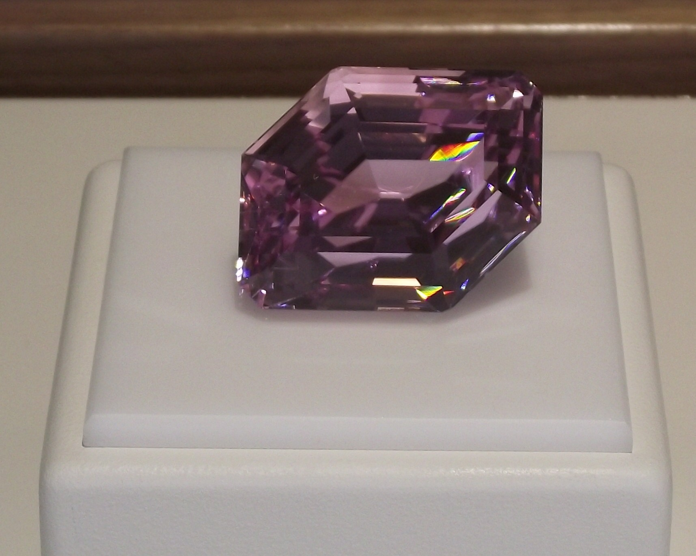
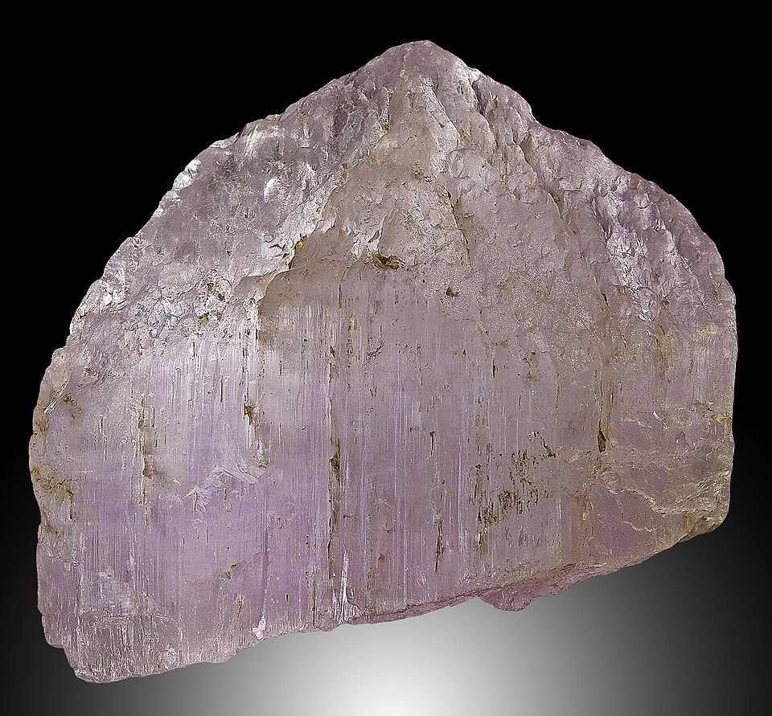
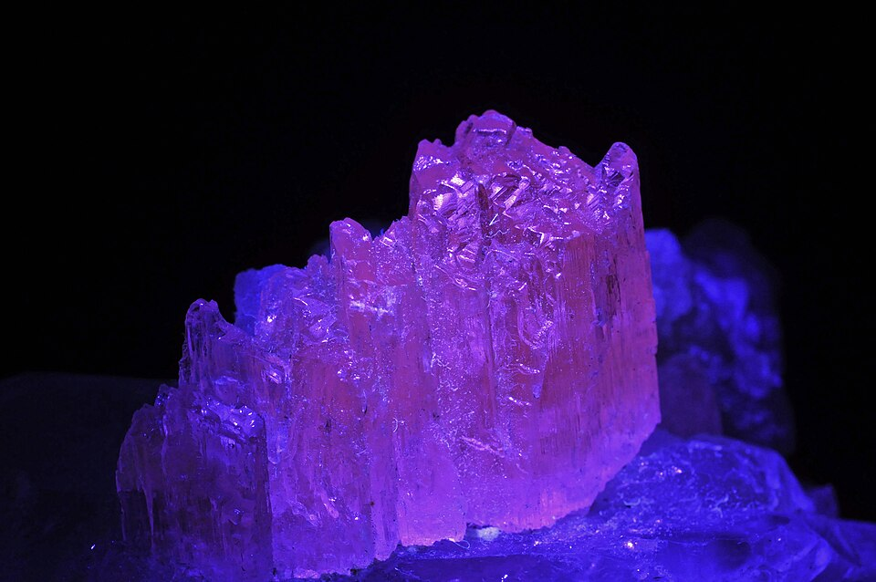
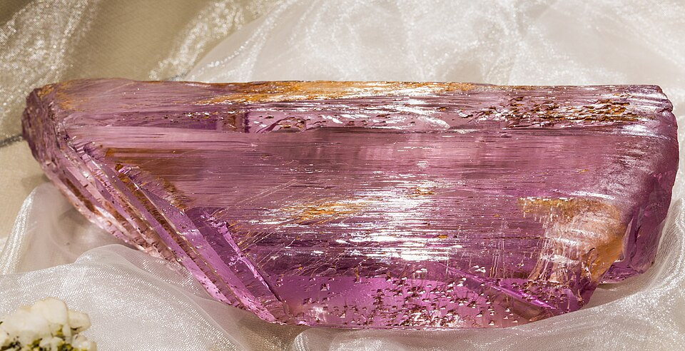

# Kunzite

> Spodumene

<!-- language switcher hint -->
中文: [紫锂辉石](/zh/gems/kunzite)

---

## Classification

| Property | Value |
|---|---|
| Mineral Family | Spodumene |
| Formula | LiAlSi₂O₆ |
| Crystal System | monoclinic |

## Physical Properties

| Property | Value |
|---|---|
| Mohs Hardness | 7 |
| Specific Gravity | 3.18 |
| Refractive Index | 1.66-1.68 |

## Optical Properties

| Property | Value |
|---|---|
| Pleochroism | strong |
| Typical Colors | Pale lilac-pink, Lavender |
| Color Cause | Mn³⁺ |

## Treatments & Disclosure

| Treatment | Details |
|-----------|---------|
| Common Methods | irradiation |
| Disclosure Required | Yes |
| Note | Named 1902 for G.F. Kunz; colour fades in strong light |

## Origin

| Region |
|---|
| Afghanistan |
| Brazil |
| Madagascar |
| California, USA |

## History & Lore

Kunzite was named in 1902 by Tiffany's gemologist G.F. Kunz — a rising star among pink gems.

## Gallery

