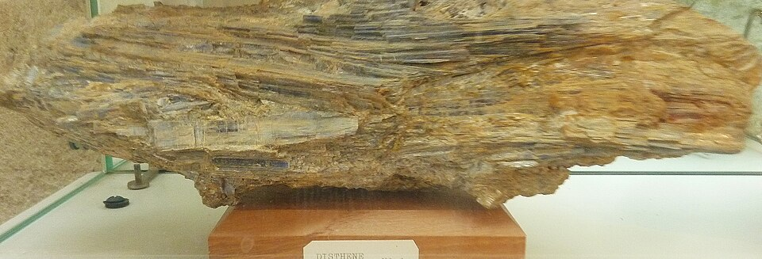
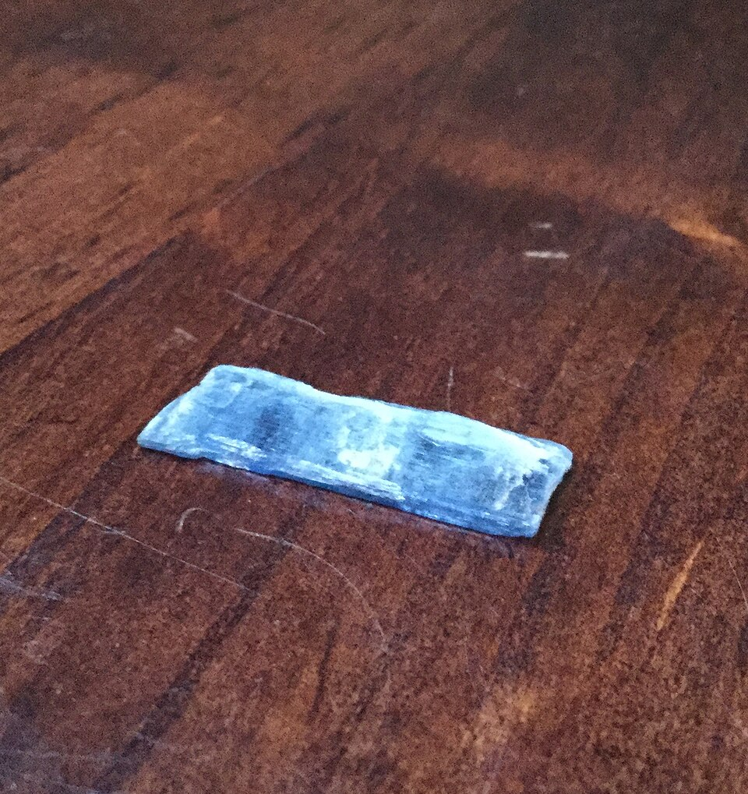
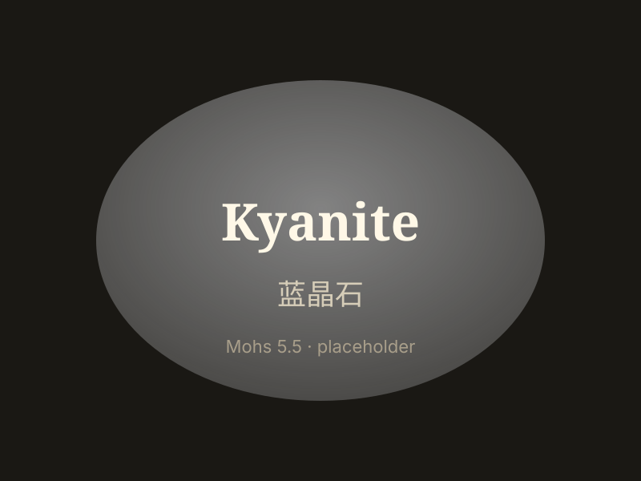

# Kyanite

> Silicate (disthene)

<!-- language switcher hint -->
中文: [蓝晶石](/zh/gems/kyanite)

---

## Classification

| Property | Value |
|---|---|
| Mineral Family | Silicate (disthene) |
| Formula | Al₂SiO₅ |
| Crystal System | triclinic |

## Physical Properties

| Property | Value |
|---|---|
| Mohs Hardness | 5.5 (Directional hardness: 4.5 length, 7 across) |
| Specific Gravity | 3.68 |
| Refractive Index | 1.71-1.73 |

## Optical Properties

| Property | Value |
|---|---|
| Pleochroism | strong |
| Typical Colors | Deep blue, Blue-black, Green |
| Color Cause | Fe/Ti blue |

## Treatments & Disclosure

| Treatment | Details |
|-----------|---------|
| Common Methods | heating |
| Disclosure Required | No |
| Note | Rarely anisotropic hardness; orange kyanite (Mn) pricier |

## Origin

| Region |
|---|
| Brazil |
| Nepal |
| Myanmar |
| North Carolina, USA |

## History & Lore

Kyanite means 'blue' in Greek; its direction-dependent hardness is unique among gems.

## Gallery

