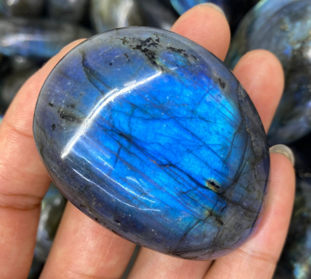
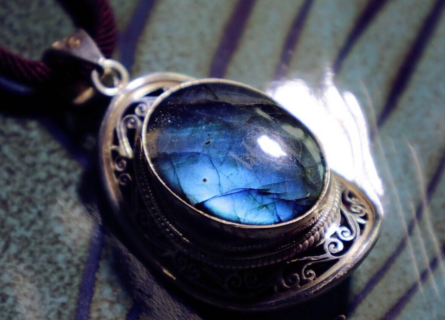
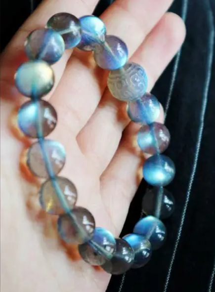

# Labradorite

> Feldspar (Plagioclase)

<!-- language switcher hint -->
中文: [拉长石](/zh/gems/labradorite)

---

## Classification

| Property | Value |
|---|---|
| Mineral Family | Feldspar (Plagioclase) |
| Formula | (Ca,Na)(Si,Al)₄O₈ |
| Crystal System | triclinic |

## Physical Properties

| Property | Value |
|---|---|
| Mohs Hardness | 6.25 |
| Specific Gravity | 2.7 |
| Refractive Index | 1.560-1.572 |

## Optical Properties

| Property | Value |
|---|---|
| Pleochroism | none |
| Typical Colors | Gray-blue with labradorescence, Dark gray with blue-green flash, Full spectrum (Spectrolite) |
| Color Cause | Nanoscale compositional striations produce interference colors (see Optical Phenomena — Labradorescence) |

## Treatments & Disclosure

| Treatment | Details |
|-----------|---------|
| Common Methods | surface-coating |
| Disclosure Required | Yes |
| Note | Labradorescence is a structural effect and cannot be artificially enhanced; surface coating sometimes used to add color |

## Origin

| Region |
|---|
| Labrador, Canada |
| Madagascar |
| Finland |

## History & Lore

Labradorite's iridescence (labradorescence) stems from lamellar twinning; the Finnish variety is 'spectrolite'.

## Gallery

