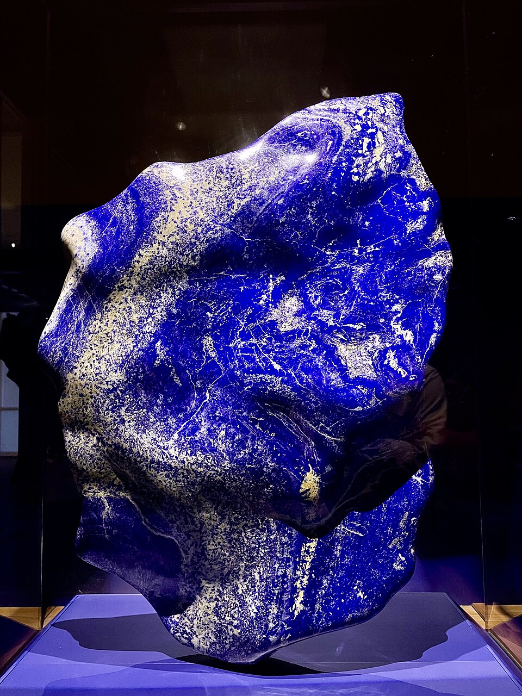
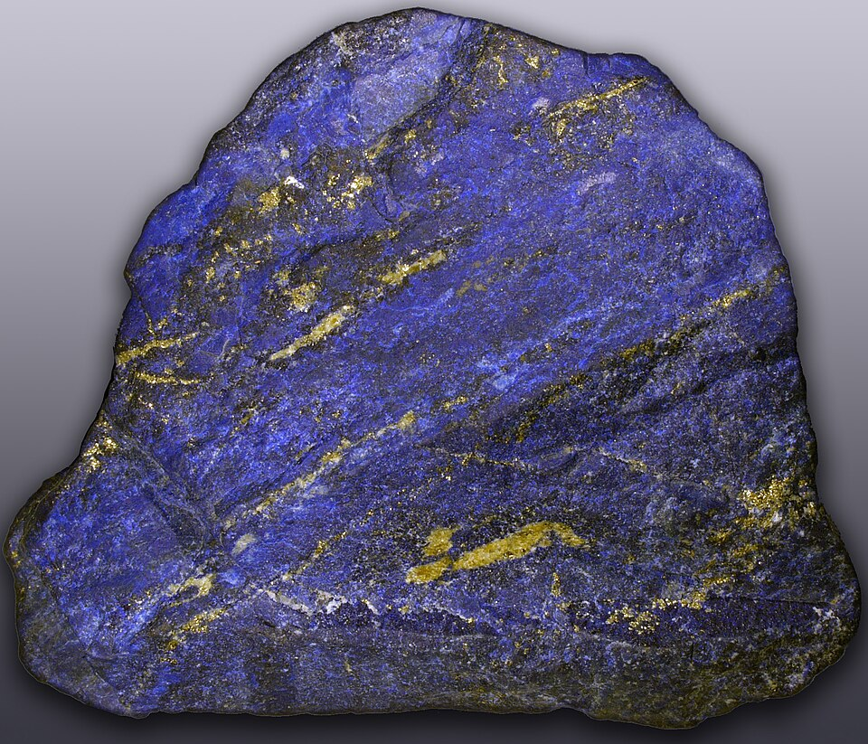
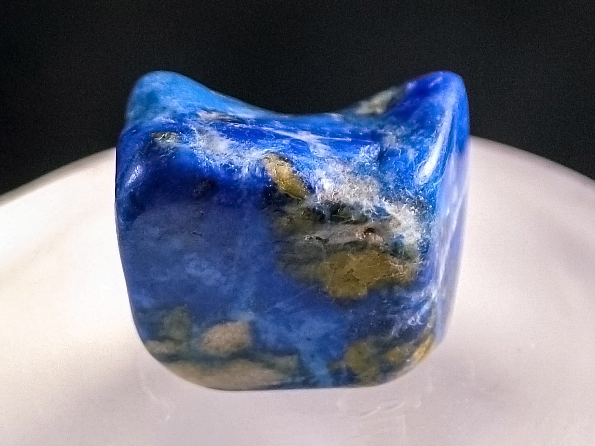

# Lapis Lazuli

> Lazurite (rock)

<!-- language switcher hint -->
中文: [青金石](/zh/gems/lapis-lazuli)

---

## Classification

| Property | Value |
|---|---|
| Mineral Family | Lazurite (rock) |
| Formula | (Na,Ca)₈(AlSiO₄)₆(S,SO₄,Cl)₂ |
| Crystal System | cubic |

## Physical Properties

| Property | Value |
|---|---|
| Mohs Hardness | 5.5 |
| Specific Gravity | 2.85 |
| Refractive Index | 1.500-1.500 |

## Optical Properties

| Property | Value |
|---|---|
| Pleochroism | none |
| Typical Colors | Deep blue (imperial), Sky blue, Violet-blue |
| Color Cause | S₃⁻ sulfur radical color centers produce deep blue |

## Treatments & Disclosure

| Treatment | Details |
|-----------|---------|
| Common Methods | wax-impregnation, dyeing |
| Disclosure Required | Yes |
| Note | Fine quality contains small golden pyrite specks ("stardust"); Afghanistan is the most famous source |

## Gallery

