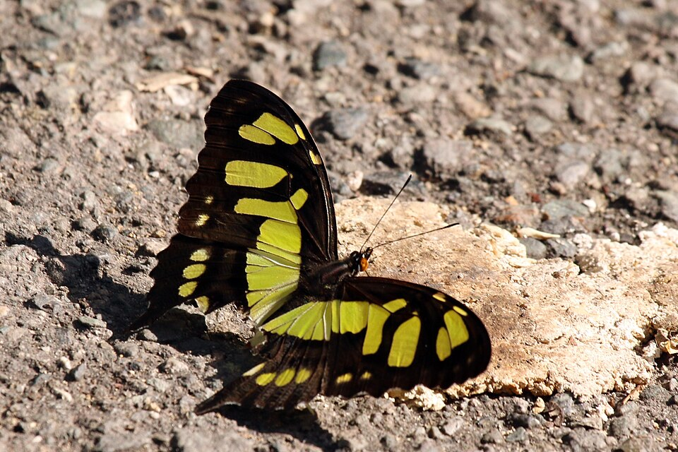
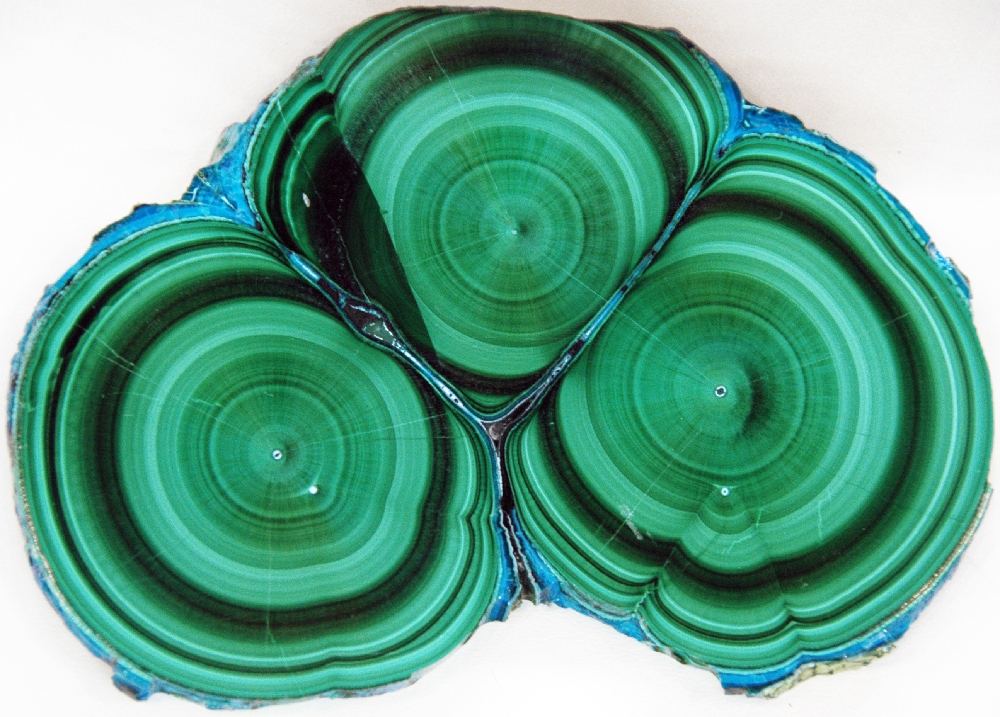
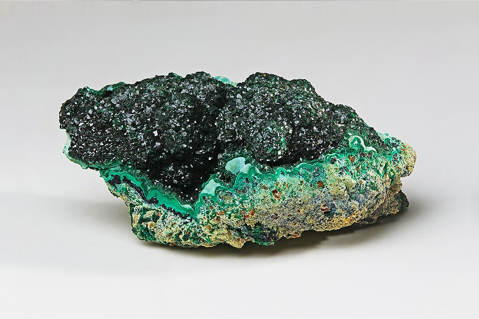
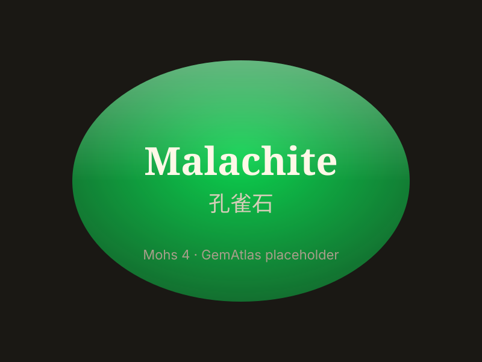

# Malachite

> Carbonate

<!-- language switcher hint -->
中文: [孔雀石](/zh/gems/malachite)

---

## Classification

| Property | Value |
|---|---|
| Mineral Family | Carbonate |
| Formula | Cu₂CO₃(OH)₂ |
| Crystal System | monoclinic |

## Physical Properties

| Property | Value |
|---|---|
| Mohs Hardness | 4 |
| Specific Gravity | 3.8 |
| Refractive Index | 1.655-1.909 |

## Optical Properties

| Property | Value |
|---|---|
| Pleochroism | none |
| Typical Colors | Bright green, Dark green, Peacock green |
| Color Cause | Cu²⁺ produces blue-green to bright green |

## Treatments & Disclosure

| Treatment | Details |
|-----------|---------|
| Common Methods | wax-impregnation, surface-coating |
| Disclosure Required | Yes |
| Note | Low toughness; carved pieces typically treated with protective wax |

## Gallery

