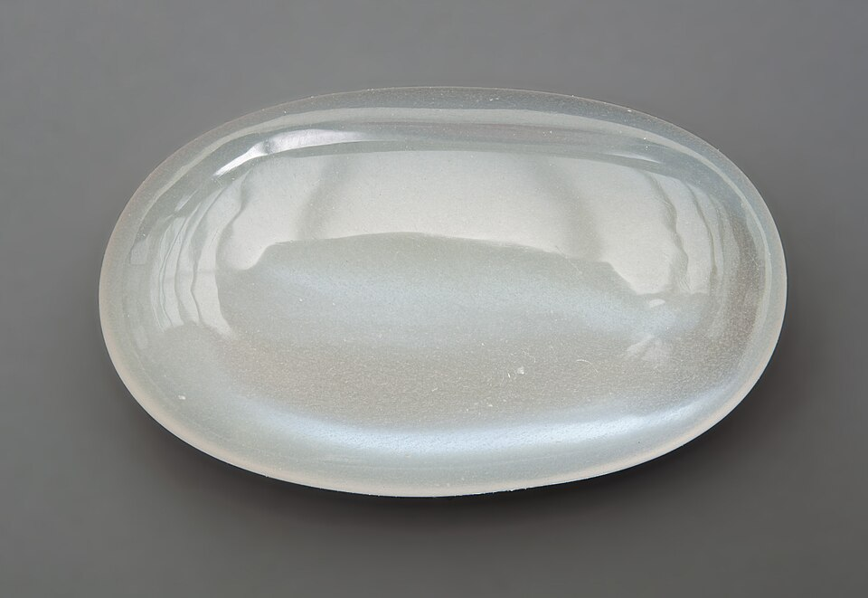
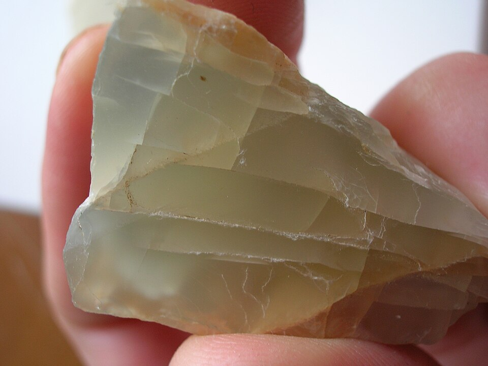
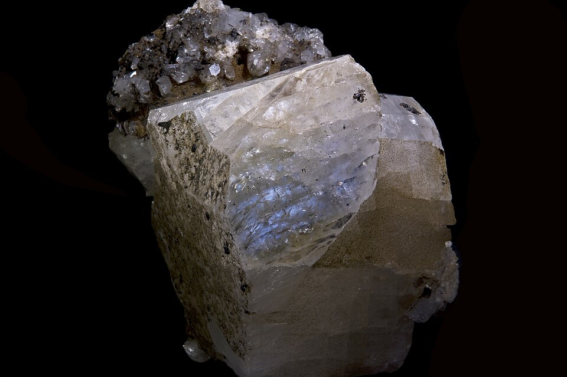

# Moonstone

> Feldspar (Orthoclase)

<!-- language switcher hint -->
中文: [月光石](/zh/gems/moonstone)

---

## Classification

| Property | Value |
|---|---|
| Mineral Family | Feldspar (Orthoclase) |
| Formula | (K,Na)AlSi₃O₈ (with albite lamellae) |
| Crystal System | monoclinic |

## Physical Properties

| Property | Value |
|---|---|
| Mohs Hardness | 6.25 |
| Specific Gravity | 2.57 |
| Refractive Index | 1.518-1.530 |

## Optical Properties

| Property | Value |
|---|---|
| Pleochroism | none |
| Typical Colors | White with blue sheen, White with silver sheen, White with rainbow sheen |
| Color Cause | Albite/orthoclase lamellar scattering (see Optical Phenomena — Adularescence) |

## Treatments & Disclosure

| Treatment | Details |
|-----------|---------|
| Common Methods | wax-impregnation, surface-coating |
| Disclosure Required | Yes |
| Note | Impregnation can enhance the adularescent sheen |

## Origin

| Region |
|---|
| Sri Lanka |
| India |
| Madagascar |

## History & Lore

Moonstone's adularescence comes from feldspar lamellar scattering; Romans believed it was frozen moonlight.

## Gallery

