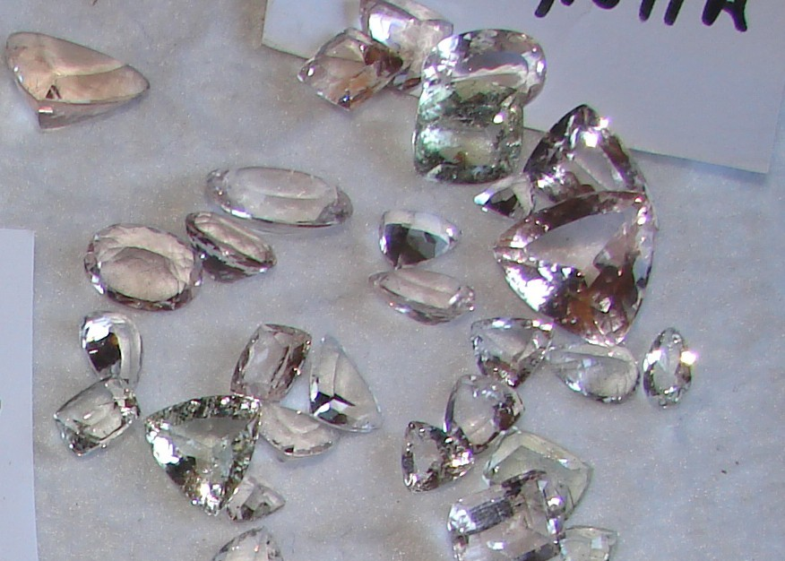
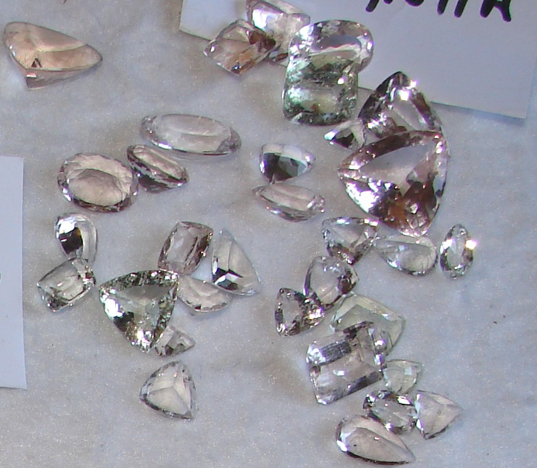
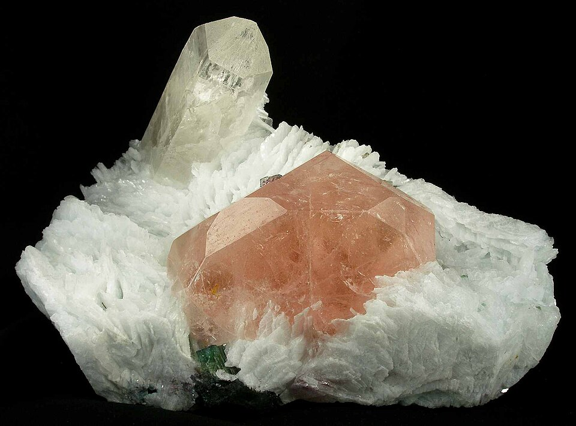
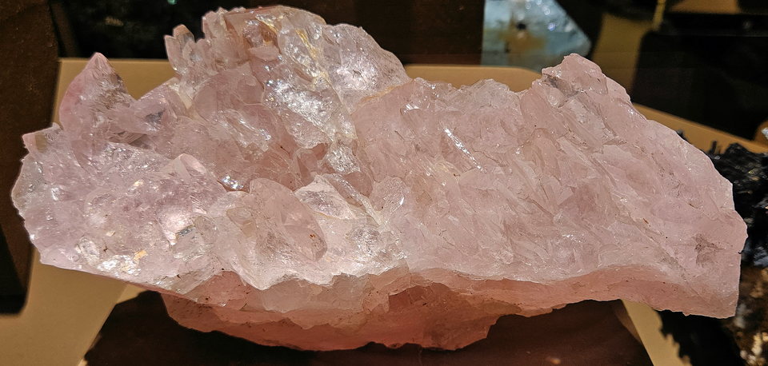

# Morganite

> Beryl

<!-- language switcher hint -->
中文: [摩根石](/zh/gems/morganite)

---

## Classification

| Property | Value |
|---|---|
| Mineral Family | Beryl |
| Formula | Be₃Al₂Si₆O₁₈ |
| Crystal System | hexagonal |

## Physical Properties

| Property | Value |
|---|---|
| Mohs Hardness | 7.75 |
| Specific Gravity | 2.71 |
| Refractive Index | 1.560-1.600 |

## Optical Properties

| Property | Value |
|---|---|
| Pleochroism | weak |
| Typical Colors | Pink, Peach pink, Purplish pink |
| Color Cause | Mn²⁺ produces pink color |

## Treatments & Disclosure

| Treatment | Details |
|-----------|---------|
| Common Methods | heat-treatment, irradiation |
| Disclosure Required | Yes |
| Note | Heat or irradiation can intensify yellow or pink saturation |

## Origin

| Region |
|---|
| Brazil |
| Madagascar |
| Afghanistan |

## History & Lore

Pink beryl named in 1910 for banker J.P. Morgan, a noted gem collector.

## Gallery

