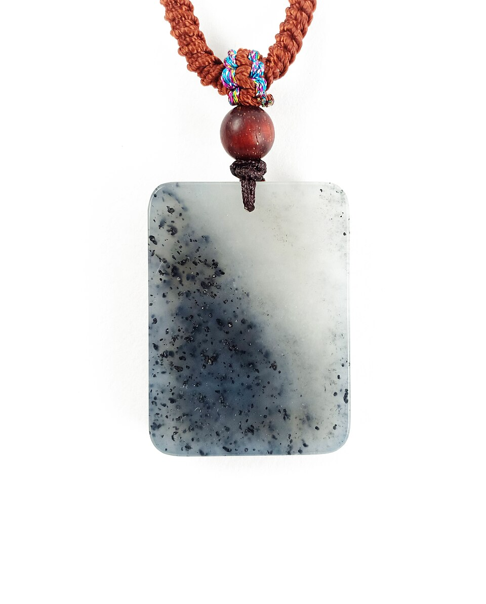
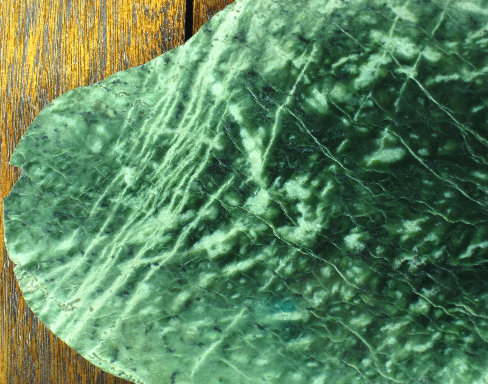
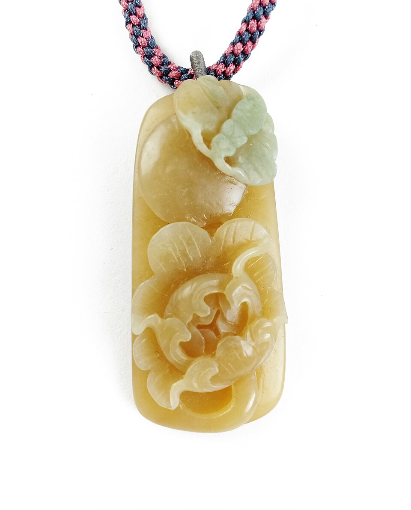

# Nephrite (Hetian Jade)

> Nephrite (Amphibole)

<!-- language switcher hint -->
中文: [软玉](/zh/gems/nephrite)

---

## Classification

| Property | Value |
|---|---|
| Mineral Family | Nephrite (Amphibole) |
| Formula | Ca₂(Mg,Fe)₅Si₈O₂₂(OH)₂ |
| Crystal System | monoclinic |

## Physical Properties

| Property | Value |
|---|---|
| Mohs Hardness | 6.25 |
| Specific Gravity | 2.96 |
| Refractive Index | 1.606-1.632 |

## Optical Properties

| Property | Value |
|---|---|
| Pleochroism | none |
| Typical Colors | Mutton-fat white, Greenish white, Spinach green, Topaz yellow, Brown (sugar) |
| Color Cause | Fe²⁺ green, Fe³⁺ brown-yellow |

## Treatments & Disclosure

| Treatment | Details |
|-----------|---------|
| Common Methods | wax-impregnation, dyeing |
| Disclosure Required | Yes |
| Note | Different mineral species from jadeite (pyroxene); Xinjiang Hetian is the most famous source |

## Origin

| Region |
|---|
| Hetian, Xinjiang, China |
| British Columbia, Canada |
| Russia |

## History & Lore

Nephrite anchors 8,000 years of Chinese jade culture; Hetian white jade was the imperial standard ('virtue like jade').

## Gallery

