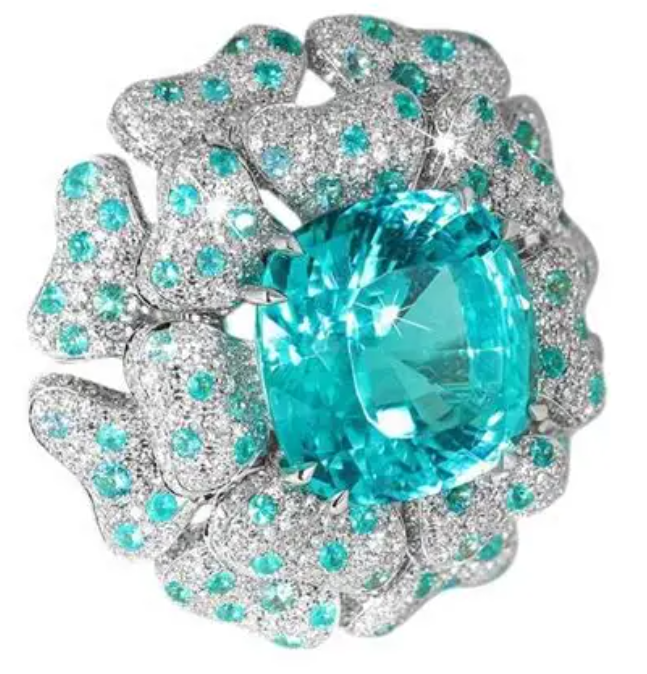
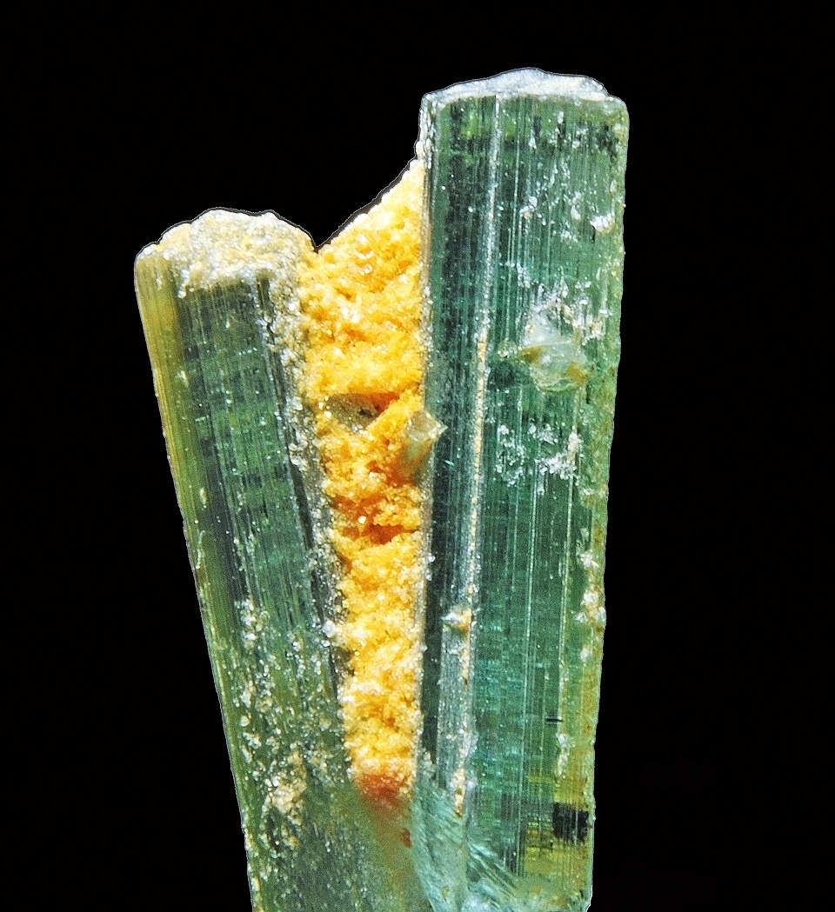
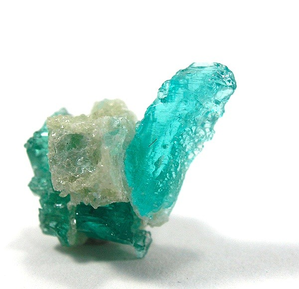
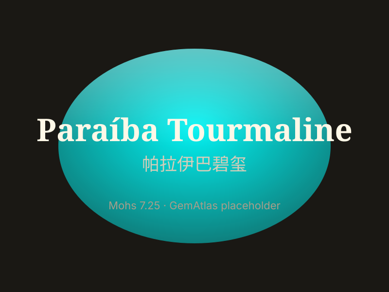

# Paraíba Tourmaline

> Tourmaline

<!-- language switcher hint -->
中文: [帕拉伊巴碧玺](/zh/gems/paraiba-tourmaline)

---

## Classification

| Property | Value |
|---|---|
| Mineral Family | Tourmaline |
| Formula | Na(Li,Al)₃Al₆(BO₃)₃Si₆O₁₈(OH)₃ |
| Crystal System | trigonal |

## Physical Properties

| Property | Value |
|---|---|
| Mohs Hardness | 7.5 |
| Specific Gravity | 3.06 |
| Refractive Index | 1.614-1.666 |

## Optical Properties

| Property | Value |
|---|---|
| Pleochroism | strong |
| Typical Colors | Neon Blue, Blue-Green, Violet |
| Color Cause | Cu²⁺ trace ions cause neon hues (origin premium driver) |

## Treatments & Disclosure

| Treatment | Details |
|-----------|---------|
| Common Methods | heat-treatment |
| Disclosure Required | Yes |
| Note | Original Brazilian Paraíba is scarce; Mozambique material trades at lower premium |

## Origin

| Region |
|---|
| Paraíba, Brazil |
| Nigeria |
| Mozambique |

## History & Lore

Discovered in Paraíba (Brazil) in 1989; copper gives its electric neon blue. Instantly iconic and among the priciest tourmalines.

## Gallery

