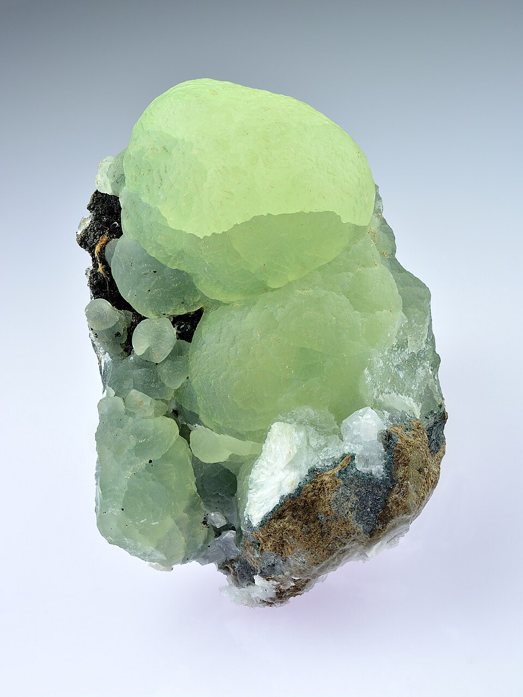
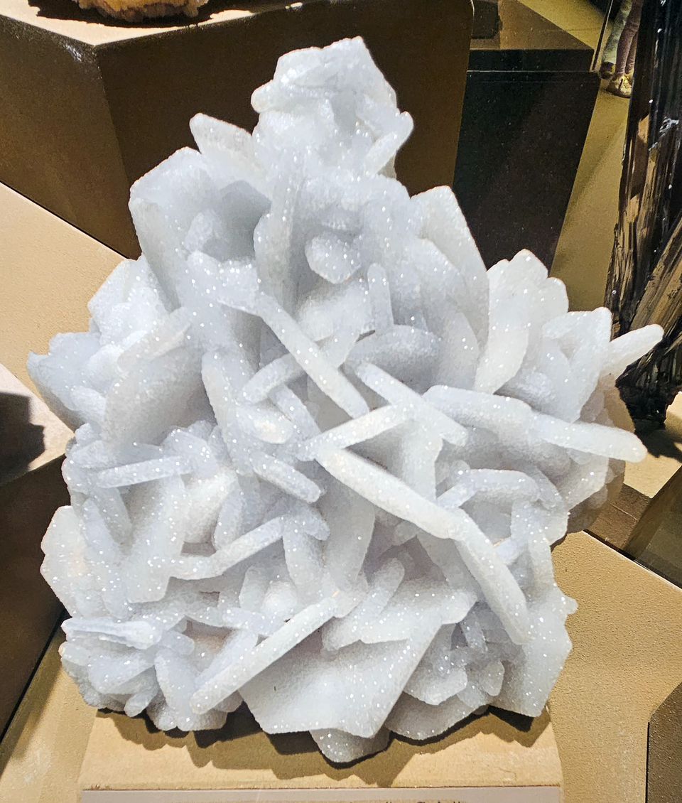
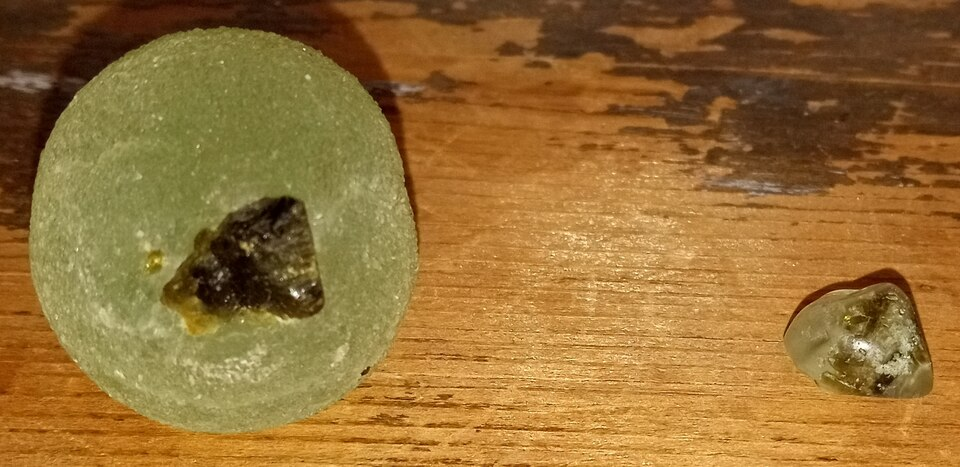
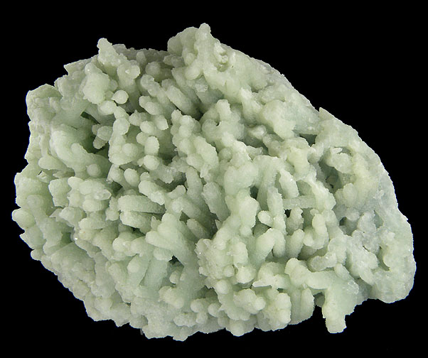

# Prehnite

> Phyllosilicate

<!-- language switcher hint -->
中文: [葡萄石](/zh/gems/prehnite)

---

## Classification

| Property | Value |
|---|---|
| Mineral Family | Phyllosilicate |
| Formula | Ca₂Al(AlSi₃O₁₀)(OH)₂ |
| Crystal System | orthorhombic |

## Physical Properties

| Property | Value |
|---|---|
| Mohs Hardness | 6.25 |
| Specific Gravity | 2.9 |
| Refractive Index | 1.611-1.672 |

## Optical Properties

| Property | Value |
|---|---|
| Pleochroism | weak |
| Typical Colors | Pale green, Yellow-green, Colorless to white |
| Color Cause | Fe³⁺ produces pale to yellow-green |

## Treatments & Disclosure

| Treatment | Details |
|-----------|---------|
| Common Methods | None / Typically untreated |
| Disclosure Required | No |
| Note | Named for its botryoidal (grape-like) habit; primarily used in pendants and carvings |

## Origin

| Region |
|---|
| South Africa |
| Australia |
| China |
| New Jersey, USA |

## History & Lore

Prehnite was named for Dutch colonist Hendrik von Prehn — the first mineral named after a person.

## Gallery

