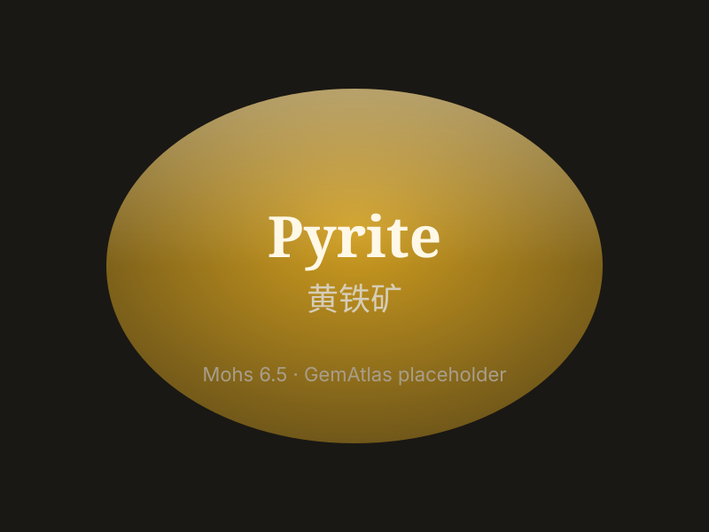

# Pyrite

> Sulfide

<!-- language switcher hint -->
中文: [黄铁矿](/zh/gems/pyrite)

---

## Classification

| Property | Value |
|---|---|
| Mineral Family | Sulfide |
| Formula | FeS₂ |
| Crystal System | cubic |

## Physical Properties

| Property | Value |
|---|---|
| Mohs Hardness | 6.5 |
| Specific Gravity | 5.01 |
| Refractive Index | 1.810-2.024 |

## Optical Properties

| Property | Value |
|---|---|
| Pleochroism | none |
| Typical Colors | Brass-yellow to golden brown |
| Color Cause | Fe-S charge transfer produces golden-yellow metallic luster |

## Treatments & Disclosure

| Treatment | Details |
|-----------|---------|
| Common Methods | surface-coating |
| Disclosure Required | Yes |
| Note | Known as "fool's gold," often confused with real gold; widely used in decorative jewelry |

## Gallery

