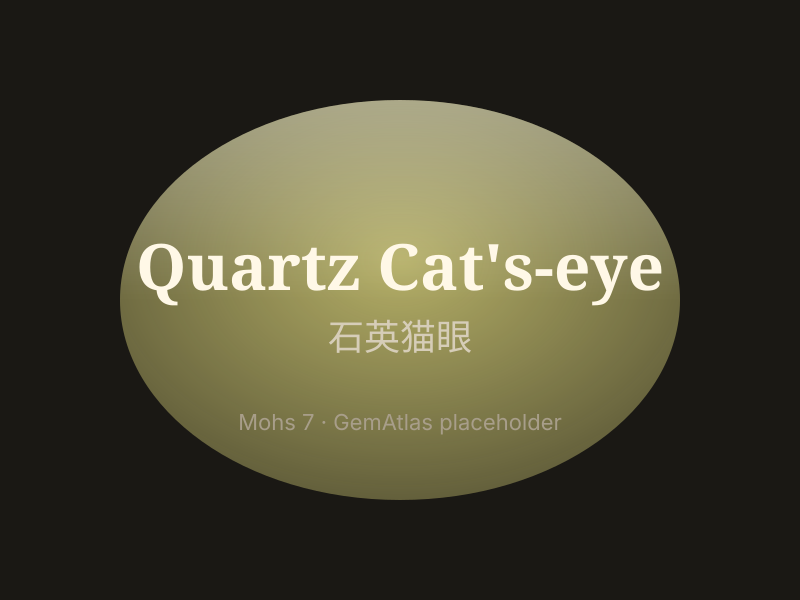

# Quartz Cat's-eye

> Quartz

<!-- language switcher hint -->
中文: [石英猫眼](/zh/gems/quartz-catseye)

---

## Classification

| Property | Value |
|---|---|
| Mineral Family | Quartz |
| Formula | SiO2 + crocidolite fibers |
| Crystal System | trigonal |

## Physical Properties

| Property | Value |
|---|---|
| Mohs Hardness | 7 |
| Specific Gravity | 2.65 |
| Refractive Index | 1.544-1.553 |

## Optical Properties

| Property | Value |
|---|---|
| Pleochroism | none |
| Typical Colors | Yellow-green with cats-eye, Olive green, Brown |
| Color Cause | Crocidolite asbestos fiber inclusions produce cat's-eye effect |

## Treatments & Disclosure

| Treatment | Details |
|-----------|---------|
| Common Methods | heat-treatment |
| Disclosure Required | Yes |
| Note | Distinct from chrysoberyl cat's-eye; quartz cat's-eye has a wider, less distinct eye |

## Gallery

