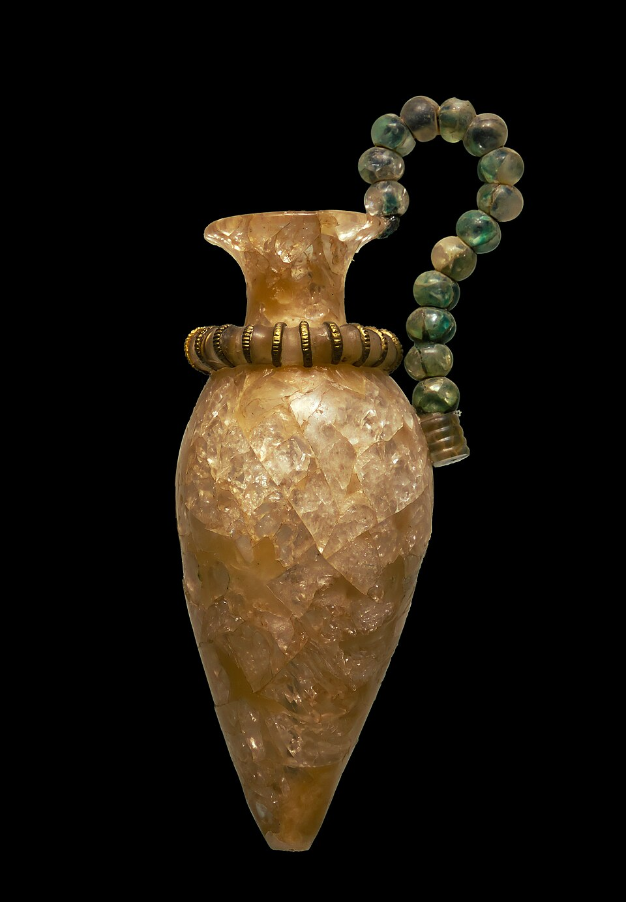
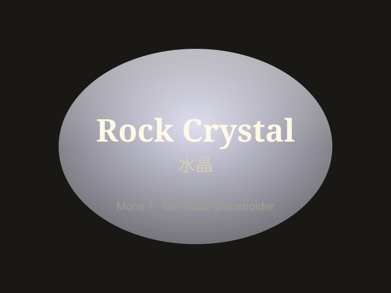

# Rock Crystal

> Quartz (crystalline)

<!-- language switcher hint -->
中文: [水晶](/zh/gems/rock-crystal)

---

## Classification

| Property | Value |
|---|---|
| Mineral Family | Quartz (crystalline) |
| Formula | SiO₂ |
| Crystal System | trigonal |

## Physical Properties

| Property | Value |
|---|---|
| Mohs Hardness | 7 |
| Specific Gravity | 2.65 |
| Refractive Index | 1.544-1.553 |

## Optical Properties

| Property | Value |
|---|---|
| Pleochroism | none |
| Typical Colors | Colorless, transparent |
| Color Cause | No chromophore elements present |

## Treatments & Disclosure

| Treatment | Details |
|-----------|---------|
| Common Methods | heat-treatment, irradiation |
| Disclosure Required | No |
| Note | The most common natural gem material, distributed worldwide; includes rutilated quartz and enhydro varieties |

## Origin

| Region |
|---|
| Brazil |
| China |
| Madagascar |
| Arkansas, USA |

## History & Lore

Rock crystal was long thought to be frozen ice (Greek 'krystallos'). Distributed worldwide.

## Gallery

