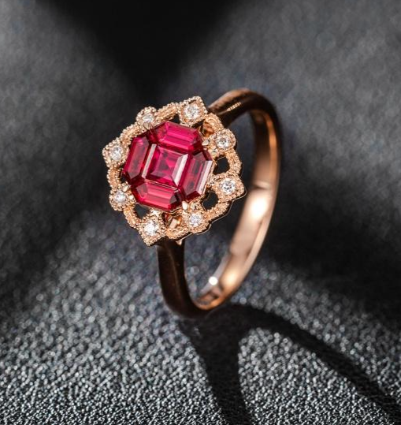
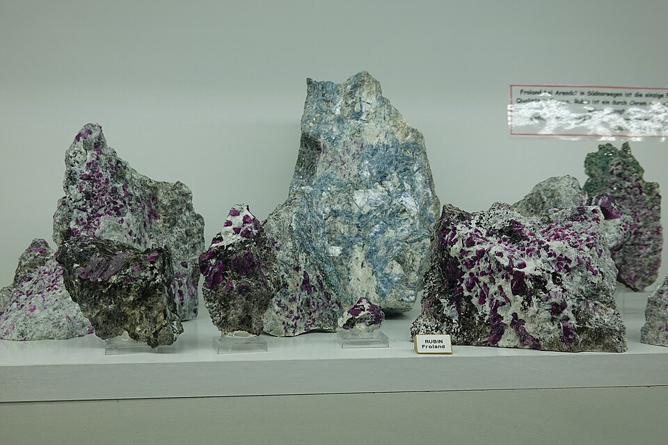
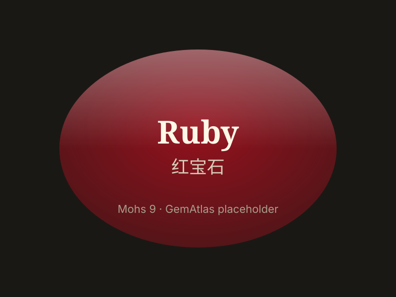

# Ruby

> Corundum

<!-- language switcher hint -->
中文: [红宝石](/zh/gems/ruby)

---

## Classification

| Property | Value |
|---|---|
| Mineral Family | Corundum |
| Formula | Al₂O₃ |
| Crystal System | trigonal |

## Physical Properties

| Property | Value |
|---|---|
| Mohs Hardness | 9 (Second only to diamond) |
| Specific Gravity | 4 |
| Refractive Index | 1.762-1.770 |

## Optical Properties

| Property | Value |
|---|---|
| Pleochroism | strong |
| Typical Colors | Pigeon Blood, Cherry Red, Rose Red |
| Color Cause | Chromium (Cr³⁺) trace ions |

## Treatments & Disclosure

| Treatment | Details |
|-----------|---------|
| Common Methods | heat-treatment |
| Disclosure Required | Yes |
| Note | Most commercial rubies are heat-treated; untreated stones command significant premiums |

## Gallery

