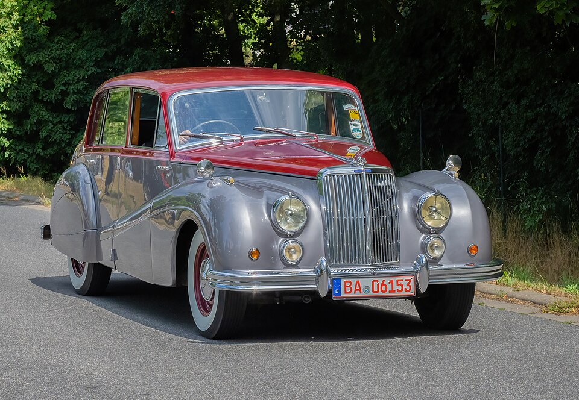
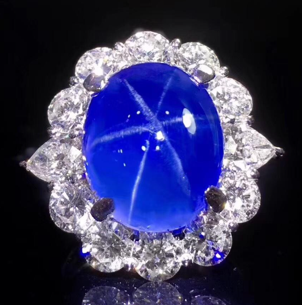
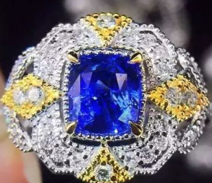

# Sapphire

> Corundum

<!-- language switcher hint -->
中文: [蓝宝石](/zh/gems/sapphire)

---

## Classification

| Property | Value |
|---|---|
| Mineral Family | Corundum |
| Formula | Al₂O₃ |
| Crystal System | trigonal |

## Physical Properties

| Property | Value |
|---|---|
| Mohs Hardness | 9 (Second only to diamond) |
| Specific Gravity | 4 |
| Refractive Index | 1.762-1.770 |

## Optical Properties

| Property | Value |
|---|---|
| Pleochroism | strong |
| Typical Colors | Cornflower Blue, Royal Blue, Padparadscha |
| Color Cause | Fe²⁺/Ti⁴⁺ (blue); Cr³⁺ (Padparadscha) |

## Treatments & Disclosure

| Treatment | Details |
|-----------|---------|
| Common Methods | heat-treatment |
| Disclosure Required | Yes |
| Note | Heat treatment is industry standard; untreated is rare |

## Origin

| Region |
|---|
| Kashmir |
| Sri Lanka |
| Madagascar |
| Myanmar |

## History & Lore

Kashmir cornflower blue is the apex of sapphire colour; Sri Lanka is famed for star sapphires. Kate Middleton's sapphire engagement ring reignited global demand.

## Gallery

