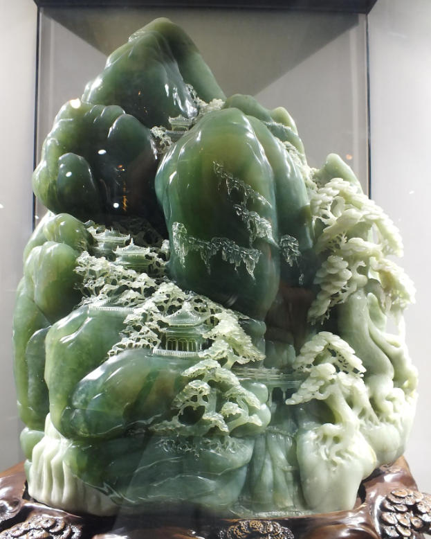

# Serpentine

> Serpentine group

<!-- language switcher hint -->
中文: [蛇纹石](/zh/gems/serpentine)

---

## Classification

| Property | Value |
|---|---|
| Mineral Family | Serpentine group |
| Formula | Mg₃Si₂O₅(OH)₄ |
| Crystal System | monoclinic |

## Physical Properties

| Property | Value |
|---|---|
| Mohs Hardness | 4.5 |
| Specific Gravity | 2.55 |
| Refractive Index | 1.560-1.590 |

## Optical Properties

| Property | Value |
|---|---|
| Pleochroism | none |
| Typical Colors | Yellow-green, Dark green (Xiuyan jade), Blue-green, White with veining |
| Color Cause | Fe²⁺ produces green; varying iron content yields different shades |

## Treatments & Disclosure

| Treatment | Details |
|-----------|---------|
| Common Methods | wax-impregnation, dyeing |
| Disclosure Required | Yes |
| Note | Xiuyan jade (serpentine jade) from China has been mined for thousands of years; distinct mineral from nephrite |

## Origin

| Region |
|---|
| China |
| South Africa |
| California, USA |
| Cornwall, UK |

## History & Lore

Serpentine is a jade substitute ('new jade'); named for its snake-skin sheen. California state stone.

## Gallery

