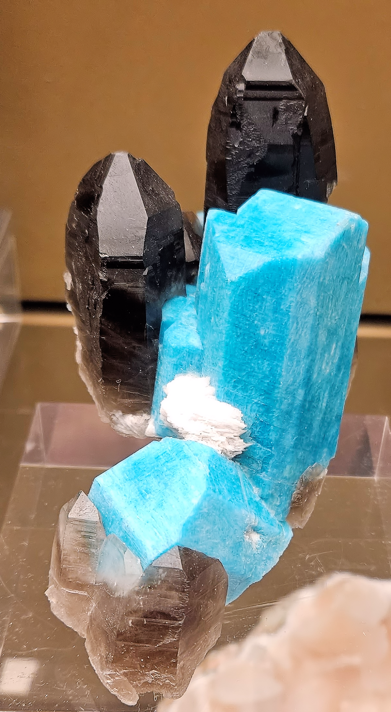

# Smoky Quartz

> Quartz

<!-- language switcher hint -->
中文: [烟晶](/zh/gems/smoky-quartz)

---

## Classification

| Property | Value |
|---|---|
| Mineral Family | Quartz |
| Formula | SiO₂ |
| Crystal System | trigonal |

## Physical Properties

| Property | Value |
|---|---|
| Mohs Hardness | 7 |
| Specific Gravity | 2.65 |
| Refractive Index | 1.544-1.553 |

## Optical Properties

| Property | Value |
|---|---|
| Pleochroism | weak |
| Typical Colors | Smoky gray, Brown, Black |
| Color Cause | Al impurity + natural radiation form color center |

## Treatments & Disclosure

| Treatment | Details |
|-----------|---------|
| Common Methods | irradiation |
| Disclosure Required | Yes |
| Note | Natural smoky quartz forms from nearby radioactive minerals; artificial irradiation can replicate the effect |

## Gallery

