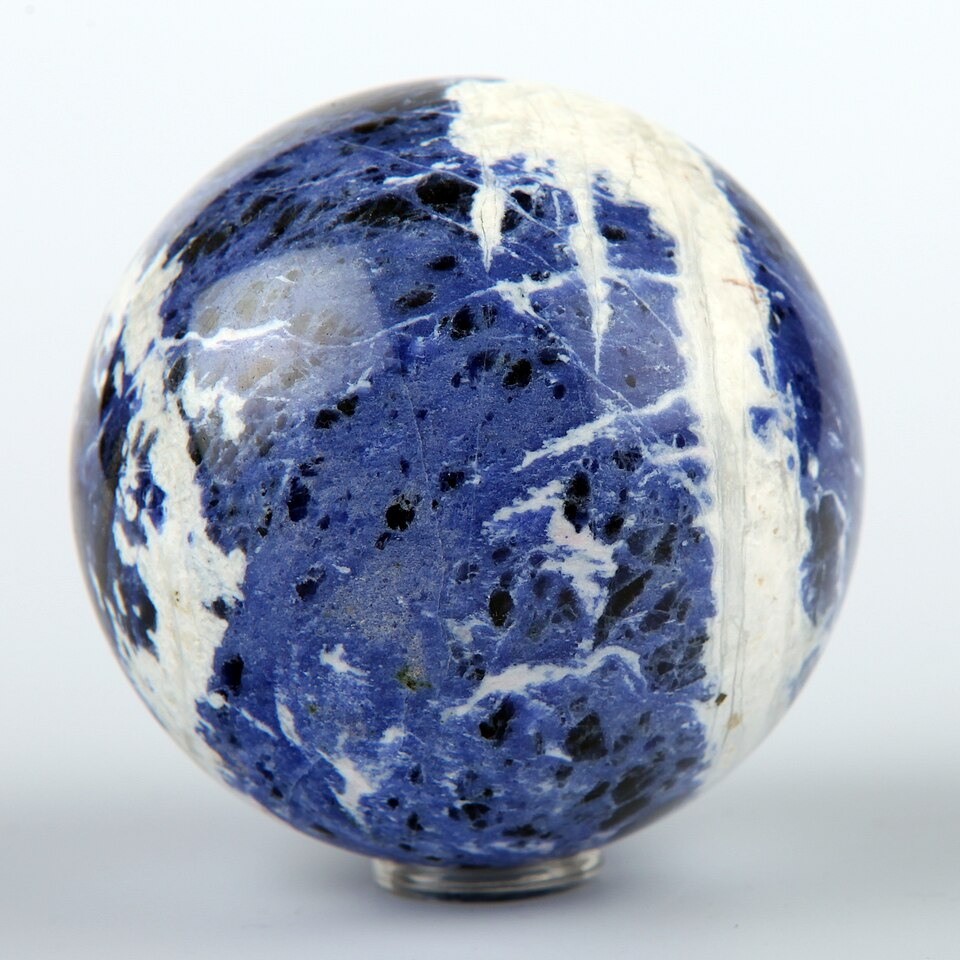
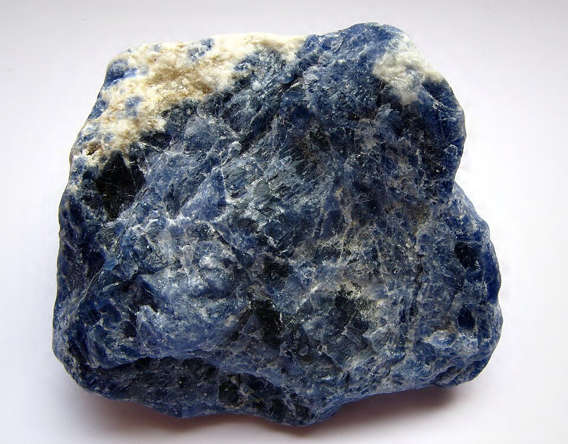
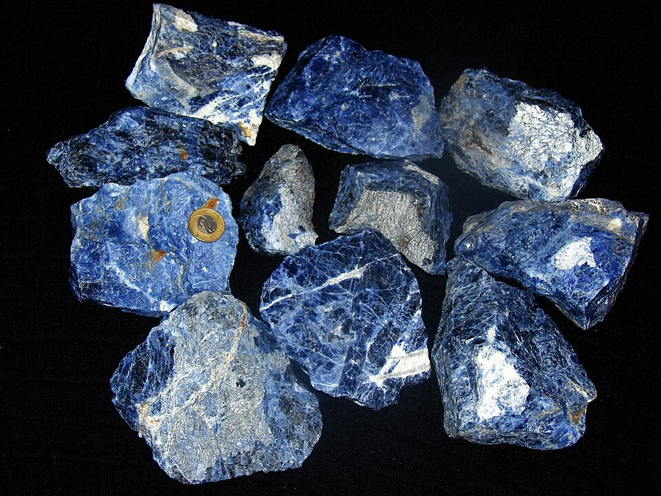

# Sodalite

> Sodalite (Feldspathoid)

<!-- language switcher hint -->
中文: [方钠石](/zh/gems/sodalite)

---

## Classification

| Property | Value |
|---|---|
| Mineral Family | Sodalite (Feldspathoid) |
| Formula | Na₈(AlSiO₄)₆Cl₂ |
| Crystal System | cubic |

## Physical Properties

| Property | Value |
|---|---|
| Mohs Hardness | 6 |
| Specific Gravity | 2.28 |
| Refractive Index | 1.483-1.490 |

## Optical Properties

| Property | Value |
|---|---|
| Pleochroism | none |
| Typical Colors | Deep blue, Light blue with white veining, Violet-blue |
| Color Cause | S₃⁻ color-center produces blue (same mechanism as lapis lazuli) |

## Treatments & Disclosure

| Treatment | Details |
|-----------|---------|
| Common Methods | wax-impregnation, dyeing |
| Disclosure Required | Yes |
| Note | Often mistaken for lapis lazuli; sodalite has more white veining and less pyrite |

## Gallery

