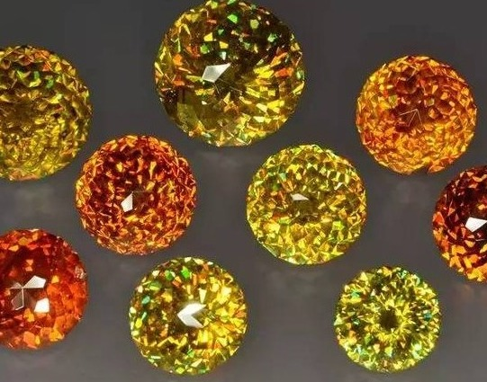
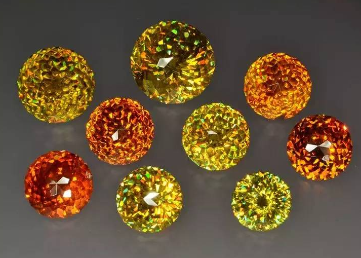
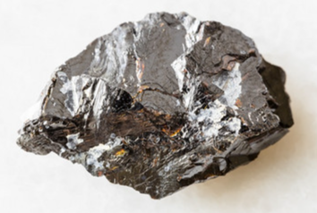

# Sphalerite

> Sulfide (zinc blende)

<!-- language switcher hint -->
中文: [闪锌矿](/zh/gems/sphalerite)

---

## Classification

| Property | Value |
|---|---|
| Mineral Family | Sulfide (zinc blende) |
| Formula | ZnS |
| Crystal System | cubic |

## Physical Properties

| Property | Value |
|---|---|
| Mohs Hardness | 3.5 (Soft, perfect cleavage — collector grade) |
| Specific Gravity | 4.09 |
| Refractive Index | 2.37 |

## Optical Properties

| Property | Value |
|---|---|
| Pleochroism | weak |
| Typical Colors | Orange-yellow, Red-brown, Green |
| Color Cause | Iron and colour centres |

## Treatments & Disclosure

| Treatment | Details |
|-----------|---------|
| Common Methods | None / Typically untreated |
| Disclosure Required | No |
| Note | Dispersion 0.156 exceeds diamond — 'fire king'; too soft for wear |

## Origin

| Region |
|---|
| Spain |
| Mexico |
| USA |
| China |

## History & Lore

Sphalerite has the highest dispersion of any gem; its orange crystals look like frozen fire, but it is collector-only due to softness.

## Gallery

