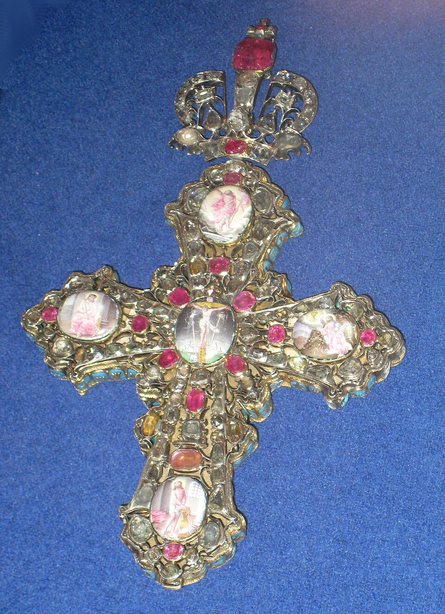
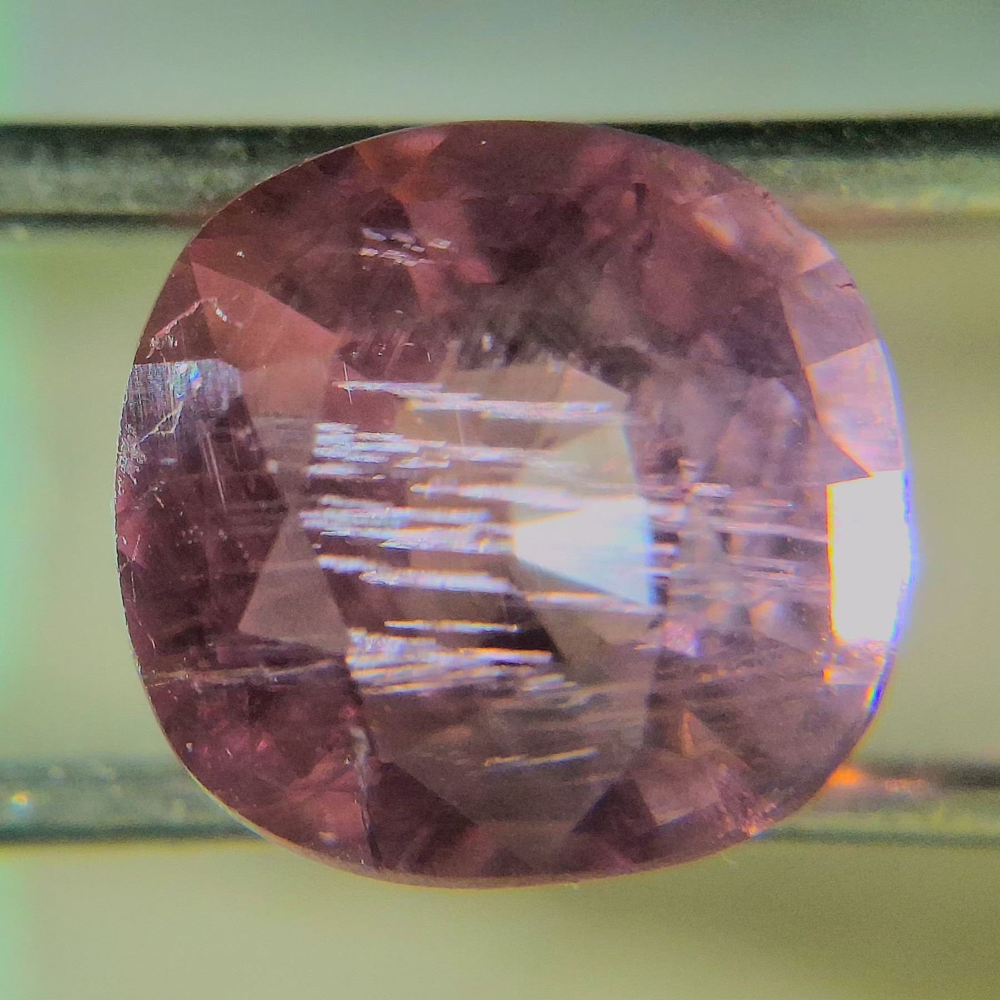
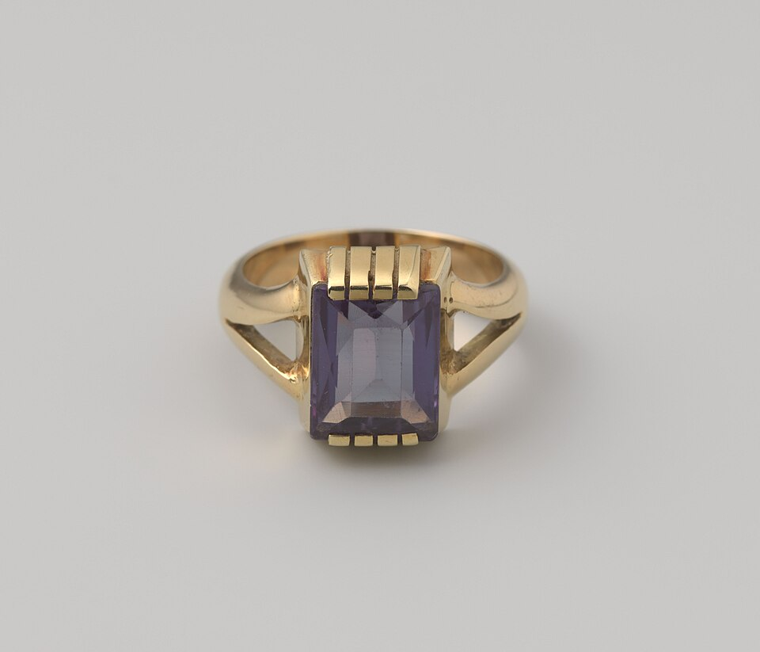
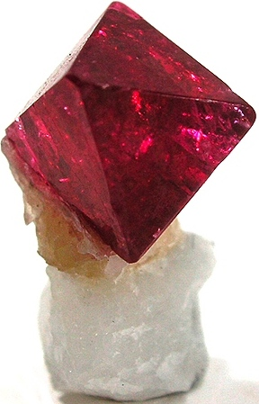

# Spinel

> Spinel

<!-- language switcher hint -->
中文: [尖晶石](/zh/gems/spinel)

---

## Classification

| Property | Value |
|---|---|
| Mineral Family | Spinel |
| Formula | MgAl₂O₄ |
| Crystal System | cubic |

## Physical Properties

| Property | Value |
|---|---|
| Mohs Hardness | 8 |
| Specific Gravity | 3.6 |
| Refractive Index | 1.712-1.762 |

## Optical Properties

| Property | Value |
|---|---|
| Pleochroism | — |
| Typical Colors | Jedi Red, Cobalt Blue, Lavender |
| Color Cause | Cr³⁺ (red); Fe²⁺ (blue); V (varied) |

## Treatments & Disclosure

| Treatment | Details |
|-----------|---------|
| Common Methods | None / Typically untreated |
| Disclosure Required | No |
| Note | Spinel is typically untreated; synthetic spinel is common in jewelry and requires lab identification |

## Gallery

