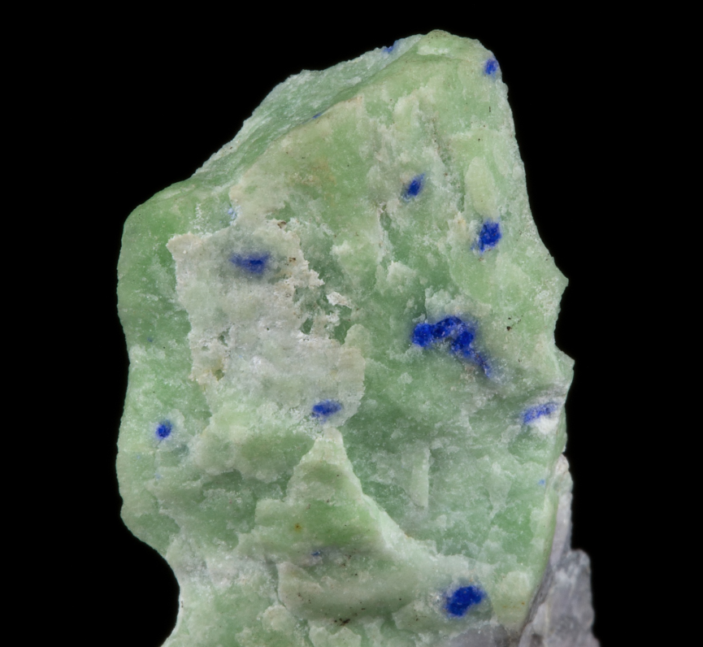
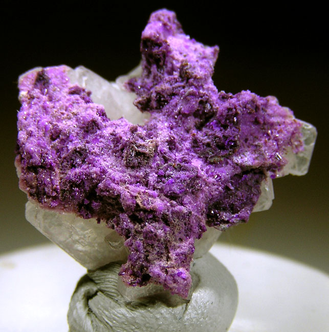
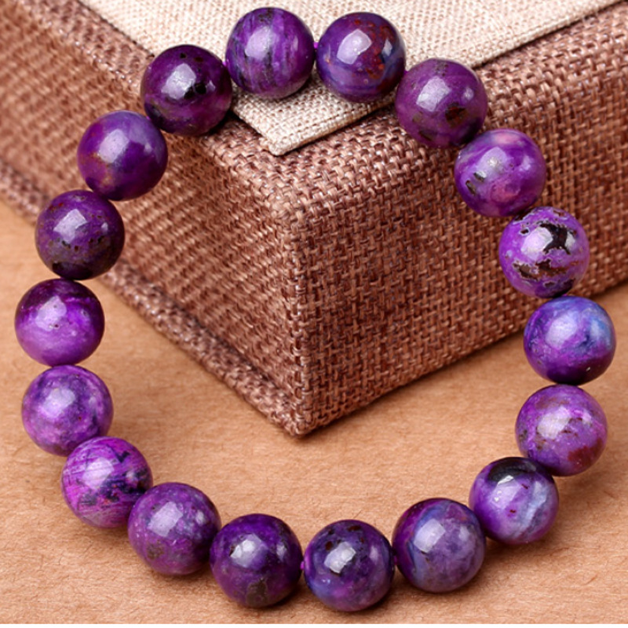
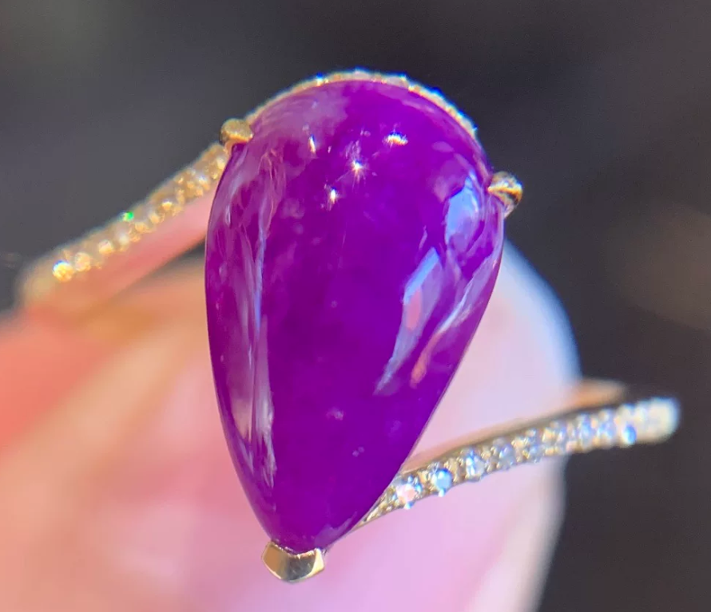

# Sugilite

> Cyclosilicate

<!-- language switcher hint -->
中文: [苏纪石](/zh/gems/sugilite)

---

## Classification

| Property | Value |
|---|---|
| Mineral Family | Cyclosilicate |
| Formula | KNa₂(Fe,Mn,Al)₂Li₃Si₁₂O₃₀ |
| Crystal System | hexagonal |

## Physical Properties

| Property | Value |
|---|---|
| Mohs Hardness | 6.5 |
| Specific Gravity | 2.74 |
| Refractive Index | 1.607-1.638 |

## Optical Properties

| Property | Value |
|---|---|
| Pleochroism | weak |
| Typical Colors | Purple-red, Violet, Pink-purple |
| Color Cause | Mn²⁺/Fe³⁺ produces purple-red |

## Treatments & Disclosure

| Treatment | Details |
|-----------|---------|
| Common Methods | None / Typically untreated |
| Disclosure Required | No |
| Note | Northern Cape, South Africa is the most important source (discovered 1973) |

## Gallery

