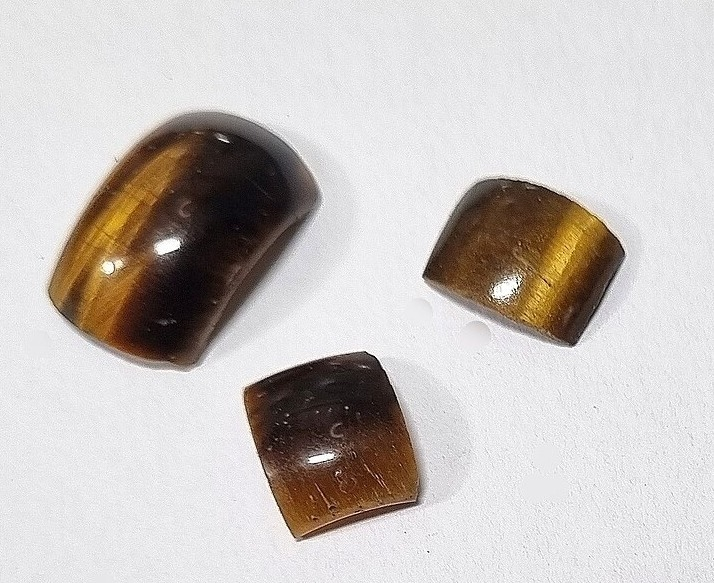
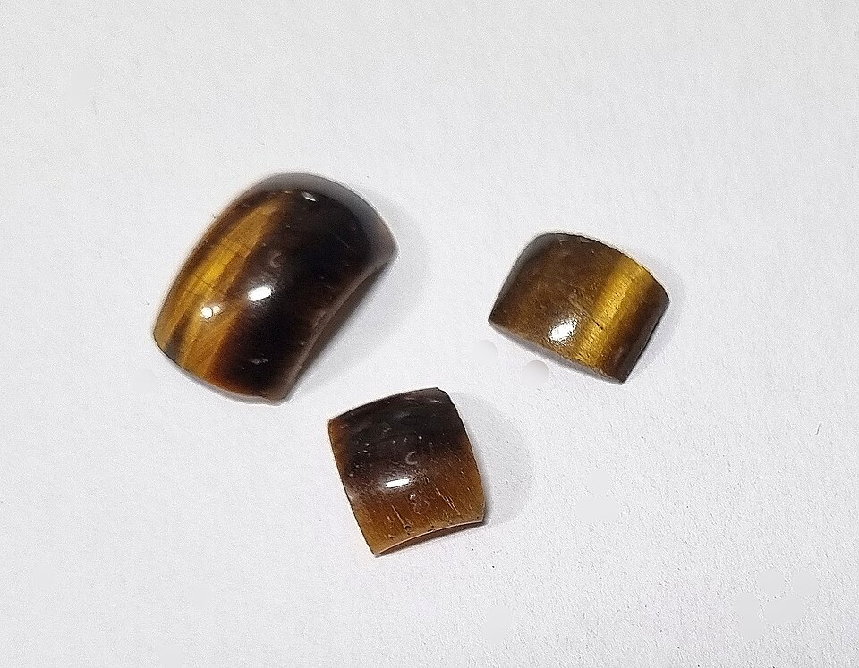
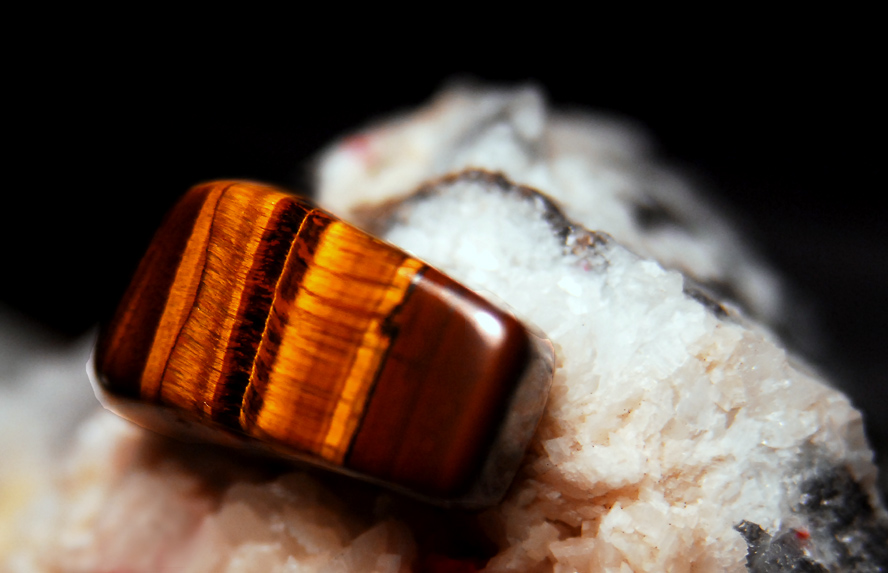
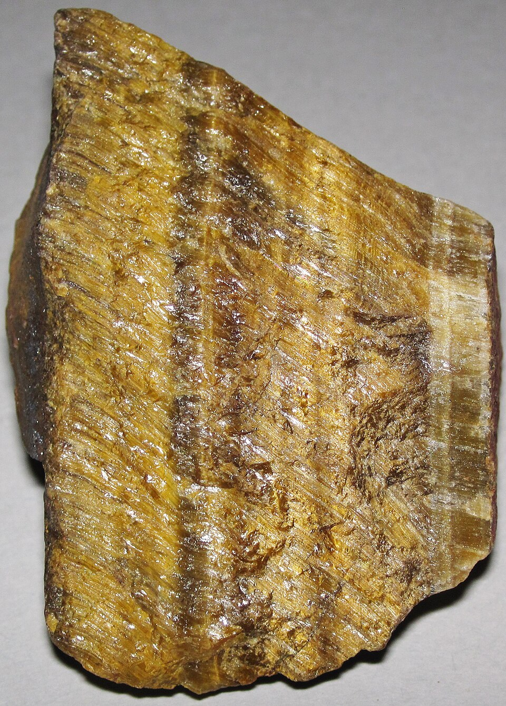

# Tiger's Eye

> Quartz (pseudomorph)

<!-- language switcher hint -->
中文: [虎眼石](/zh/gems/tigers-eye)

---

## Classification

| Property | Value |
|---|---|
| Mineral Family | Quartz (pseudomorph) |
| Formula | SiO₂ (pseudomorph after crocidolite) |
| Crystal System | trigonal |

## Physical Properties

| Property | Value |
|---|---|
| Mohs Hardness | 7 |
| Specific Gravity | 2.64 |
| Refractive Index | 1.544-1.553 |

## Optical Properties

| Property | Value |
|---|---|
| Pleochroism | none |
| Typical Colors | Golden brown, Blue-gray (Hawk-eye), Red-brown |
| Color Cause | Oxidized crocidolite fibers produce golden brown; unoxidized remains blue-gray |

## Treatments & Disclosure

| Treatment | Details |
|-----------|---------|
| Common Methods | heat-treatment, dyeing |
| Disclosure Required | Yes |
| Note | Heat treatment can enhance red-brown; Hawk-eye is the unoxidized variety |

## Origin

| Region |
|---|
| South Africa |
| Australia |
| India |
| Brazil |

## History & Lore

Tiger's-eye is silicified crocidolite; hawk's-eye and bull's-eye are variants. Roman soldiers wore it as a talisman.

## Gallery

