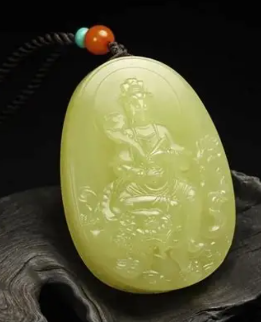
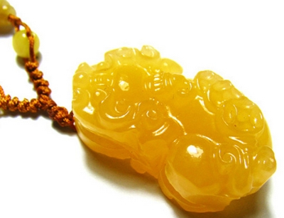
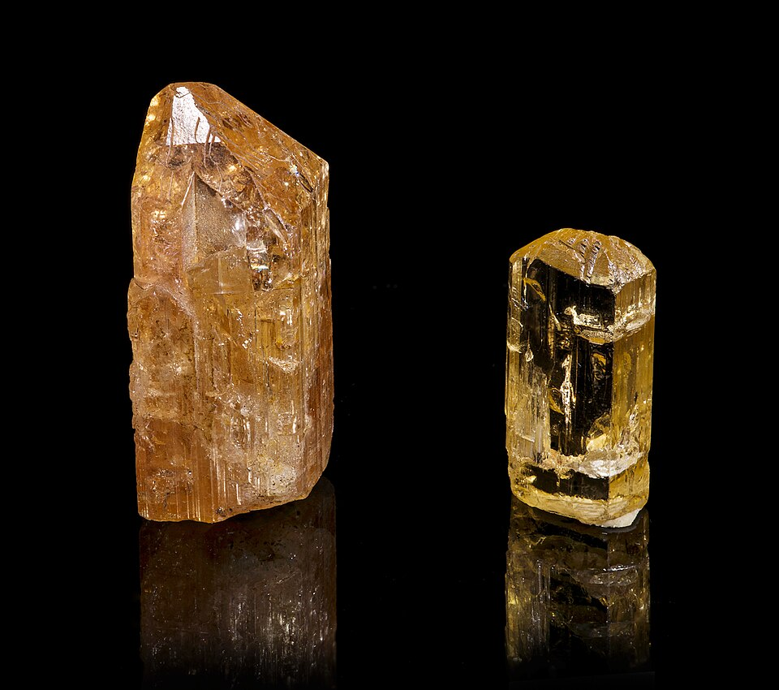
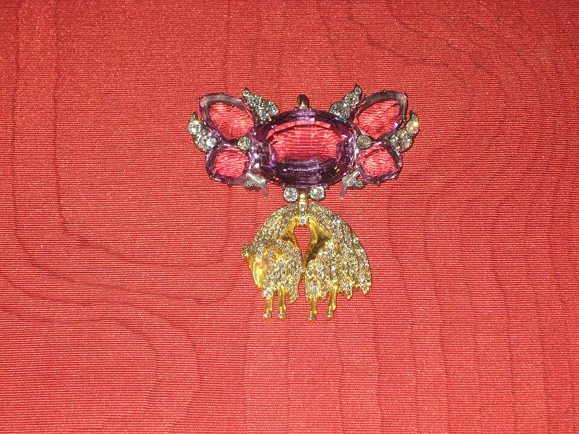

# Topaz

> Topaz

<!-- language switcher hint -->
中文: [黄玉](/zh/gems/topaz)

---

## Classification

| Property | Value |
|---|---|
| Mineral Family | Topaz |
| Formula | Al₂SiO₄(F,OH)₂ |
| Crystal System | orthorhombic |

## Physical Properties

| Property | Value |
|---|---|
| Mohs Hardness | 8 |
| Specific Gravity | 3.54 |
| Refractive Index | 1.609-1.643 |

## Optical Properties

| Property | Value |
|---|---|
| Pleochroism | weak |
| Typical Colors | Imperial (golden yellow), Blue, Pink, Colorless, Sherry |
| Color Cause | Yellow color center; blue / pink color center + irradiation |

## Treatments & Disclosure

| Treatment | Details |
|-----------|---------|
| Common Methods | heat-treatment, irradiation |
| Disclosure Required | Yes |
| Note | Commercial blue topaz is typically irradiated + heat treated |

## Gallery

