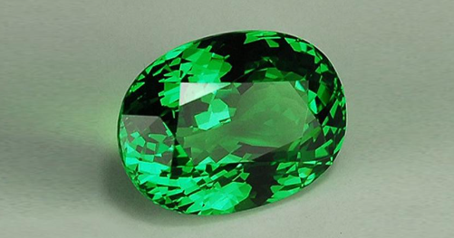
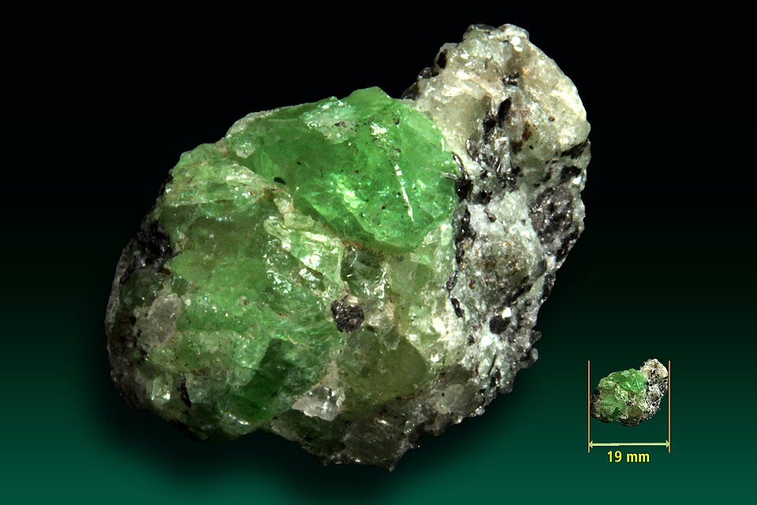
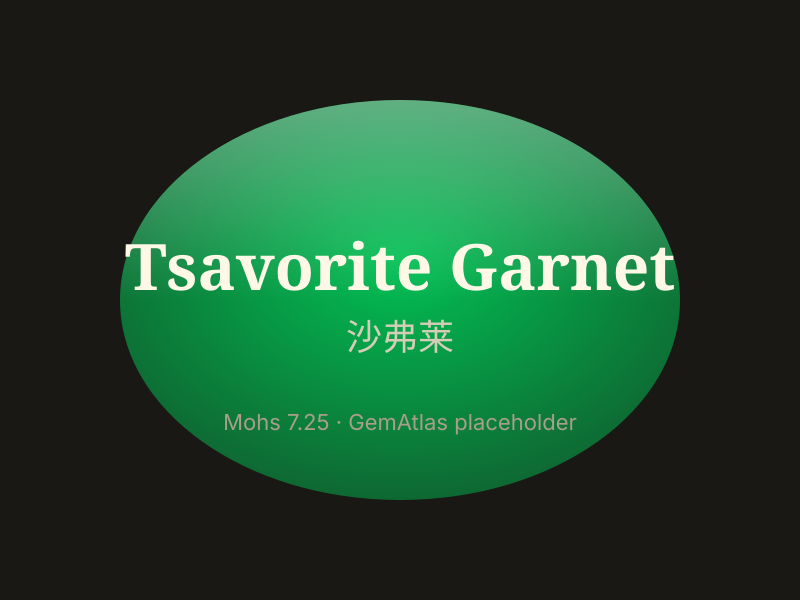

# Tsavorite Garnet

> Garnet

<!-- language switcher hint -->
中文: [沙弗莱石榴石](/zh/gems/tsavorite-garnet)

---

## Classification

| Property | Value |
|---|---|
| Mineral Family | Garnet |
| Formula | Ca₃Al₂(SiO₄)₃ |
| Crystal System | cubic |

## Physical Properties

| Property | Value |
|---|---|
| Mohs Hardness | 7.25 |
| Specific Gravity | 3.61 |
| Refractive Index | 1.739-1.744 |

## Optical Properties

| Property | Value |
|---|---|
| Pleochroism | — |
| Typical Colors | Forest Green, Grass Green |
| Color Cause | V³⁺ and Cr³⁺ trace ions |

## Treatments & Disclosure

| Treatment | Details |
|-----------|---------|
| Common Methods | None / Typically untreated |
| Disclosure Required | No |
| Note | No treatment needed; scarcity from small Kenya/Tanzania veins |

## Gallery

