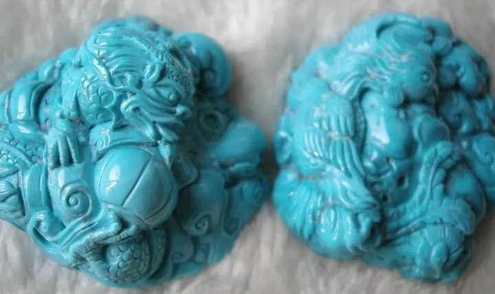
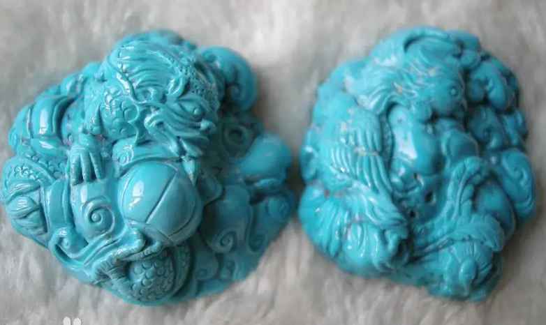
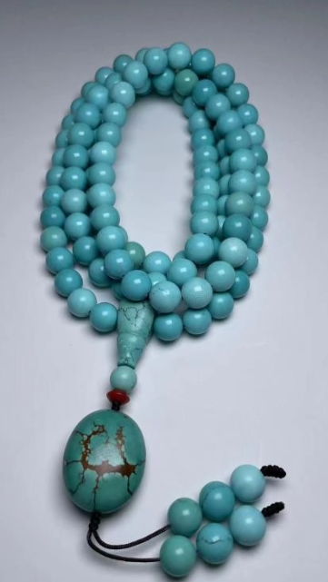
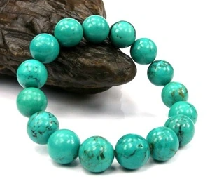

<a href="./">Gemstone Index</a>/Turquoise

  

    
GEM ATLAS / 59

    <h1 id="gem-detail-title-turquoise">Turquoise绿松石</h1>
    
Mineral identityHydrous copper aluminium phosphate

    <dl class="gem-detail__identity-facts">
      
<dt>Formula</dt><dd>CuAl₆(PO₄)₄(OH)₈·4H₂O</dd>

      
<dt>Crystal system</dt><dd>Triclinic</dd>

    </dl>
    <dl class="gem-detail__quick-facts">
      
<dt>Mohs</dt><dd>6</dd>

      
<dt>Specific gravity</dt><dd>2.7</dd>

      
<dt>Refractive index</dt><dd>1.61-1.65</dd>

    </dl>
    <a class="gem-detail__language" href="../zh/gems/turquoise.html" hreflang="zh-CN">中文: 绿松石 ↗</a>
  

  <figure class="gem-detail__hero-media"><figcaption>Primary viewVisual identification</figcaption></figure>

## Classification

IDENTITY / SPECIES RECORD

<table class="gem-detail__table">
  <thead><tr><th scope="col">Property</th><th scope="col">Value</th></tr></thead>
  <tbody><tr><th scope="row">Mineral Family</th><td>Hydrous copper aluminium phosphate</td></tr><tr><th scope="row">Formula</th><td>CuAl₆(PO₄)₄(OH)₈·4H₂O</td></tr><tr><th scope="row">Crystal System</th><td>Triclinic</td></tr></tbody>
</table>

## Physical Properties

<table class="gem-detail__table">
  <thead><tr><th scope="col">Property</th><th scope="col">Value</th></tr></thead>
  <tbody><tr><th scope="row">Mohs Hardness</th><td>6</td></tr><tr><th scope="row">Specific Gravity</th><td>2.7</td></tr><tr><th scope="row">Refractive Index</th><td>1.61-1.65</td></tr></tbody>
</table>

## Optical Properties

<table class="gem-detail__table">
  <thead><tr><th scope="col">Property</th><th scope="col">Value</th></tr></thead>
  <tbody><tr><th scope="row">Pleochroism</th><td>Weak</td></tr><tr><th scope="row">Typical Colors</th><td>Sky blue, Blue-green, Green</td></tr><tr><th scope="row">Color Cause</th><td>Cu blue, Fe green</td></tr></tbody>
</table>

## Treatments & Disclosure

  
Common methods<strong>Stabilisation, Dyeing</strong>

  
Disclosure required<strong class="is-required">Yes</strong>

  
NoteChina-blue &#39;Sleeping Beauty&#39; priciest; stabilisation common

## Origin Records

Representative localities<ul><li>Hubei, China</li><li>Nishapur, Iran</li><li>Arizona, USA</li><li>Mexico</li></ul>

## History & Lore

Turquoise is among the oldest gems — sacred to Egyptian pharaohs, Native Americans, and Tibetan culture. 

## Image Evidence

<figure><figcaption>Evidence 01</figcaption></figure>
<figure><figcaption>Evidence 02</figcaption></figure>
<figure><figcaption>Evidence 03</figcaption></figure>

CONTINUE EXPLORING<i aria-hidden="true">/</i><small>继续阅读</small>

<nav class="gem-detail__pager" aria-label="Gemstone record navigation">
<a class="gem-detail__pager-link gem-detail__pager-link--previous" href="./tsavorite-garnet.html" aria-label="Previous Tsavorite Garnet"><i aria-hidden="true">←</i>Previous<strong>Tsavorite Garnet</strong><small>沙弗莱石榴石</small></a>
<a class="gem-detail__pager-index" href="./" aria-label="Return to gemstone index">Return to index<strong>59 / 60</strong><small>All species</small></a>
<a class="gem-detail__pager-link gem-detail__pager-link--next" href="./zircon.html" aria-label="Next Zircon">Next<strong>Zircon</strong><small>锆石</small><i aria-hidden="true">→</i></a>
</nav>

