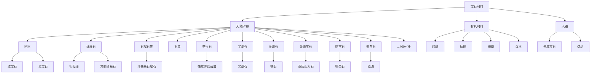

# 分类

> *从矿物种类到指间那一颗。*

每一种宝石都始于矿物——天然形成、具有固定化学成分和有序原子结构的无机固体。分类是了解宝石的第一步：它们从何而来、性质如何、以及各自独特之处何在。

## 矿物学分类

宝石的主要分类依据是矿物种类，以化学成分和晶体结构为基础。

## 传统分类

历史上宝石被分为**贵重**与**半贵重**两类——这是 19 世纪欧洲商业营销的残余，而非任何科学区分。

| 传统类别 | 示例 | 现代观点 |
|---------|------|---------|
| **贵重宝石** | 钻石、红宝石、蓝宝石、祖母绿 | 这四种仍然最具商业重要性，但现代宝石学已废弃此分级 |
| **半贵重宝石** | 其余所有 | 具有误导性——许多"半贵重"宝石（沙弗莱、帕拉伊巴碧玺、亚历山大石）比"贵重"宝石更稀有、更昂贵 |

> **现代宝石学已不再使用"贵重 vs 半贵重"的区分。**决定宝石价值的是稀有度、美观度和耐久性，而非一个继承而来的标签。

## 按晶系分类

共有七大晶系（外加非晶质）：

- **等轴晶系** — 钻石、尖晶石、石榴石
- **四方晶系** — 锆石、金红石
- **斜方晶系** — 坦桑石、亚历山大石、托帕石
- **六方晶系** — 绿柱石（祖母绿、海蓝宝）、磷灰石
- **三方晶系** — 红宝石、蓝宝石、石英、电气石
- **单斜晶系** — 正长石、锂辉石
- **三斜晶系** — 蓝晶石、绿松石
- **非晶质** — 欧泊、黑曜石、琥珀

*详见各[晶系](crystal-systems/cubic)页面。*

## 按光学效应分类

| 效应 | 描述 | 示例 |
|------|------|------|
| **星光效应** | 星形光反射 | 星光红宝石、星光蓝宝石 |
| **猫眼效应** | 带状反射光 | 猫眼金绿宝石、虎睛石 |
| **变色效应** | 不同光源下不同颜色 | 亚历山大石、变色蓝宝石 |
| **变彩效应** | 彩虹光谱闪色 | 欧泊 |
| **晕彩效应** | 珍珠或彩虹光泽 | 月光石、拉长石 |
| **月光效应** | 蓝色白色浮动光晕 | 月光石 |
| **拉长晕彩** | 金属光泽闪色 | 拉长石 |
| **砂金效应** | 闪烁的金属内含物 | 砂金石、日光石 |

## 按颜色分类

| 颜色 | 典型宝石 |
|------|---------|
| 红 | 红宝石、尖晶石、石榴石 |
| 蓝 | 蓝宝石、坦桑石、托帕石 |
| 绿 | 祖母绿、沙弗莱、橄榄石 |
| 黄 | 黄水晶、黄色蓝宝石、金绿柱石 |
| 粉 | 摩根石、粉色蓝宝石、紫锂辉石 |
| 紫 | 紫水晶、紫色蓝宝石 |
| 无色 | 钻石、锆石、无色蓝宝石 |

## GemAtlas 中的宝石

每颗宝石在本书中都有一页独立页面，展示其物理性质、光学特征、处理方式与参考文献。从以下推荐宝石开始探索，或使用上方导航浏览各模块。

<GemCard id="ruby" nameZh="红宝石" nameEn="Ruby" mineral="刚玉族" :hardness="9" locale="zh" />
<GemCard id="sapphire" nameZh="蓝宝石" nameEn="Sapphire" mineral="刚玉族" :hardness="9" locale="zh" />
<GemCard id="emerald" nameZh="祖母绿" nameEn="Emerald" mineral="绿柱石族" :hardness="7.75" locale="zh" />
<GemCard id="diamond" nameZh="钻石" nameEn="Diamond" mineral="金刚石" :hardness="10" locale="zh" />
